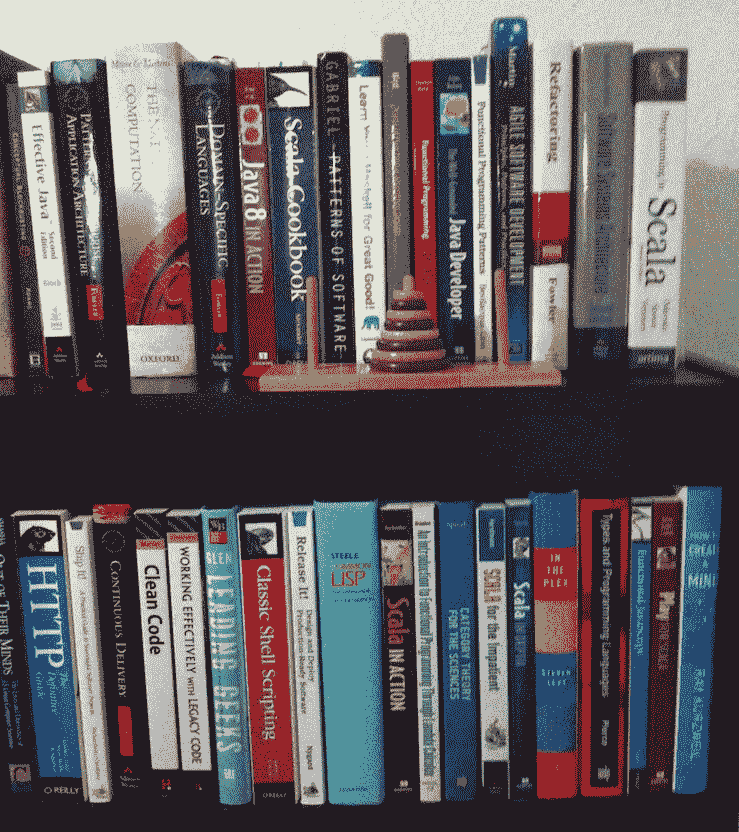
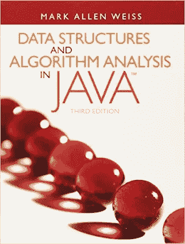
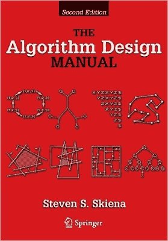
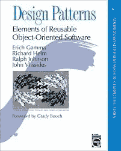

# 如果你有 100 美元可以花，该买哪些编程书籍？

> 原文：<https://medium.com/javarevisited/which-programming-books-to-buy-if-you-get-100-to-spend-9ef10db422a6?source=collection_archive---------0----------------------->

如果你免费得到 100 美元，你今天会买哪些编程书籍？

大家好，现在是时候在 Javarevisited 中回答一个假设问题了。我喜欢书，我的图书馆和手机里有很多书，但这一次，我想征求你的建议。如果给你 100 美元，你想买哪本编程书？

我知道，说到购买，人们希望他们的钱物有所值，这就是为什么我向你们提出这个问题。假设你正在书店找一些书，突然售货员走过来说，在这个特定的时刻，我们给你 100 美元免费购买[任何编程书籍](http://java67.blogspot.com/2015/03/10-books-every-programmer-and-software-engineer-read.html)。

现在你只有 10 分钟的时间来完成你的购买，并免费拿走那些很棒的 Java 书籍，你打算买什么书呢？

记住你只能购买总价不超过 100 美元的书，你可以购买一本或多本书的组合。为了价格，你可以考虑亚马逊给出的 Java 书籍平装版的价格，记住你需要考虑平装版而不是电子书的价格。

还有，你可以自由购买任何编程或软件工程方面的书籍，不仅仅局限于 Java 或相关技术。

就我自己而言，我很想花我的 100 美元买以下的书，虽然我想买更多，但在选择最后一本书时，我没有时间了，所以我可以包括前两本书。

*   罗伯特·c·马丁的《干净的代码》[37.58 美元](http://www.amazon.com/Clean-Code-Handbook-Software-Craftsmanship/dp/0132350882?tag=javamysqlanta-20)
*   [有效 Java 第三版(49%折扣)](http://www.amazon.com/dp/0321356683/?tag=javamysqlanta-20) $27.84
*   [构建微服务:设计细粒度系统](http://www.java67.com/2018/02/10-books-java-developers-should-read-in.html) $23.99
*   总计 89.86 美元

你可以把你选择的书作为评论贴出来，我会从中选出最适合 100 美元的书的组合贴在这里。

# 社区推荐的编程书籍

谢谢你们的评论。从所有的评论中，我们可以看到一个模式，在购买编程书籍阅读时，大多数建议都是永恒的，经典的，可以阅读的书籍

甚至多年以后。

很明显，在这一类别中，[算法和数据结构](https://javarevisited.blogspot.com/2018/01/top-5-free-data-structure-and-algorithm-courses-java--c-programmers.html)名列前茅，其次是关于[面向对象编程](http://www.java67.com/2018/02/5-free-object-oriented-programming-online-courses.html)、最佳实践和软件工程的书籍。下面是我们的读者推荐的一些经典编程书籍

在评论区。当你有 100 美元剩余时，你也可以用这个列表来买下一本编程书籍

## 1.[托马斯·科尔曼解开的算法](http://www.amazon.com/Algorithms-Unlocked-Thomas-H-Cormen/dp/0262518805?tag=javamysqlanta-20)，

Atif 推荐的是一个简单易读的复杂算法的好汇编。它是由 Thomas Corman 写的，他已经和别人合著了很多关于数据结构和算法空间的书。最重要的是，它真的很便宜，只要 22.50 美元

# 2.[Java 中的数据结构和算法分析](http://www.amazon.com/Data-Structures-Algorithm-Analysis-Edition/dp/0132576279?tag=javamysqlanta-20)，

正如 Suresh 所建议的，花费大约 123 美元有点贵，但是如果你想学习 Java 编程语言中的数据结构和算法，这是值得的

.

## 3.[史蒂文·斯基纳的算法设计手册](http://www.amazon.com/Algorithm-Design-Manual-Steven-Skiena/dp/1849967202?tag=javamysqlanta-20)

由 Gaurav Dubey 建议，价格约为 82 美元，但再次考虑到该主题的重要性

在编程上，我觉得一分钱一分货。

# 4.设计模式:可重用的面向对象软件的元素

这本书是由一位匿名读者推荐的。这本书已经有 18 年的历史了，第一次发行是在 20 世纪 90 年代中期，但是考虑到面向对象语言在企业世界中的流行，它仍然是相关的，并将继续有效。它的价格约为 47.99 美元。

## 5.[重构:改进现有代码的设计](http://javarevisited.blogspot.com/2014/09/top-6-books-to-learn-programming-coding.html)

马丁·福勒是@Pratap 推荐的另一部永恒经典，这本书也在我的愿望清单上，是我的下一本书。成本约为 44.70 美元

我找到了这些书，它们值得在 Java 程序员书架上占有一席之地。我是平装本书籍的忠实粉丝，因为这让我有一种真正的阅读书籍的感觉，但鉴于 iPad 和亚马逊 Kindle 在你的包里携带大量电子书的优势，我也开始建立我的电子书书架。

顺便说一句，很难抽出时间来阅读编程书籍，但如果你有学习的欲望并不断提升自己，你一定会每天至少抽出半个小时或一周抽出几个小时来阅读编程书籍。

顺便说一句，你可以用 100 美元买到更多的编程课程，尤其是在 Udemy 上，你可以只花 10 美元买到最高质量的 200 美元课程，对，就是 10 美元。我也很惊讶，不敢相信，但现在我知道这是真的，这就是为什么我在 Udemy 销售期间从他们那里买了很多有用的编程课程。

如果我有 100 美元购买编程和软件开发课程，那么我会购买以下常青树课程，人们可以在整个职业生涯中使用这些课程:

*   [何塞·波尔蒂利亚的 Python 训练营全集](http://bit.ly/2BY5LJC)
*   Tim Buchalaka 的 Java Masterclass 全集
*   [在 5 天内学会 Linux，提升你的职业水平](https://click.linksynergy.com/fs-bin/click?id=JVFxdTr9V80&subid=0&offerid=562016.1&type=10&tmpid=14538&RD_PARM1=https%3A%2F%2Fwww.udemy.com%2Flearn-linux-in-5-days%2F)
*   [Java 中的设计模式](https://click.linksynergy.com/deeplink?id=JVFxdTr9V80&mid=39197&murl=https%3A%2F%2Fwww.udemy.com%2Fcourse%2Fdesign-patterns-java%2F)
*   [数据结构和算法:使用 Java 进行深入研究](https://click.linksynergy.com/fs-bin/click?id=JVFxdTr9V80&subid=0&offerid=323058.1&type=10&tmpid=14538&RD_PARM1=https%3A%2F%2Fwww.udemy.com%2Fdata-structures-and-algorithms-deep-dive-using-java%2F)
*   [完整的 SQL 训练营成为 SQL 专家！](https://click.linksynergy.com/fs-bin/click?id=JVFxdTr9V80&subid=0&offerid=323058.1&type=10&tmpid=14538&RD_PARM1=https%3A%2F%2Fwww.udemy.com%2Fthe-complete-sql-bootcamp%2F)

如果你喜欢这篇文章，请与你的朋友和同事分享。如果您有任何问题或反馈，请留言。

祝你学习之旅一切顺利。