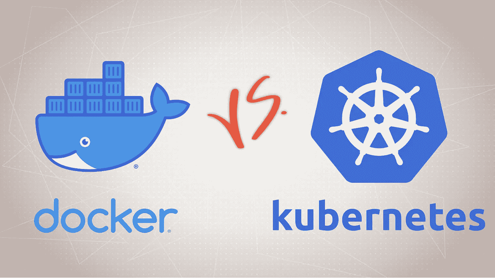
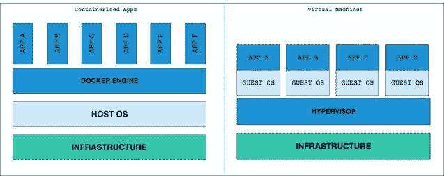
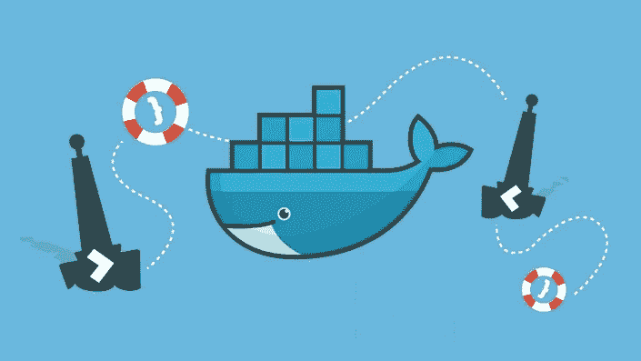

# 2023 年为什么要学 Docker 和 Kubernetes，怎么学？

> 原文：<https://medium.com/javarevisited/why-and-how-to-learn-docker-and-kubernetes-1dcbe8679792?source=collection_archive---------0----------------------->

## Docker 可以轻松地将您的应用或微服务部署在云上，Kubernetes 可以更轻松地将您的应用部署在数百台服务器上。

image_credit — Udemy

大家好，如果你想在 2023 年学习一些受欢迎的软件工具来改善你的个人资料，你来对地方了。早些时候，我已经为 Java 程序员分享了[最佳工具](/javarevisited/10-tools-and-libraries-every-software-developers-should-learn-e05e636a5577)、[库](/javarevisited/20-essential-java-libraries-and-apis-every-programmer-should-learn-5ccd41812fc7)和[框架](/javarevisited/5-essential-frameworks-every-java-developer-should-learn-6ed83315f1fb)，今天，我将它扩展到所有开发人员。

除了 [Docker](https://www.docker.com/) 之外，如果最近还有另一种工具或技术引起了软件开发人员的注意，那一定是 [Kubernetes](https://kubernetes.io/) 。实际上，它经常和 Docker 一起被提及，因为它把 Docker 提供的东西带到了一个新的层次。

如果你不知道什么是 Docker 和 Kubernetes，让我在深入研究为什么每个程序员都应该学习 Kubernetes 之前给你一个简单的概述。许多程序员也搞不清 Docker 和 Kubernetes，所以也需要这个简单的介绍。

简单地说，Docker 是一个容器，Kubernetes 是一个容器编排工具，可以大规模地创建、销毁和管理容器。

容器允许你构建你的应用程序，并把它和它所有的依赖项放在一个容器里，包括操作系统，比如 Linux 或者 Windows，运行时，比如 T2，Java，T4。NET 或[节点](https://javarevisited.blogspot.com/2018/01/top-5-nodejs-and-express-js-online-courses-for-web-developers.html)，以及您的应用程序正在使用的任何第三方库和框架代码。

这极大地简化了应用程序部署过程，因为您可以快速构建新环境，并且您可以将 docker 映像(一个包含您的应用程序所需的所有内容的大 tar 文件)发送给其他开发人员，或者将其部署到任何主机甚至云平台，如 [AWS](https://javarevisited.blogspot.com/2020/02/top-5-courses-to-crack-aws-certified-cloud-practitioner-exam-certification-clf-c01.html) 、 [GCP](https://javarevisited.blogspot.com/2019/07/top-5-google-cloud-platform-gcp-courses-certifications-online.html) 和 [Azure](https://javarevisited.blogspot.com/2020/09/top-5-courses-to-learn-microsoft-azure.html#axzz6co28cbJC) 。

您也不需要担心单独升级它们，也不需要冒它们可能与主机中的其他东西不兼容的风险。这意味着改善开发和运营以及 [DevOps 体验](/javarevisited/13-best-courses-to-learn-devops-for-senior-developers-in-2020-a2997ff7c33c)。

虽然容器确实简化了开发和部署(特别是对于[微服务](/javarevisited/top-5-courses-to-learn-microservices-in-java-and-spring-framework-e9fed1ba804d))，但如果您必须手动管理成百上千个用于不同流程的容器，那将是一件痛苦的事情，这就是 Kubernetes 的用武之地。Kubernetes 通过自动为您创建和部署容器来消除这种痛苦。这使得扩展你的应用程序变得非常容易，而这一直是全球各种规模的成长型初创公司和公司面临的主要挑战。事实上，Kubernetes 是世界各地软件公司最受欢迎的技能之一，如果你希望获得一项将伴随你整个职业生涯的技能，就像 SQL 和 UNIX 一样，那么学习 Kubernetes 是一个很好的选择。

顺便说一句，如果你已经下定决心学习 Docker 和 Kubernetes，只是需要一个好的资源，那么你可以从 Udemy 上 Stephen Grider 的 [**Docker 和 Kubernetes:完全指南**](https://click.linksynergy.com/deeplink?id=JVFxdTr9V80&mid=39197&murl=https%3A%2F%2Fwww.udemy.com%2Fcourse%2Fdocker-and-kubernetes-the-complete-guide%2F) 课程开始。

<https://click.linksynergy.com/deeplink?id=JVFxdTr9V80&mid=39197&murl=https%3A%2F%2Fwww.udemy.com%2Fcourse%2Fdocker-and-kubernetes-the-complete-guide%2F>  

这是一门非常引人入胜、内容丰富、动手操作的课程，可以学习 Docker 和 Kubernetes。它也非常实惠，你只需花 9.99 美元就可以在不时发生的疯狂的 Udemy 大甩卖上买到。

# 为什么 2023 年每个软件开发者都应该学习 Docker 和 Kubernetes

现在你知道了 Docker 和 Kubernetes 为软件开发者提供了什么，这就很容易理解为什么每个程序员或开发者都应该学习 Kubernetes。

> 主要原因是越来越多的人采用云技术，而 Kubernetes 在其中扮演着重要角色。

每隔几年，科技界都会出现一个塑造行业格局的大趋势。在过去，这些都是像并发和云计算这样的东西。

然后一波[区块链](https://javarevisited.blogspot.com/2020/07/top-5-online-courses-to-learn-blockchain.html)、[数据科学](https://becominghuman.ai/9-data-science-and-machine-learning-courses-by-harvard-ibm-udemy-and-others-12a0c7c23ec1)、[机器学习](https://www.java67.com/2018/10/top-10-data-science-and-machine-learning-courses.html)、[人工智能](/javarevisited/7-best-courses-to-learn-artificial-intelligence-in-2020-26d59d62f6fe)来了。它们仍然在这里，但是我们不会在本文中讨论它们。相反，我们将把讨论的重点放在大大小小的公司越来越多地采用的技术上，比如容器和无服务器计算。

> Docker 在集装箱方面领先，但 Kubernetes 将其提升到了另一个水平。Kubernetes 彻底改变了代码部署过程，使得在成百上千的服务器上轻松推出新版本而不停机成为可能。

作为一名程序员，我们需要熟悉运行和支持您的应用程序所需的一切。虽然 Kubernetes 对于直接负责管理应用程序部署的 DevOps 工程师来说更加重要和必要，但如果程序员知道 Kubernetes 如何工作以及它如何大规模管理容器，他也会从中受益。

如果生产过程中出现问题，那么开发人员通常会参与其中，如果他不知道生产过程中的事情是如何进行的，那么他就帮不上忙，这就是为什么我认为每个程序员和开发人员都应该花一些时间学习 [Kubernetes](/javarevisited/7-free-online-courses-to-learn-kubernetes-in-2020-3b8a68ec7abc) 。

与 [DevOps 工程师](/hackernoon/the-2018-devops-roadmap-31588d8670cb)不同，他们需要掌握 Kubernetes 的实际知识，你可能不需要成为一名专家，但只要知道 Kubernetes 的基础知识以及产品中的设置和工作方式，就可以对你的职业生涯、开发人员的声誉以及整体效用产生重大影响。

# 2023 年如何学习 Docker 和 Kubernetes？

现在的问题是如何学习 Docker 和 Kubernetes？没有比参加在线培训课程更好的学习方法了。在线学习 Docker 和 kubernetes 也有很多免费资料，你可以用它们来开始你的旅程。

过去我分享过几本免费的 [Docker](/javarevisited/top-5-free-courses-to-learn-docker-for-beginners-best-of-lot-b2b1ad2b98ad?source=collection_home---4------2-----------------------) 和 [Kubernetes 课程](/javarevisited/7-free-online-courses-to-learn-kubernetes-in-2020-3b8a68ec7abc)和[书籍](https://javarevisited.blogspot.com/2020/04/top-5-books-to-learn-docker-for-beginners.html)可以作为一个很好的起点。你可以加入他们学习像 Docker 和 Kubernetes 这样的容器和工具的基础知识。

这对于很多开发者来说已经足够好了，但是如果你想深入学习 Docker 和 Kubernetes，并用于 DevOps，那么你需要更深入，挑选一个可能不免费的综合资源。如果你能花几块钱学习像 Docker 和 Kubernetes 这样有价值的东西，那么我强烈推荐你去看看 Maximilian Schwarzmuller 在 Udemy 上的 Docker[**Kubernetes:实用指南**](https://click.linksynergy.com/deeplink?id=CuIbQrBnhiw&mid=39197&murl=https%3A%2F%2Fwww.udemy.com%2Fcourse%2Fdocker-kubernetes-the-practical-guide%2F) 课程，深入学习 Docker 和 Kubernetes。

这些是网上许多专家强烈推荐的书籍和课程。它们也非常实惠，你可以在网上购买，在家里或办公室安全地学习。

以上就是关于**为什么每个程序员都要在 2023 年学习 Kubernetes**的全部内容。正如我所说，软件开发的未来在云中，Docker 和 Kubernetes 将在应用程序部署和扩展中发挥重要作用。

对于全栈开发者和 DevOps 工程师来说，掌握容器技术，尤其是 Docker 和 Kubernetes 的相关知识是非常重要的。

你可能喜欢的其他开发工具和课程

*   [2023 年 DevOps 开发者路线图](/hackernoon/the-2018-devops-roadmap-31588d8670cb)
*   [面向 Java 和 DevOps 专业人员的 10 门免费 Docker 课程](https://javarevisited.blogspot.sg/2018/02/10-free-docker-container-courses-for-Java-Developers.html)
*   [5 门免费硒课程学习自动化测试](https://javarevisited.blogspot.sg/2018/02/top-5-selenium-webdriver-with-java-courses-for-testers.html)
*   [面向程序员的 10 门 Docker 和 Kubernetes 课程](https://dev.to/javinpaul/top-10-courses-to-learn-docker-and-kubernetes-for-programmers-4lg0)
*   [面向 Java 开发人员的 6 门 Maven 课程](http://www.java67.com/2018/02/6-free-maven-and-jenkins-online-courses-for-java-developers.html)
*   [2023 年 Java 开发人员应该学会的 10 件事](http://javarevisited.blogspot.sg/2017/12/10-things-java-programmers-should-learn.html#axzz53ENLS1RB)
*   [学习 Jenkins 自动化和开发运维的 5 大课程](https://javarevisited.blogspot.com/2018/09/top-5-jenkins-courses-for-java-and-DevOps-Programmers.html)
*   [2023 年学习 Kubernetes 的 7 门免费在线课程](/javarevisited/7-free-online-courses-to-learn-kubernetes-in-2020-3b8a68ec7abc)
*   [我最喜欢的学习亚马逊网络服务的课程](https://javarevisited.blogspot.com/2020/05/top-5-amazon-web-services-aws-courses-for-beginners-and-experienced-programmers.html)
*   [面向高级开发人员的 13 门最佳 DevOps 课程](/javarevisited/13-best-courses-to-learn-devops-for-senior-developers-in-2020-a2997ff7c33c)
*   [我最喜欢为有经验的人学习 DevOps 的课程](/javarevisited/top-10-courses-to-learn-devops-for-experienced-programmers-d93b666db151)
*   [程序员学习 AWS 和云的 10 门免费课程](/javarevisited/top-10-courses-to-learn-amazon-web-services-aws-cloud-in-2020-best-and-free-317f10d7c21d)
*   [7 门免费课程为 DevOps 学习硒](/javarevisited/top-7-courses-to-learn-selenium-for-java-and-c-developers-to-learn-automation-testing-free-and-e91637cd9622)
*   [2023 年学习 DevOps 的前 5 本书](https://javarevisited.blogspot.com/2020/04/top-5-books-to-learn-devops-for-developers.html)

感谢您阅读本文。如果你喜欢 Kubernetes，觉得这篇文章很有用，那么请分享给你的朋友和同事。如果您有任何问题或反馈，请留言。

**P. S. —** 如果你想深入学习 Docker 和 Kubernetes，并寻找最好的在线课程，那么你也可以看看这份名单 [**5 个最好的 Docker 和 Kubernetes 课程**](https://javarevisited.blogspot.com/2019/05/top-5-courses-to-learn-docker-and-kubernetes-for-devops.html) 你可以在 2023 年甚至 2023 年加入，学习这些热门工具。

</javarevisited/top-15-online-courses-to-learn-docker-kubernetes-and-aws-for-fullstack-developers-and-devops-d8cc4f16e773> 