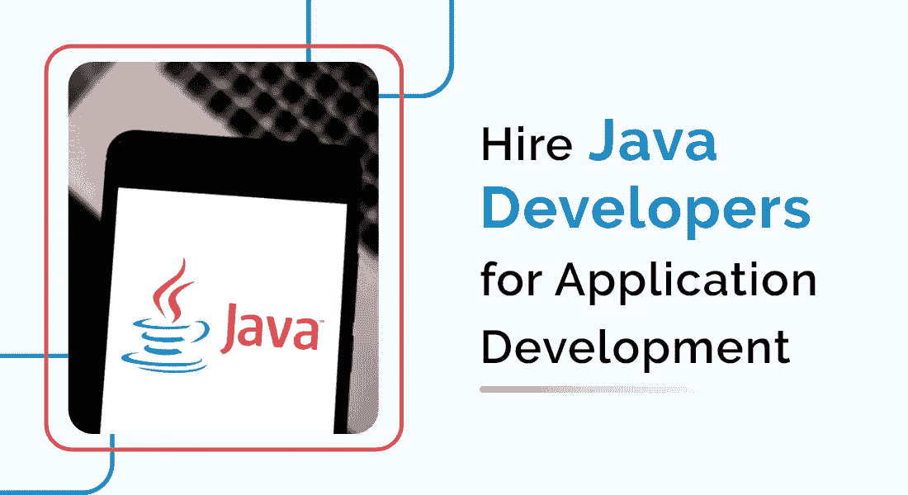
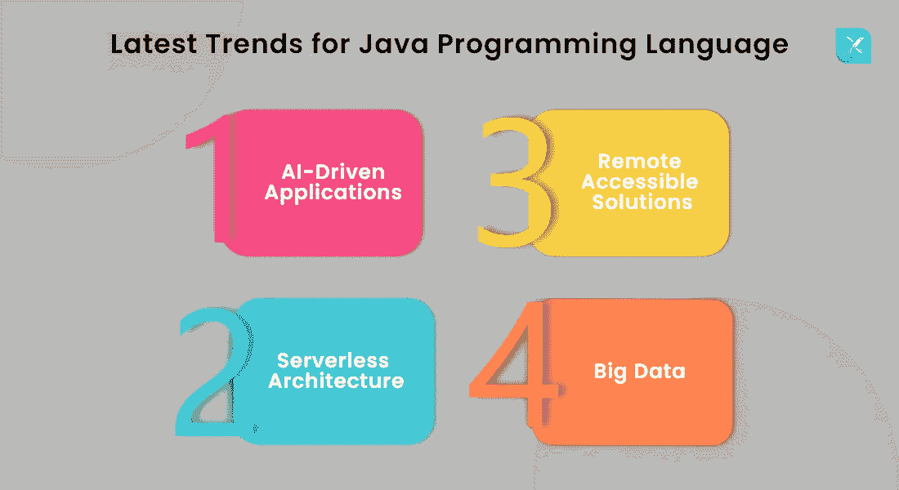
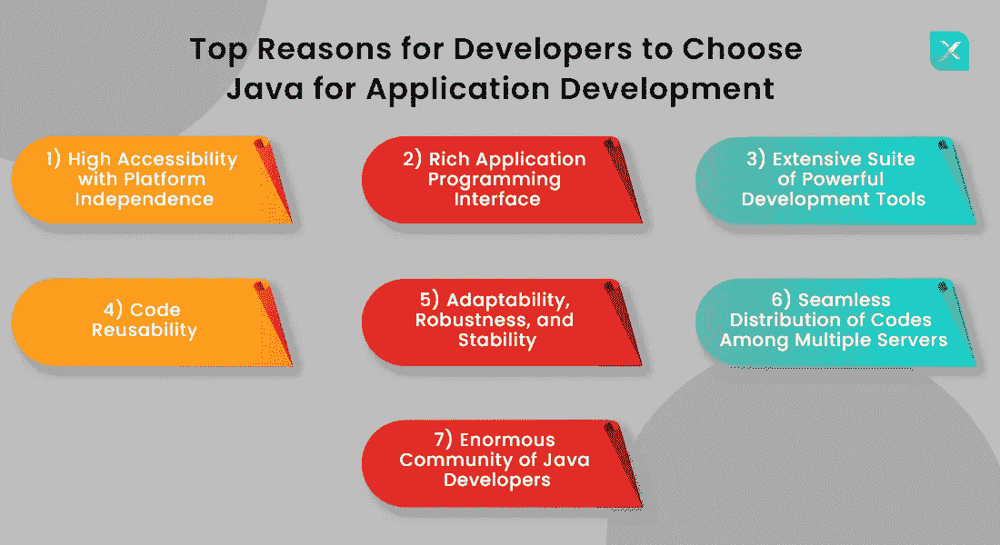

# 为什么企业要雇佣 Java 开发人员进行应用开发？

> 原文：<https://medium.com/javarevisited/why-do-businesses-want-to-hire-java-developers-for-application-development-abd33c643544?source=collection_archive---------4----------------------->

**简介**

Java 被认为是有史以来最优秀的编程语言之一，即使在它形成 27 年后，它仍继续在程序员中传播它的荣耀。随着企业继续采用用 Java 语言设计的应用程序，Java web 开发服务的市场仍然很热。这种语言如此突出的原因是因为它的多种实用功能和多年来编程效率的不断提高。

尽管出现了其他几种编程语言，但 Java 仍然是 Indeed 列出的 2021 年需求最高的语言之一。如果你想知道是什么让 java 如此受[海外 Java 开发者](https://www.inexture.com/services/java-development/)的欢迎，让我们通过这个博客向你展示一些事实和信息。让我们开始吧！

# Java 编程语言的最新趋势

与其他各种语言不同，Java 保持了其在市场上的相关性，并紧跟技术的发展。Java 紧跟最新趋势不断升级其系统，这有助于其改进并变得比以前更强大。

活跃的 [Java 门户开发社区](https://www.inexture.com/services/java-development/)总是渴望找到令人兴奋的新方法来使用 Java 并响应不同垂直行业的需求。以下是 Java 开发人员利用这种语言来开发新的创新应用程序的一些新兴趋势:

# 人工智能驱动的应用

Java 是一种高效的语言，适合开发人工智能驱动的应用程序。AI 应用需要大量使用算法，Java 的简易编码技术使得针对不同类型的算法编写代码变得很容易。此外，Java 提供了大量资源，可以帮助连接 ML(机器学习)和人工智能，并开发有用的应用程序。

# 无服务器架构

如今，无服务器架构有着巨大的需求。许多公司正在转向这种新的计算技术，通过这种技术，应用程序可以在不管理基础设施的情况下运行。Java 可以用来开发一个健壮的无服务器系统，减轻企业的运营压力。

# 远程访问解决方案

对于需要远程访问其产品的企业来说，Java 是构建高效便捷解决方案的有效工具。远程可访问性目前在全球市场上有着巨大的需求，通过 Java 开发其应用程序对所有人都有巨大的好处。

# 大数据

大数据是世界上增长最快的行业之一。它可以使用任何形式的数据产生的洞察力对任何行业都是值得称赞和有用的。Java 提供了许多开源工具，如 Apache Mahout、Apache Hadoop 和 Deeplearning4j，这些工具对开发大数据应用程序非常有益。

# Java 的应用用途

Java 是一种出色的语言，易于解释，已经为各种业务开发了数百万个应用程序。Java 的一些主要用途如下:

# 安卓应用

尽管 Java 在 Android 出现之前就已经引入了，但 Java 仍然提供了构建 Android 应用程序所需的所有必要工具。Java 利用 Google 的 Android API 开发 Android 应用程序。

# 商业应用

Java 提供了独立的代码和与多个平台的灵活集成，因此它是大多数企业构建业务应用程序的首选。

# 科学应用

科学应用通常利用自然语言处理。Java 是一种安全、易于维护的可移植语言，并且具有各种高级并发工具，因此被认为是开发科学应用程序的最佳选择之一。

# 软件和工具

除了构建移动和网络应用程序，Java 还用于开发其他软件。用 Java 开发的一些流行软件有 Eclipse、IntelliJ IDEA 和 NetBeans IDE。

# 开发人员选择 Java 进行应用程序开发的主要原因

Java 的广泛流行不仅仅是一个骗局，而是一个事实，这是由于多种独特特性的存在。以下是一些使 Java 成为编程理想工具的特性，以及为什么对 Java 开发公司的需求仍然巨大:

## 具有平台独立性的高可访问性

Java 是一种流行的开源编程语言，它提供了大量的应用程序开发工具。Java 运行在 Java 运行时环境(JRE)上，该环境需要安装在您的计算机系统中。

JRE 使得 Java 可以轻松地跨多个平台运行，并且不需要对代码进行任何解释。此外，JRE 可以安装在所有操作系统中，包括 Mac、Linux、Windows，甚至您的智能手机操作系统。这使得该语言独立于平台，所有 Java 开发人员都可以轻松访问。

## 丰富的应用程序编程接口

Java 的应用编程接口(API)极其丰富。它为用户提供了几种可以直接移植到任何代码上的方法。这些方法满足各种目的，比如联网、解析 XML、连接数据库、处理输入输出等等。

此外，Java 包括数百个开源库，如 Google Guava、Apache POI、Apache Commons、Apache Xerxes、OpenCV、Gson 等。

## 大量功能强大的开发工具套件

离岸 Java 开发人员喜欢使用这种语言的原因之一是与这种语言相关的许多强大的开发工具。该套件包括编辑器、调试器、自动化工具等等。

这些工具中的每一个都是为管理开发人员多年来的不同关注点而构建的。一些最著名的工具是 GIT、Jenkins、Docker、Gradle、Selenium 等。所有这些工具和技术都为编码和开发提供了极好的支持。

## 代码可重用性

代码可重用性对需要相同逻辑推理的不同类使用相同的代码。反复编写相同的代码不仅让开发人员感到沮丧，而且非常耗时。

Java 使用“对象”的概念，帮助开发人员在任何适用的地方重用公共代码。一个类中两个不同对象之间的相似属性通过使用一个对象来共享，这节省了开发人员构建软件应用程序的其他属性的大量时间。代码可重用性使得编码简单、快速且廉价。

## 适应性、健壮性和稳定性

Java 是一种非常健壮的语言，具有跨多个平台的高度适应性，并提供了很好的稳定性。Java 程序在大型和小型系统上都易于运行，这意味着代码是健壮和稳定的。因此，由于在 Java 中编码没有限制，您可以自由地开发任意数量的复杂业务应用程序。

## 在多个服务器之间无缝分发代码

Java 是编程世界中适应性最强、最健壮、最稳定的语言之一。当企业希望在不同的计算机网络上运行软件应用程序时，最大的挑战是如何同步计算机，使应用程序在系统上无缝运行。

Java 的 PATH 和 CLASSPATH 是两个环境变量，在跨不同的服务器轻松分发和运行程序时非常有效。

## 庞大的 Java 开发人员社区

经过这么多年的发展，Java 仍然保持着自己的优势，因为它有一个很大的在线社区。该社区帮助其他 Java 开发人员寻找他们在 [Java web 应用程序开发](https://www.inexture.com/services/java-development/)过程中所面临问题的答案。此外，作为一种开源语言，程序员也可以为云上现有问题的解决方案做出贡献。

## 最后的想法

Java 就是其中的一种，其旺盛的需求和卓越的两个重要原因是跨平台兼容性和高可伸缩性。这两个特性使得这种语言非常适合为各种类型的企业开发 Java 应用程序。Java web 开发服务在整个开发行业蓬勃发展是有原因的，这个原因就是 Java。要构建一个新的 Java 项目来实现您的想法，[请点击这里](https://www.inexture.com/contact-us/)联系我们的团队。

*原载于 2021 年 10 月 28 日*[*【https://www.inexture.com】*](https://www.inexture.com/hire-java-developers-for-application-development/)*。*