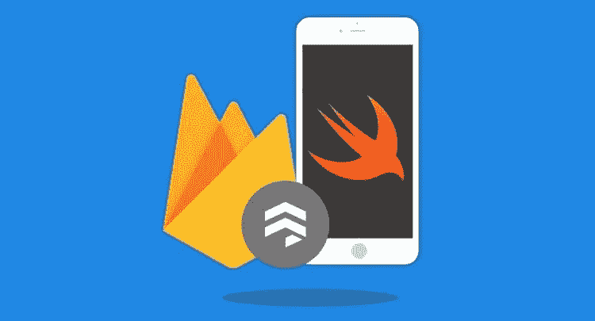
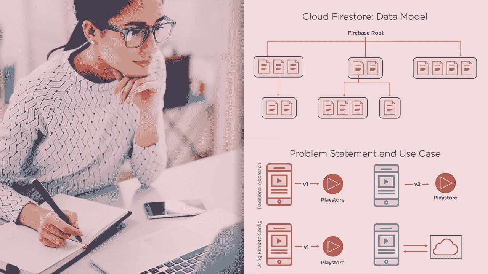
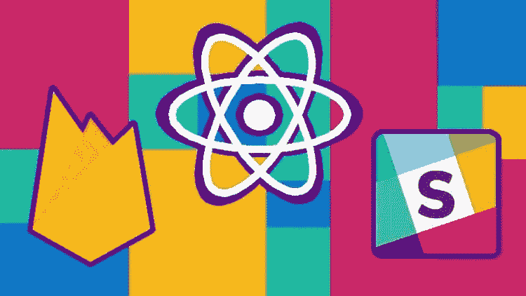

# 为什么前端开发者要在 2023 年学习 Firebase？

> 原文：<https://medium.com/javarevisited/why-frontend-developers-should-learn-firebase-16ff7f7150de?source=collection_archive---------0----------------------->

## Firebase 是 Google 提供的免费服务，可以用作功能丰富的后端。前端开发人员可以使用 Firebase 来减少开发时间和提高生产力。

image_credit —教育性

如果你是一个前端开发人员，经常因为后端没有准备好而感到沮丧和困惑，那么我有一个好消息要告诉你。您可以将 Firebase 用作功能全面的后端，并继续您的开发。

如果你不知道，Firebase 是谷歌提供的一套免费云服务，可以用作你的 [React](/javarevisited/the-2019-react-js-developer-roadmap-9a8e290b8a56?source=collection_home---4------1-----------------------) 或 [Angular](/javarevisited/10-courses-to-learn-angular-for-web-development-6da1bd2856dc) 应用程序的功能丰富的后端。你可以使用 Firebase 在一个名为 Firestore 的 [NoSQL 数据库](https://javarevisited.blogspot.com/2019/03/top-5-nosql-database-web-developers-should-learn.html#ixzz64aBvbXQ4)中存储和检索实时数据，也可以使用 Firebase Auth 服务验证你的应用程序用户。

您还可以使用 Firebase 存储来上传图像，以及将我们所有的应用程序部署到 Firebase 主机上。简而言之，即使真正的后端没有准备好，您也可以使用 Firebase 作为应用程序的后端。

虽然 [Firebase](https://firebase.google.com/) 已经存在了一段时间，但在[谷歌云平台](/javarevisited/5-best-gcp-associate-cloud-engineer-certification-courses-in-2021-c93d7e35228a)越来越受欢迎，并且引入了其他几个 Firebase 服务之后，它在最近几年才真正受到关注。

如果你是一名前端开发人员，正在使用 [React.js](https://javarevisited.blogspot.com/2018/08/top-5-react-js-and-redux-courses-to-learn-online.html#axzz5r06B3egD) 、 [Angular](https://javarevisited.blogspot.com/2018/06/5-best-courses-to-learn-angular.html) 、 [Vue.js](https://javarevisited.blogspot.com/2019/08/top-5-online-courses-to-learn-vue.js-best.html) 或任何其他前端开发框架创建前端，你将从 Firebase 中受益。

Firebase 对于移动开发者以及使用 Swift、T2、iOS 和安卓来创建移动应用的人来说同样有用。他们还可以使用 Firebase 服务为他们的应用程序创建后端，因为它提供了一个在线的免费数据库和其他一些有用的服务，如 **FireStore** 、 **FireAuth** 和 **Firebase** Cloud function。

如果没有可供使用的 API，前端开发人员往往会停滞不前，他们需要一个 API 来下载数据、验证用户身份和进行支付，如果没有这个 API，他们就不会取得进展。

虽然许多公司都有[前端和后端开发人员](/javarevisited/top-10-frameworks-full-stack-java-developers-can-learn-in-2020-5995021401e5)，他们协同工作，但是对于概念验证和演示，如果没有后端开发人员，你会感到很困惑，不知道如何设置后端。Firebase 通过为您提供一个**数据库**和**预建 API**，以及认证和支付支持来解决这个问题。

根据我的经验，我可以说，如果您能够处理 CRUD、身份验证和支付，那么您或多或少可以为任何应用程序进行 POC。

在这篇文章中，我将告诉你**为什么前端和移动开发者应该学习 Firebase** 以及它如何帮助他们在 2023 年快速创建 web 应用或移动应用。

我第一次知道 [Firebase](https://javarevisited.blogspot.com/2020/03/top-5-courses-to-learn-firebase-in-2020.html) 是在我学习 [Vue.js](https://javarevisited.blogspot.com/2019/08/top-5-online-courses-to-learn-vue.js-best.html) 并寻找一个公共 API 来开发我的应用程序的时候。我最终使用 Github 用户 API，这对于加载用户和显示他们的存储库是很好的，但是你不能控制数据，Firebase 允许你这样做。

顺便说一下，如果你也在学习 Vue.js，并想使用 Firebase 作为后端，那么你应该看看 Shaun Pelling 的 [**用 Vue JS 2 & Firebase**](https://click.linksynergy.com/deeplink?id=JVFxdTr9V80&mid=39197&murl=https%3A%2F%2Fwww.udemy.com%2Fcourse%2Fbuild-web-apps-with-vuejs-firebase%2F) 构建 Web 应用程序课程，他在 Udemy 和 Youtube 上被称为网络忍者。

 [## 构建令人惊叹的 Web 应用程序:使用 Vue JS 和 Firebase 开发应用程序

### 嘿，伙计们，我的名字叫肖恩，从很小的时候起，我就对几乎所有与科技相关的东西着迷。我一直…

udemy.com](https://click.linksynergy.com/deeplink?id=JVFxdTr9V80&mid=39197&murl=https%3A%2F%2Fwww.udemy.com%2Fcourse%2Fbuild-web-apps-with-vuejs-firebase%2F) 

# 什么是 Firebase？

正如我所说，Firebase 是谷歌提供的一套在线的、基于云的免费服务，它是手机和网络应用的功能丰富、成熟的后端。

此外，称为 BaaS(后端即服务)的 Firebase 提供了后端的所有优势，而没有从头开始设置后端的复杂性。

前端开发者可以使用 Firebase 在 NoSQL 一个名为 **Firestore** 的数据库中存储和检索数据，也可以使用 Firebase Auth 服务来验证他们应用程序的用户。一旦你学会了如何利用它的服务，你将会成倍地减少开发时间。

而 Firestore，实时数据库实际上只是一个开发者可以实时管理的大型 JSON 对象。它允许您为您的应用程序设置所需的数据，而 Firebase Authentication 是由创建 Google Sign-in、Smart Lock 和 Chrome Password Manager 的同一批人构建的。

Firebase 还提供了一个名为 **Firebase Cloud Functions** 的服务，它允许你在 Node.js 环境中运行服务器端的 JavaScript 代码，你也可以将你所有的应用程序部署到 Firebase 主机上。

你可以进一步查看 iOS 课程的 [**Firebase Firestore，了解更多关于 Firestore 的知识，以及如何在你的项目中使用它。**](https://click.linksynergy.com/deeplink?id=JVFxdTr9V80&mid=39197&murl=https%3A%2F%2Fwww.udemy.com%2Fcourse%2Fdevslopes-firestore-ios%2F)

# 为什么前端开发者要在 2023 年学习 Firebase？

现在你已经知道了 Firebase 的功能，我们可以总结一下为什么前端开发人员应该学习 Firebase。以下是我认为前端和移动应用开发都能从学习 Firebase 中受益的一些主要原因:

## 1.解除前端开发的障碍

Firebase 提供了一个现成的后端系统，前端开发人员可以使用它来挂钩他们的 GUI，而无需等待后端准备就绪。

## 2.更快的发展

Firebase 提供了数据库、身份验证、支付和 API，它们是任何前端应用程序不可或缺的一部分，有了它们，您的开发时间将大大减少。

虽然 Firebase 服务的良好知识在这里很有帮助，但如果你是从零开始，那么 Joe Eames 在 Pluralsight 上的 [**Firebase 基础知识**](https://pluralsight.pxf.io/c/1193463/424552/7490?u=https%3A%2F%2Fwww.pluralsight.com%2Fcourses%2Ffirebase-fundamentals) 课程对初学者来说是一个很好的资源。

## 3.更好的代码

人们可能会认为，使用 Firebase 意味着你被锁定在谷歌云平台上，你可能无法将你的网络应用或移动应用部署到 [AWS](https://javarevisited.blogspot.com/2020/05/top-5-amazon-web-services-aws-courses-for-beginners-and-experienced-programmers.html) 、 [Azure](https://javarevisited.blogspot.com/2019/07/top-5-courses-to-crack-azure-architecture-technologies-certification-az-300-exam.html) 、 [GCP](https://javarevisited.blogspot.com/2019/07/top-5-google-cloud-platform-gcp-courses-certifications-online.html) 或任何其他云平台上，但这不是事实。

只要您遵循标准的编码实践和关注点分离，您就可以在服务或数据层中封装交互。在大多数情况下，前端开发者可以在开发阶段使用 Firebase，而在生产阶段使用真实的后端。因此，他们设计他们的应用程序的方式，切换到不同的后端更容易，这种方法导致更好的结构。

## 4.速度和简单性

Firebase 不仅提供了极快的数据存储能力，而且还提供了一个简单的 API，如果您考虑在生产中使用 Firebase，这是很有诱惑力的。

## 5.缩短开发时间

Firebase 提供了后端的所有好处，而没有从头开始设置后端的复杂性。一旦你学会了如何利用它的服务，你将会成倍地减少开发时间。

如果您想了解 Firebase 的实际应用，以及它如何帮助前端开发，那么您还可以查看由 Reed Barger 在 Udemy 上开设的 [**使用 React、Redux 和 Firebase 构建 Slack 聊天应用**](https://click.linksynergy.com/deeplink?id=JVFxdTr9V80&mid=39197&murl=https%3A%2F%2Fwww.udemy.com%2Fcourse%2Fbuild-a-slack-chat-app-with-react-redux-and-firebase%2F) 课程，该课程将向您展示如何使用 React、Redux、Firebase 5 和语义 UI React 从前到后创建一个完整的全栈聊天应用

# 前端开发有哪些重要的 Firebase 服务？

实际上，Firebase 服务比我在这里提到的要多得多，您可以将它们分为两类，如开发和测试服务以及分析服务。

这里列出了一些最受前端开发人员欢迎的开发和测试 Firebase 服务:

*   实时数据库
*   作家（author 的简写）
*   测试实验室
*   碰撞分析
*   云函数
*   Firestore
*   云存储
*   性能监控
*   崩溃报告
*   主办；主持
*   培养和吸引你的观众

Firebase 最好的一点是，**只有一个 API** ，Firebase 数据库为您的应用程序提供数据的当前值和该数据的任何更新。

如果你有兴趣将 Firebase 与 Angular、Vue.js 或 React.js 一起使用，我建议你查看一下[**Firebase&Firestore master class**](https://click.linksynergy.com/deeplink?id=JVFxdTr9V80&mid=39197&murl=https%3A%2F%2Fwww.udemy.com%2Fcourse%2Ffirebase-course%2F)，它将向你展示如何使用 Firebase 托管、Firebase 云函数以及 AngularFire 与 Angular 进行全栈开发。

以上就是关于**为什么前端开发者应该学习 Firebase** 的全部内容。这些只是我现在能想到的一些最重要的原因，但还有更多。Firebase 正在发展，并添加越来越多的服务，因此越来越多的公司也开始在生产中使用它们。

如果你正在学习 Angular、React.js 或 Vue.js，那么 Firebase 真的可以帮助你开发项目，掌握你选择的前端框架。

**进一步学习**
[用 Vue JS 构建 Web 应用 2&Firebase](https://click.linksynergy.com/deeplink?id=JVFxdTr9V80&mid=39197&murl=https%3A%2F%2Fwww.udemy.com%2Fcourse%2Fbuild-web-apps-with-vuejs-firebase%2F)
[Firebase Firestore for the iOS](https://click.linksynergy.com/deeplink?id=JVFxdTr9V80&mid=39197&murl=https%3A%2F%2Fwww.udemy.com%2Fcourse%2Fdevslopes-firestore-ios%2F)
[Firebase Fundamentals by Joe Emas](https://pluralsight.pxf.io/c/1193463/424552/7490?u=https%3A%2F%2Fwww.pluralsight.com%2Fcourses%2Ffirebase-fundamentals)
[全栈 Web 应用用 Firebase](https://www.educative.io/courses/fullstack-web-apps-with-firebase?affiliate_id=5073518643380224)

其他**编程和开发文章**你可能喜欢:

*   前端开发人员应该学习的 10 件事([文章](https://javarevisited.blogspot.com/2020/01/10-things-web-developers-should-learn.html))
*   完整的 React 开发者路线图([路线图](https://javarevisited.blogspot.com/2018/10/the-2018-react-developer-roadmap.html))
*   我最喜欢的初学者学习网页开发的课程([课程](/better-programming/my-5-favorite-courses-to-learn-web-development-in-2019-a5e74167f8b2))
*   完整的前端开发者路线图([指南](https://javarevisited.blogspot.com/2019/02/the-2019-web-developer-roadmap.html))
*   程序员学习 Kubernetes 的 7 门免费课程([课程](/javarevisited/7-free-online-courses-to-learn-kubernetes-in-2020-3b8a68ec7abc)
*   新手必备的 10 个前端技能([技能](https://www.java67.com/2020/10/best-frontend-skills-web-developer.html))
*   完整的 DevOps 开发者路线图([指南](https://javarevisited.blogspot.com/2018/09/the-2018-devops-roadmap-your-guide-to-become-DevOps-Engineer.html#axzz61d5FPRru))
*   Java 开发人员应该学习的 10 个框架([文章](/javarevisited/top-10-frameworks-full-stack-java-developers-can-learn-in-2020-5995021401e5))
*   5 门免费课程学习 Docker for DevOps ( [课程](/javarevisited/top-5-free-courses-to-learn-docker-for-beginners-best-of-lot-b2b1ad2b98ad))
*   Java 开发人员应该学习的 10 项技能([技能](https://dev.to/javinpaul/10-skills-java-programmer-can-learn-to-accelerate-their-career-3nlh))
*   为什么每个人都应该学习 Python 编程([文章](https://becominghuman.ai/why-everybody-should-learn-python-in-2020-2578e7031629))
*   10 个面向初学者的移动框架和库([框架](/@javinpaul/10-frameworks-and-libraries-mobile-application-developers-can-learn-in-2020-e0b91391cade))
*   10 张 Coursera 职业证书，助你事业腾飞
*   Java 开发者路线图([指南](https://javarevisited.blogspot.com/2019/10/the-java-developer-roadmap.html))
*   如何使用 Udemy 课程在 7 天内学会 Python([指南](https://javarevisited.blogspot.com/2020/10/how-to-learn-python-programming-in-7-days.html))

感谢您阅读本文。如果你喜欢这篇文章，请与你的朋友和同事分享。如果您有任何问题或反馈，请留言。

**P. S.** —如果你有兴趣学习 Firebase 及其不同的服务，如 FireStore 和云功能，但正在寻找免费的在线培训课程来启动你的旅程，那么你可以在 Udemy 上查看这个 [**React + Firebase 初学者课程**](https://click.linksynergy.com/deeplink?id=JVFxdTr9V80&mid=39197&murl=https%3A%2F%2Fwww.udemy.com%2Fcourse%2Fnew-react-firebase-real-time-serverless-apps%2F) 。这是完全免费的，你只需要一个 Udemy 帐户就可以注册这门课程。

 [## 免费 React 挂钩教程-[新] React + Firebase:针对初学者

### 在过去的 10 年中，Daniel 一直担任多家公司的高级开发人员，并扩展了多个…

udemy.com](https://click.linksynergy.com/deeplink?id=JVFxdTr9V80&mid=39197&murl=https%3A%2F%2Fwww.udemy.com%2Fcourse%2Fnew-react-firebase-real-time-serverless-apps%2F)