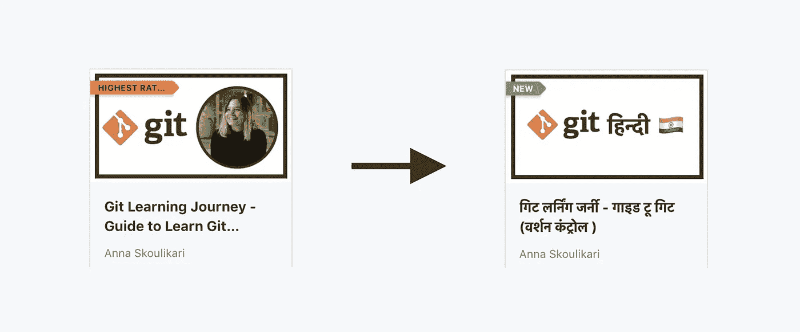
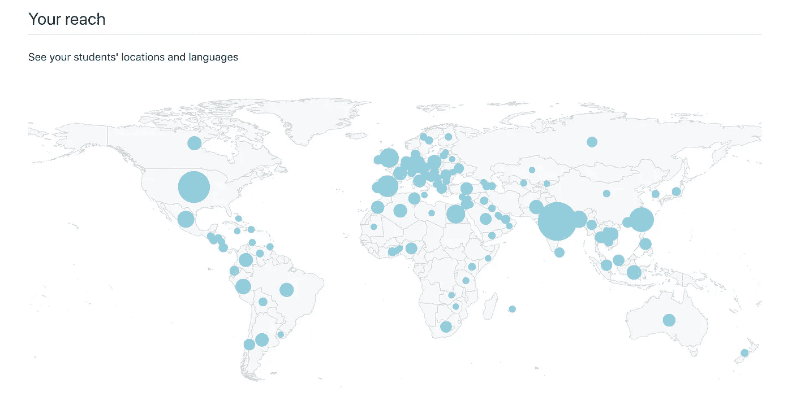
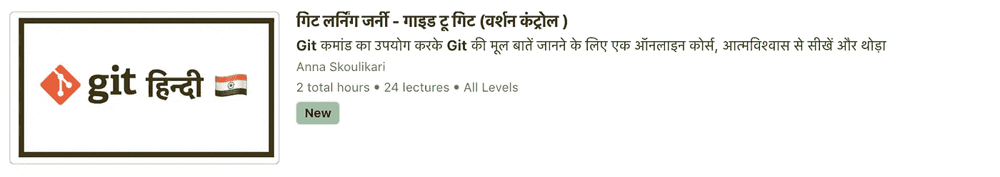

# 为什么我决定将我的在线课程 Git(版本控制)翻译成印地语？🇮🇳

> 原文：<https://medium.com/javarevisited/why-i-decided-to-translate-my-online-course-teaching-git-version-control-into-hindi-765aab168424?source=collection_archive---------1----------------------->

将英语课程翻译成印地语！

所以，我创建了一个教授 Git 版本控制的在线课程，原版是英文的。然后我决定将[在线课程翻译成印地语](https://www.udemy.com/course/git-course-guide-to-learn-git-version-control-in-hindi/?referralCode=9A2C7A66464F79876911)！🇮🇳

我为什么要这么做？

当我把课程放在 [**Udemy**](https://click.linksynergy.com/deeplink?id=JVFxdTr9V80&mid=39197&murl=https%3A%2F%2Fwww.udemy.com%2F) (在线教育平台)上时，我开始收到来自世界各地的学生。🌏

下面是我的 **Udemy 仪表盘**上的一张地图，显示了我所有的学生来自哪里:

看看印度有多大！

我意识到我的大多数学生来自印度。下面来自我的 Udemy 仪表盘的国家分类也证实了这一点:

这让我想到…作为一个会多种语言的人，我知道用自己的母语学习有多好。所以我决定用印地语提供我的在线 Git 课程！

我非常幸运地联系到了一位软件工程师 Manjula Dube，我和他一起合作翻译了这个课程。🙌🏼

如果你对这门课程感兴趣，或者知道有人可能喜欢这门课程，请随时与他们分享这个链接！

[https://www . udemy . com/course/git-course-guide-to-learn-git-version-control-in-Hindi/？referral code = 9 a2 c7a 66464 f 79876911](https://www.udemy.com/course/git-course-guide-to-learn-git-version-control-in-hindi/?referralCode=9A2C7A66464F79876911)

祝您在 Git 学习之旅中好运！💪🏼 👍🏻 🙌🏼

*   查看我的 YouTube 频道**，我在上面有课程的前 8 课！📹**
*   **在 Udemy 上查看 [**课程🎓**](https://www.udemy.com/course/git-course-guide-to-learn-git-version-control-in-hindi/?referralCode=9A2C7A66464F79876911)**
*   **在 [**LinkedIn**](https://www.linkedin.com/in/annaskoulikari/) 上与我联系💼**
*   **或者直接给我发邮件:【annaskoulikari@gmail.com】T4**