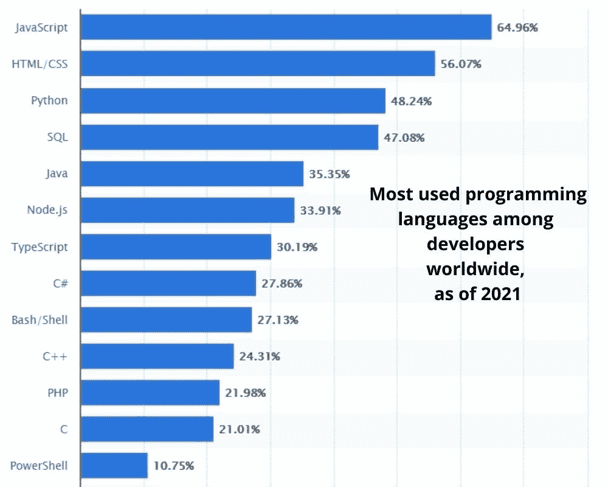
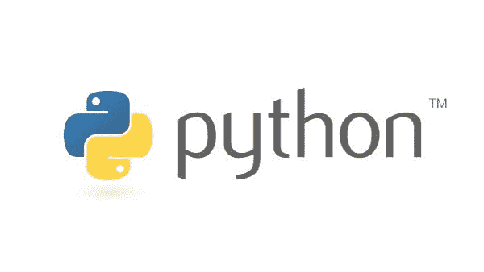
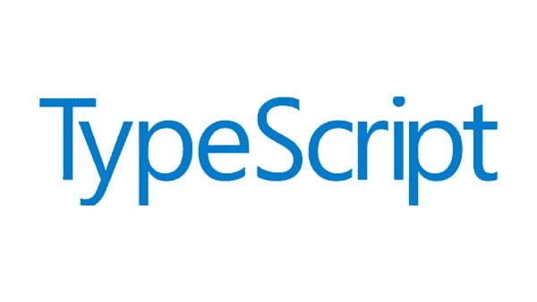
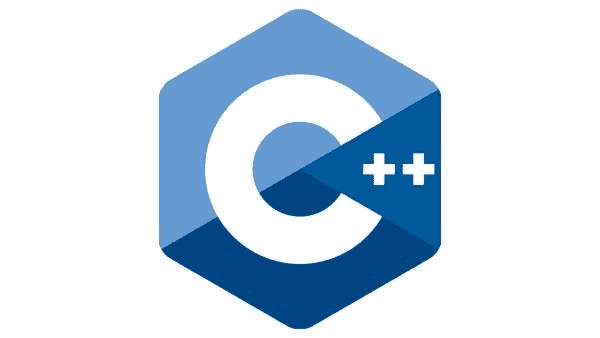
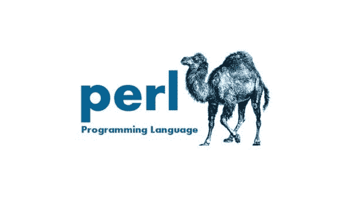

# 为什么 Java 最适合 Web 开发？

> 原文：<https://medium.com/javarevisited/why-is-java-optimum-for-web-development-9864621fd8d6?source=collection_archive---------1----------------------->

Java 是一种著名的有影响力的编程语言，已经被用来创建和开发许多软件应用程序。Java 被设计成一种面向对象、跨平台的编程语言。这意味着它可以在不同类型的操作系统上运行而不会有任何问题。

根据 [Java 开发统计](https://www.standardfirms.com/top-java-web-app-development-companies/)，它被全球超过 **83，000 个网站**使用。使用 Java 作为编程语言的著名网站包括 IBM Developers work、Big Moose Saloon、Sun Developer Network 等。

如果你正在考虑 web 开发，Java 是你可以信赖的终极语言。

**这是为什么？**

# **Java 是一种高度可扩展的语言**

许多 web 开发项目需要高度的可伸缩性。Java 是构建这类网站或应用程序的合适选择。不像其他编程语言，不像 Java 那样具有可伸缩性，当使用 Java 作为应用程序时，你不必担心。

一个 web 开发项目，当 Java 作为[编程语言](/javarevisited/python-or-java-which-programming-language-beginners-should-learn-in-2020-de992b2650ec)使用时，可以以闪电般的速度处理高流量和负载。它可以轻松地进行水平和垂直扩展，以满足任何项目的需求。因此，乍一看，无论一个项目是大是小，Java 的可伸缩性都是可靠的。

# **Java 为你提供跨平台支持**

Java 是一种跨平台的编程语言。这意味着它可以在任何操作系统上使用，并且仍然可以工作。对于那些想为微软 Windows 和 Linux 开发应用程序的人来说，这是个好消息！您不必担心将代码移植到不同的平台，因为 Java 语言已经为您做好了准备。

用 [Java 编程](/javarevisited/10-free-courses-to-learn-java-in-2019-22d1f33a3915)，你只要写一次，然后你就可以在任何地方使用代码。对于开发在不同操作系统上运行的应用程序来说，它确实是最好的编程语言。

# **出色的内存管理特性**

内存管理是 Java 编程的一个重要部分。Java 语言通过使用[垃圾收集器](/javarevisited/7-best-courses-to-learn-jvm-garbage-collection-and-performance-tuning-for-experienced-java-331705180686?source=---------8------------------)来提供内存管理。通过使用这种方法，程序员不必持续监视对象何时不再被使用，然后从内存中删除它们。

这使得开发速度更快，因为您不必跟踪应用程序中正在进行的所有事情。

Java 是一种[面向对象的编程语言](/swlh/5-free-object-oriented-programming-online-courses-for-programmers-156afd0a3a73)，你可以用许多不同的方式和出于各种目的来使用它。程序员在为系统编写代码之前，应该始终考虑他们希望系统做什么。为此，他们需要对[编程语言](/hackernoon/10-best-programming-languages-to-learn-in-2019-e5b05af4a972)有扎实的理解。

# **多线程提供高性能**

您可以使用 Java 创建单线程和[多线程应用](/javarevisited/6-multithreading-and-concurrency-books-every-java-programmer-should-read-b6a08d2aae54)。开发人员可以使用单线程编写程序，这意味着它一次只会执行一项任务。这种类型的应用程序变得非常慢，因为这些功能不会同时发生。

出于这个原因，开发人员更喜欢使用多线程程序，这种程序允许他们在不同的线程之间划分任务，然后并行运行。结果是，当一行可能在等待另一行的某种输入时，另一个线程将继续工作并取得进展，就好像它不需要来自前一个线程的任何东西一样。

如你所知，互联网连接速度是非常不可预测的。许多开发人员选择使用多线程应用程序，即使一个线程需要更多时间来完成其任务，这些应用程序也将继续工作。它使得 Java web 开发项目运行整洁流畅，没有任何技术故障。

# **适合**的经济实惠的选择

Java 是一种预算友好的编程语言。这是因为你可以在任何操作系统上使用它，并且仍然没有任何问题。使用 Java 进行 [web 开发](/javarevisited/10-best-coursera-courses-for-web-development-and-web-design-9ec54ed92dd9)的一个重要好处是垃圾收集器支持的内存管理，它允许开发人员快速工作，而不用担心对象何时不再被使用，然后从内存中删除它们。

随着项目在很短的时间内完成，它自动降低了开发成本。当你 [**以小时为单位雇佣 Java 开发人员**](https://www.pixelcrayons.com/hire-Java-developers#utm_source=PS-java-developers&utm_id=AR-Blog) 时，Java 的成本意识就很明显了。

这就是使用 Java 创建 web 应用程序的全部好处。请看下面的信息图，它描述了开发 web 应用程序的其他选择。

来源: [**码爸**](https://www.codersdaddy.com/)

**除 Java 之外，web 开发首选的顶级语言**

## [**1。JavaScript**](/javarevisited/my-favorite-free-tutorials-and-courses-to-learn-javascript-8f4d0a71faf2)

如果你还不知道，但是是的，Java 和 JavaScript 是不一样的。这两者之间有很大的区别。JavaScript 自 1995 年问世以来，至今仍是互联网上使用最广泛的编程语言之一。它是一种基于对象的语言，非常依赖客户端脚本和动态 HTML 操作。

在您的 [web 开发项目](/javarevisited/the-2019-web-developer-roadmap-ab89ac3c380e)中使用 javascript 有利有弊，但是它的流行保证了无论您在寻找什么，总会有大量的可用资源！

它有一个庞大的社区，为开发者提供了大量的支持和资源。使用 JS 的主要缺点是它涉及安全风险，当你不小心时会危及你的网站。

## [**Python**](/javarevisited/10-best-python-certification-courses-from-coursera-4576890eb6b3)

Python 是一种通用编程语言，由吉多·范·罗苏姆于 1991 年创建。开发人员称它是一种容易学习但很难掌握的语言。Python 以其清晰的语法和丰富的标准库而闻名，其中包括许多对 web 开发者有用的特性。

这种编程语言还包括一个广泛的标准库，它在许多方面都很有用，包括它能够动态操作字符串！

Python 提供了许多不同类型的[库，因此您永远不会没有选择。它是一种通用编程语言。因此，它缺乏对 web 开发人员有帮助的特定功能。](https://javarevisited.blogspot.com/2018/10/top-8-python-libraries-for-data-science-machine-learning.html#axzz6mjRPASEY)

## [**超文本处理器【PHP】**](/javarevisited/10-best-php-courses-for-beginners-and-experienced-developers-db18057a814f)

PHP 是 Rasmus Lerdoff 在 1994 年创建的服务器端脚本。它帮助开发动态网站和网络应用程序。PHP 是一种易于使用的编程语言，非常适合初学者。由于它在互联网上的广泛使用，它也经常被 web 开发人员使用。

这种编程语言有一些缺点，包括您不能单独执行它——在执行任何用 PHP 编写的代码之前，您需要首先运行 Apache 或其他类型的 web 服务器！它也缺乏灵活性&依赖关系是正确执行它所必需的。

## [**Ruby on Rails(RoR)**](/javarevisited/10-best-ruby-on-rails-courses-for-beginners-dca4d66e9f7b)

Ruby on Rails 是一种创建于 2003 年的简单编程语言。Web 开发人员经常使用它来创建动态网站和应用程序，重点是提高生产率。

Ruby on rails 对初学者来说也很容易掌握，它有清晰的语法，开发人员很容易理解。

RoR 的缺点是，如果不需要额外的软件组件，你就无法执行它——这需要 web 开发人员花更多的时间进行设置！

## [**打字稿**](/javarevisited/7-best-courses-to-learn-typescript-in-depth-58439e1ce729)

Typescript 是 Anders Hajlsberg 于 2012 年在微软公司创建的一种编程语言。这种语言的优点包括您可以在服务器端和客户端执行，同时还具有强大的输入功能！它有利于构建静态网站，强调类型安全和对 web 开发人员的工具支持。

[打字稿](/javarevisited/top-10-free-typescript-courses-to-learn-online-best-of-lot-44bce9da41d1)简单易学。缺点是这种编程语言没有任何专门用于 web 开发的特性，但是您可以结合使用 Typescript 和 JavaScript 来帮助解决这些问题！

## [**C++语言**](/javarevisited/10-best-c-and-c-programming-books-for-beginners-and-experienced-programmers-eb5ee8dbdc5a)

C++是比雅尼·斯特劳斯特鲁普在 1979 年创造的一种编程语言。这种语言有一些优点，包括只用一个命令行就能编译成机器码！您可以使用它来创建需要速度或效率的 web 应用程序和非 web 程序(例如，视频游戏)。

你可以像编译机器码一样快地编译 C++，使它成为创建需要速度或效率的程序的完美工具。不利的一面是这种语言很难学，也很难理解——但结果是， [C++](/javarevisited/top-10-courses-to-learn-c-for-beginners-best-and-free-4afc262a544e) 仍然是现存的最流行的语言之一！

## **Perl 语言**

Perl 是拉里·沃尔在 1987 年创造的一种编程语言。这种语言的优点包括你可以把它编译成机器码，而不需要任何依赖！您可以使用它来创建动态网页和程序，强调效率、速度和文本处理。

Perl 自 1987 年就出现了，这使它成为最古老的语言之一。缺点是，这种语言有一个无组织的语法，可以使学习具有挑战性，但有经验的 web 开发人员会发现它的优点大于缺点！

# 包扎

这就是使用 Java 的最大好处以及您可以选择的其他选项。根据你的语言选择，你可以在印度以合理的时薪雇佣网络开发人员。

**检查我们的服务:**

## [Web 应用程序开发服务](https://www.codersdaddy.com/website-app-development-company-agency)、[移动应用程序开发服务](https://www.codersdaddy.com/mobile-app-development)、[印度 UI UX 设计服务](https://www.codersdaddy.com/ui-ux-design-service-company)、[印度 IT 员工扩充服务](https://www.codersdaddy.com/it-staff-resource-augmentation)、[网站维护&支持服务](https://www.codersdaddy.com/website-app-maintenance-support)、[雇佣专门的软件程序员](https://www.codersdaddy.com/hire-developer-engineer-programmer/)、[雇佣印度 Android 应用程序开发人员](https://www.codersdaddy.com/hire-developer-engineer-programmer/android-app)、[雇佣印度 iPhone 应用程序开发人员](https://www.codersdaddy.com/hire-developer-engineer-programmer/ios-iphone-app)、[雇佣印度 PHP 开发人员](https://www.codersdaddy.com/hire-developer-engineer-programmer/php-web)、 <https://www.codersdaddy.com/hire-developer-engineer-programmer/php-web> [雇佣印度. Net 开发者](https://www.codersdaddy.com/hire-developer-engineer-programmer/dot-net)，[雇佣印度 Laravel 开发者](https://www.codersdaddy.com/hire-developer-engineer-programmer/laravel)，[数字营销服务](https://www.codersdaddy.com/digital-marketing-agency-company-firm)，[印度 SEO 服务](https://www.codersdaddy.com/seo-service-company-agency-firm)，[印度 ORM 服务](https://www.codersdaddy.com/online-reputation-management-service-company)，[印度 SEO 内容写作服务](https://www.codersdaddy.com/content-writing)，[雇佣印度 WordPress 开发者](https://www.codersdaddy.com/hire-developer-engineer-programmer/wordpress-web)，[雇佣印度 Drupal 开发者](https://www.codersdaddy.com/hire-developer-engineer-programmer/drupal)，[雇佣印度 Angular 开发者](https://www.codersdaddy.com/hire-developer-engineer-programmer/angular-js)，