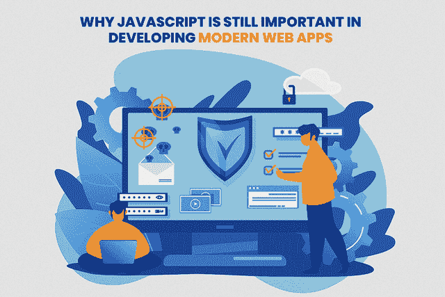

# 为什么 JavaScript 在开发现代 Web 应用程序中仍然很重要

> 原文：<https://medium.com/javarevisited/why-is-javascript-still-important-in-developing-modern-web-apps-67fcd30d7ad6?source=collection_archive---------1----------------------->

毫无疑问，自 1995 年以来，Javascript 在开发动态和交互式网页方面拥有最大的影响力。作为最强大的客户端编程语言之一，它不仅保持了继 Java 之后的顶级编程语言的地位，还为互联网上 96.2%的网站提供了支持。