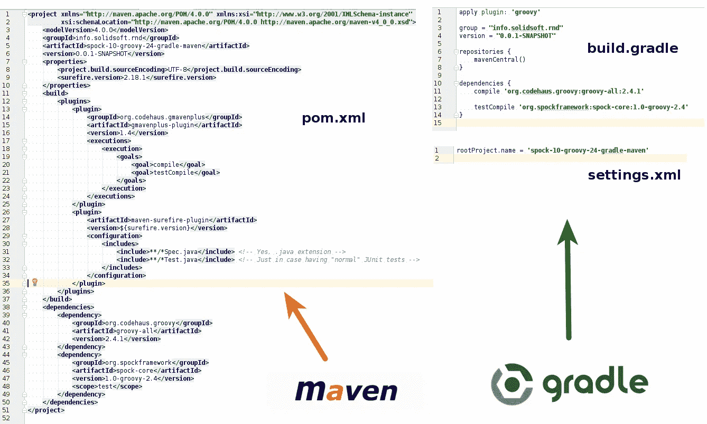
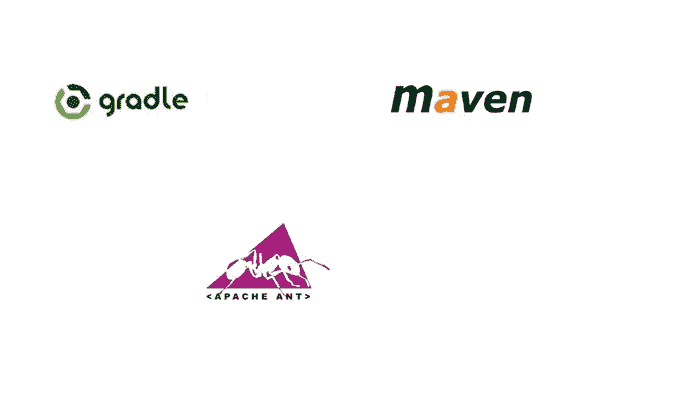
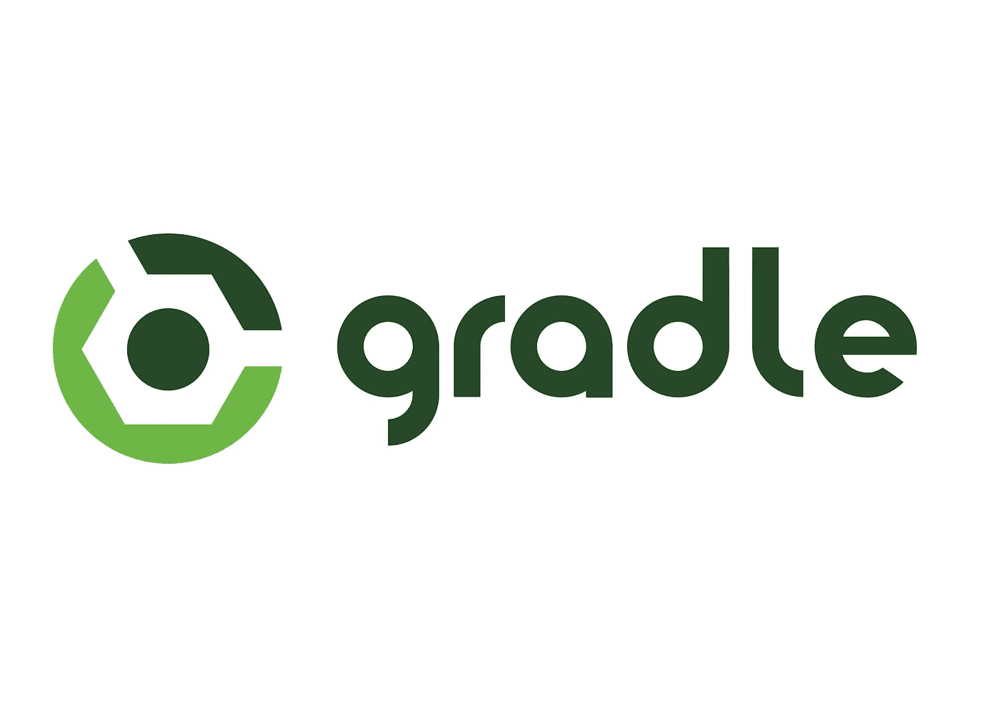
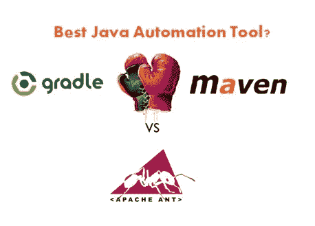

# 为什么每个 Java 开发者都要学 Maven 或者 Gradle？

> 原文：<https://medium.com/javarevisited/why-java-developer-should-learn-maven-or-gradle-aefe7ea20a83?source=collection_archive---------1----------------------->

## Maven 和 Gradle 是 Java 开发人员构建代码和管理依赖关系的两个重要工具，学习这些工具对于专业 Java 开发人员来说是必不可少的。

大家好，作为一名 Java 博客作者，许多 Java 开发人员问我类似“我正在学习 Java，我是否也应该学习 Maven 或 Gradle？”或者“为了得到一份 Java 开发人员的工作，必须学习 Maven 吗”，“我应该学习 Maven 还是 Gradle，哪个对未来更好？”以及不太常见的“作为 Java 开发人员，我为什么要学习 Maven 或 Gradle？”。

过去，我曾为 Java 开发人员分享过学习 Maven 的[最佳课程和一些有用的](https://javarevisited.blogspot.com/2019/03/top-5-course-to-learn-apache-maven-for.html#axzz6ccm5KWKs) [Gradle 书籍和课程](https://javarevisited.blogspot.com/2020/05/top-5-courses-and-books-to-learn-gradle.html#axzz6fk6WjYD0)，以及回答过围绕[Maven vs Gradle的问题，我将在本文中尝试回答这些问题，并断言 Maven 和 Gradle 作为 Java 开发人员的构建工具的重要性。一路上，我还将为 Java 开发人员分享学习 Maven 和 Gradle 的有用资源。](https://javarevisited.blogspot.com/2020/06/maven-vs-gradle-beginners-introduction.html#axzz6dHZ7oEpK)

# 什么是 Maven 和 Gradle？

Maven 和 Gradle 都是类似于 ANT 的构建工具，但它提供的不仅仅是一个构建工具。Maven 提供的最重要的东西是一个项目结构，它有一个预定义的地方来放置您的源文件、测试文件和资源。

它提倡约定胜于配置的思想，这使得理解项目变得容易。任何 Java 开发人员都可以在 Maven 上构建一个未知的项目，并知道在那里寻找 Java 文件、测试文件或配置和资源等。使用 Maven 的第二个主要优势是自动的依赖管理，你不需要手动下载你的项目需要的每一个 JAR 文件，记住，现实世界的 Java 项目使用上百个 JAR 文件。

这个优点就是一切插件。您可以使用插件创建 ZIP 或 tar 文件，可以创建 WAR 和 EAR 文件，可以直接部署工件来配置主机，可以将其保存在您的内部存储库中。

Gradle 是另一个类似于 Maven 的构建工具，但它使用 Groovy 而不是 XML 来定义其构建文件，这样可读性更好，也更简洁。与 Maven 相似，它也提供了项目结构和依赖性管理，包括传递依赖性。

例如，如果你下载了 Spring 5.0 jar，那么你就不需要 Spring 5.0 所需要的所有 JAR，Maven 或 Gradle 都会为你下载所有依赖的 JAR，比如 Log4j、HttpClient.jar 以及它们的正确版本。

这是 Java 开发人员应该学习 Maven 或 Gradle 作为构建工具的唯一原因。作为一名专业的 Java 开发人员，您将需要这些知识来处理使用 Maven 或 Gradle 来构建 JAR 和 WAR 文件等工件的实际项目。

如果你想学习 Maven 并且需要资源，那么我强烈推荐你加入 Udemy 上约翰·汤姆逊的 [**Apache Maven:初学者到大师**](https://click.linksynergy.com/deeplink?id=CuIbQrBnhiw&mid=39197&murl=https%3A%2F%2Fwww.udemy.com%2Fcourse%2Fapache-maven-beginner-to-guru%2F) 课程。深入学习 Apache Maven 是很棒的课程。

# 是不是每个 Java 开发者也应该学 Maven 或者 Gradle？

最初，当你学习 Java 时，你并不真的需要学习 Maven 或 Gradle，因为这将使你的学习变得复杂，首先，尝试在互动网站上执行 Java 程序，如 [*Educative*](https://www.educative.io/subscription?affiliate_id=5073518643380224) 和 [*CodeCademy*](https://bit.ly/codecademyhome) ，它们的 Java 课程允许你在线练习 Java 编码。

一旦你理解了一点 Java，下一步就是建立你自己的 Java 环境，并学习在 ide 中工作，如 [Eclipse](/javarevisited/top-10-courses-to-learn-eclipse-junit-and-mockito-for-java-developers-4de1e8d62b96) 或 [IntelliJIDEA](/javarevisited/7-best-courses-to-learn-intellij-idea-for-beginners-and-experienced-java-programmers-2e9aa9bb0c05) 。您可以在这里花一些时间，直到您熟悉 IDE 以及运行和调试 Java 程序之类的东西。

之后，你可以尝试从命令提示符下编译并运行 Java 程序，这是非常低级的，但如果你想真正掌握 Java，这是非常重要的。嗯，我第一步就学会了，这很难，但现在你有了交互式网站和 ide，所以你可以以后再学，但一定要学会。

完成这一步后，我建议您开始学习 Maven 或 Gradle，首先在您的 ide 中使用它们，因为这比从命令行使用它们更容易，一旦您掌握了它们，您可以尝试从命令行运行 Maven 和 Gradle 命令。

简而言之，是的，你应该在学习 Java 的同时学习 Maven 或 Gradle，因为从长远来看会有很大帮助。**大多数商业和现实项目使用 Maven 或 Gradle 进行构建、发布和依赖管理。**

在这一点上，我建议你优先考虑 Gradle 而不是 Maven，因为它的构建文件更干净，我真的很喜欢这些干净简洁的 Gradle 构建文件。更容易找到依赖关系并对整个项目有所了解。

如果你想深入了解 Gradle 并需要资源，那么我建议你去 Udemy 网站上看看 Bruce E. Hilton 的 Gradle 大师课程 。这是一门面向 Java 开发人员学习 Gradle 的实践课程。

# 想找一份 Java 开发人员的工作，学习 Maven 是必须的吗？

不，这不是强制性的，但更有可能的是，你会需要它，如果你知道它也提供了另一个候选人的竞争优势，他已经申请了相同的职位，但不知道 Maven。

有时项目经理也会寻找他们项目中使用的确切技能，所以如果你的简历中没有包括 Maven 或 Gradle，你可能会错过这些机会

底线是，作为一名专业的 Java 开发人员，您应该学习所有必要的工具来专业而高效地完成您的工作，Maven 就是其中之一。

您可以选择学习 Maven 或 Gradle，但是对这两者都有基本的了解是必需的，因为在您的职业生涯中，您必然会从事不同的 Java 项目，使用不同的技术堆栈。他们中的一些人会使用 Maven，其他人会使用 Gradle。

# Java 开发者为什么要学 Maven 或者 Gradle？

你应该学习 Maven，因为它会帮助你更好地管理你的 Java 项目。您不需要手动查找和下载 JAR 文件。如果您依赖于公司内部开发的核心库，并且总是希望包含该库的更新版本，那么您可以使用 Maven 来自动化这个过程。

通过学习 Maven，你可以很容易地与世界上任何知道 Maven 的人分享你的项目，这比没有 Maven 的人更容易理解和处理基于 Maven 的项目。

甚至你也会很乐意在 Maven 上进行项目构建。尽管有像 ANT 和 Gradle 这样的替代工具，尽管 ANT 更强大，并作为最受欢迎的构建工具统治着 Java 世界，但它不像 Maven 那样容易，也不提供像预定义项目结构、自动依赖管理和插件这样的关键优势。

这就是关于**为什么一个 Java 开发者应该学习 Maven 或者 Gradle** 的全部内容。要得到一份 Java 工作，并不一定要学习 Maven、Gradle 或 ANT 或任何其他构建工具，但这是一个对你的学习和工作都有很大帮助的工具。

从我的经验来看，我可以说，仅仅通过使用 Maven 进行依赖管理，您就可以节省大量时间。过去，我经历过手动搜索和下载 JAR 文件并将其放入类路径的痛苦，相信这花费了你大量的时间和精力。

自从我用了 Maven，我就不用再为此烦恼了。另一个也有很大影响的是一致的项目结构，它更容易找到测试文件、源文件、配置文件和其他资源。

**进一步学习**

[格拉德基础](https://click.linksynergy.com/deeplink?id=CuIbQrBnhiw&mid=39197&murl=https%3A%2F%2Fwww.udemy.com%2Fcourse%2Fgradle-fundamentals%2F)

[阿帕奇 Maven:初学者到大师](https://click.linksynergy.com/deeplink?id=CuIbQrBnhiw&mid=39197&murl=https%3A%2F%2Fwww.udemy.com%2Fcourse%2Fapache-maven-beginner-to-guru%2F)

[格拉德大师班课程](https://click.linksynergy.com/deeplink?id=CuIbQrBnhiw&mid=39197&murl=https%3A%2F%2Fwww.udemy.com%2Fcourse%2Fgradle-masterclass%2F)

您可能喜欢的其他 **Maven 和 Java 文章**

*   每个 Java 开发人员都应该学习的 10 个基本工具([工具](https://www.java67.com/2018/04/10-tools-java-developers-should-learn.html))
*   如何在 ANT 中创建和修改 build.xml？([教程](http://javarevisited.blogspot.sg/2010/10/ant-tutorial-part-2.html))
*   每个 Java 开发者都应该知道的十大 Maven 插件([列表](https://javarevisited.blogspot.sg/2016/08/top-10-maven-plugins-every-java-developer-know.html))
*   Maven，ANT，和 Jenkins 有什么区别？([回答](http://javarevisited.blogspot.sg/2015/01/difference-between-maven-ant-jenkins-and-hudson.html))
*   如何在 Windows 10 中安装 Maven？([步骤](http://javarevisited.blogspot.sg/2016/06/how-to-install-maven-in-on-windows-78-or-10.html))
*   如何增加 Maven 的堆大小？([步骤](http://javarevisited.blogspot.sg/2011/08/increase-heap-size-maven-ant.html))
*   在 Eclipse for Java 开发中使用 Maven 的 3 个技巧([技巧](https://javarevisited.blogspot.com/2016/09/3-maven-eclipse-tips-for-java-developers.html))
*   面向 Java 开发人员的前 5 本 Apache Maven 免费书籍([本](http://www.java67.com/2016/09/top-5-apache-maven-free-ebooks-for-java.html))
*   如何使用 ANT 构建一个 Java 项目？([篇](http://javarevisited.blogspot.sg/2010/10/ant-basics.html)
*   开发人员学习 Apache Maven 的前 5 门课程([课程](https://javarevisited.blogspot.com/2019/03/top-5-course-to-learn-apache-maven-for.html))
*   每个 Java 开发人员都应该学习的 10 件事([技能](https://javarevisited.blogspot.com/2017/12/10-things-java-programmers-should-learn.html))
*   20 个 Maven 面试问题及答案( [maven 提问](https://javarevisited.blogspot.com/2022/07/maven-interview-questions-with-answers.html))

感谢您阅读本文。如果你觉得这篇文章和我对 Maven 和 Gradle 对于 Java 开发人员的重要性的解释有用，那么请与你的朋友和同事分享。如果您有任何问题或反馈，请留言。

**P. S. —** 如果你正在寻找一些免费的课程来学习 Maven、Jenkins 和其他 Java 开发人员必备的工具，那么我也建议你查看一下这份为中型 Java 开发人员提供的 [**10 门免费课程的列表。**](/javarevisited/top-10-free-courses-to-learn-maven-jenkins-and-docker-for-java-developers-51fa7a1e66f6)

 [## 面向 Java 程序员的 6 大免费 Maven 和 Jenkins 在线课程[更新]

### 你好 Java 程序员，如果你想学习 Maven 和 Jenkins 并寻找免费资源如免费在线课程…

www.java67.com](https://www.java67.com/2018/02/6-free-maven-and-jenkins-online-courses-for-java-developers.html)