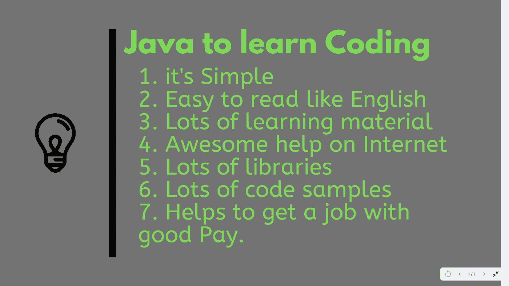
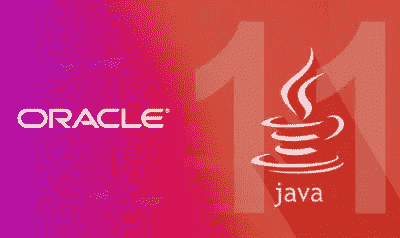
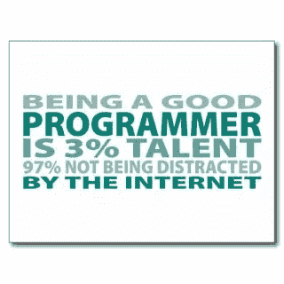

# 为什么 Java 是学习编码的最佳编程语言？

> 原文：<https://medium.com/javarevisited/why-java-is-the-best-programming-language-to-learn-coding-for-beginners-cba79aed1271?source=collection_archive---------1----------------------->

## 即使在 25 年后，Java 仍然非常受后端开发人员的欢迎，它也是初学者开始编程和编码的最佳语言

我经常收到类似*这样的问题，首先要学习哪种编程语言？*，Java 是不是一个好的入门编程语言？，Java 作为第一编程语言有多好，哪个是最适合初学者的编程语言，或者[我该从 Java 还是 Python 开始？](http://javarevisited.blogspot.sg/2013/11/java-vs-python-which-programming-laungage-to-learn-first.html)。

所有这些问题的答案是，Java 是最流行的编程语言之一，学习 Java 有很多[理由](https://javarevisited.blogspot.com/2018/07/10-reasons-to-learn-java-programming.html)，从工作机会到利用社区支持。

> *但是，在开始编程或选择 Java 作为第一语言的背景下，我最重要的原因是*学习*更简单。*

人们可能会争辩说 [Python](/better-programming/top-5-courses-to-learn-python-in-2018-best-of-lot-26644a99e7ec) 甚至更简单，甚至不需要编译，但是我个人发现 Java 更容易阅读和理解。

上一代程序员开始学习使用 BASIC 等语言编程，然后长大学习 [C](https://javarevisited.blogspot.com/2019/11/top-5-courses-to-learn-c-programming-in.html) 和 [C++](https://hackernoon.com/top-5-free-c-courses-to-learn-programming-in-2019-d27352277da0) ，并将 [Java](https://www.java67.com/2018/07/is-java-best-programming-language-for-beginners.html) 作为他们的第二或第三编程语言。

其中一个原因可能是 C 和 C++在那个年代比 Java 更流行，另一个原因是 most 课程是为了教授 C 和 C++，而且那个年代没有 [Python](https://javarevisited.blogspot.com/2018/03/top-5-courses-to-learn-python-in-2018.html) ，至少我们学院没有。

这是真的，* *我们经常不做选择*，我们在学校和大学学习编程课程的一部分。在我那个时代， [C](https://javarevisited.blogspot.com/2018/01/top-5-free-data-structure-and-algorithm-courses-java--c-programmers.html) 是我们工程学院最早的编程语言，然后我们学习了 C++，VB，VC++，最后是 [Java](/javarevisited/10-free-courses-to-learn-java-in-2019-22d1f33a3915) 。

现在我说 Java 更简单易学，但我仍然记得我说过它比 C++更复杂，因为我必须键入 [System.out.println()](http://javarevisited.blogspot.com/2012/10/eclipse-shortcut-to-systemoutprintln-in-java.html) 而不是更简单的`cout` 才能在屏幕上打印一些东西，但那只是一瞬间的感觉。

当我开始编写和维护更大的程序时，我发现 Java 可读性更好，你可以想想代码在做什么。在 [Java](https://javarevisited.blogspot.sg/2017/11/top-5-free-java-courses-for-beginners.html#axzz4zuIICRs9) 中调试和发现问题也比 [C++](http://www.java67.com/2018/02/5-free-cpp-courses-to-learn-programming.html) 或 [C](https://javarevisited.blogspot.com/2018/01/top-5-free-data-structure-and-algorithm-courses-java--c-programmers.html) 舒服得多。

对了，我是学专业编程的，或者你说真正的编码只是在我第一份工作的时候，那是我认真开始学 Java 的时候。

# Java 是一种好的编程语言吗？

以下是我认为 Java 是开始学习编码的正确编程语言的几个原因:

## 1.简单的

Java 更简单，其语法比 C、C++或任何其他语言都更易读。

## 2.面向对象编程

Java 对学习面向对象编程很好，但对过程编程不太好，在那里更喜欢 C。面向对象的程序设计是一项有用的技能，因为它很好地处理了现实世界应用程序的复杂性。更容易从类和对象的角度去思考。

## 3.丰富的 API 和第三方库

Java 有丰富的 API，你可以用 Java 做更多的事情，包括图形、声音，很可能还可以编写像井字游戏、俄罗斯方块等小游戏。

这并不是说你不能使用其他语言，你经常需要下载和安装不同的模块和库，这对初学者来说是一项艰巨的工作。当您安装 [Java](https://javarevisited.blogspot.com/2017/11/top-5-free-java-courses-for-beginners.html#axzz5bvMCbE00) 时，这些特性中的大多数只是安装的一部分。

## 4.社区支持

Java 拥有**强大的社区支持**，无论你有什么样的疑问、疑问或问题，Google 都能为你找到答案。如果没有 Google，那么 StackOverflow、Java 论坛和许多其他社区都可以帮助你。

这确实是我建议初学者[学习使用 Java](https://javarevisited.blogspot.com/2019/03/top-5-online-courses-to-learn-to-code.html) 编程的最大原因，因为当你开始学习编程时，你会面临许多不同种类的问题，需要理解编程基础和 Java。

因为有数百万的 Java 开发人员和一个大的社区在那里支持，你很可能会很快找到答案，而不会感到沮丧和失望。

## 5.强类型语言

Java 是一种 ***强类型语言*** ，捕捉了很多新手的错误。在较小程度上，对于静态类型也是有效的。这是我建议初学者先学 Java 再学 Python 的另一个原因，因为 Python 是一种动态类型语言，你不需要定义类型，这让学习变得有点混乱。

## 6.内置垃圾收集器

Java 自带内置的垃圾收集功能，这对于完全的初学者来说是一个很大的优势。在开始学习编程时，处理内存管理是一件大事。

以上是我认为初学者应该先学习 Java 而不是其他语言的一些原因。我可能因为是一个 [Java 程序员](https://javarevisited.blogspot.com/2018/05/10-tips-to-become-better-java-developer.html#axzz5jwmmAbXI)而有失偏颇，但我也懂 [Python](https://hackernoon.com/10-free-python-programming-courses-for-beginners-to-learn-online-38312f3b9912) ，也做过 C 和 [C++](/@javinpaul/top-10-courses-to-learn-c-for-beginners-best-and-free-4afc262a544e?source=extreme_sidebar---------0-2----------------------) 的专业编程。从那次经历中，我可以说，对于初学者来说，Java 无疑是最好的编程语言之一。

如果你已经下定决心学习 Java，那么你可以加入 [**完整的 Java 大师班**](https://click.linksynergy.com/fs-bin/click?id=JVFxdTr9V80&subid=0&offerid=323058.1&type=10&tmpid=14538&RD_PARM1=https%3A%2F%2Fwww.udemy.com%2Fjava-the-complete-java-developer-course%2F) 开始你的 Java 美好世界之旅。这是初学者学习 Java 最好的课程之一。它很全面，但同时也很实用，适合初学者。

# 学习 Java 是否足以成为一名软件开发人员？

现在问题是区别，不是。作为程序员，你必须知道很多东西，像[数据结构、](http://www.java67.com/2018/06/data-structure-and-algorithm-interview-questions-programmers.html)、[内存管理](https://javarevisited.blogspot.com/2019/04/top-5-courses-to-learn-jvm-internals.html)、[面向对象编程](http://java67.blogspot.sg/2013/02/class-in-java-and-object-oriented-programming-tutorial.html)、[脚本](https://javarevisited.blogspot.com/2018/02/5-courses-to-learn-shell-scripting-in-linux.html)等等。不同的语言教给你不同的东西。

一旦你熟悉了 Java，你就可以转向其他有用的编程语言，比如 [Scala](https://javarevisited.blogspot.com/2018/01/10-reasons-to-learn-scala-programming.html#axzz550Ppgfxg) 、 [JavaScript](http://www.java67.com/2018/04/top-5-free-javascript-courses-to-learn.html) ，或者也可以转向脚本语言，比如 [Python](https://javarevisited.blogspot.com/2018/05/10-reasons-to-learn-python-programming.html) ，它们不需要编译。

要在编程生涯中取得成功，你需要不断学习和发展，这是这个领域最大的挑战。如果你碰巧喜欢[编程](https://hackernoon.com/10-data-structure-algorithms-and-programming-courses-to-crack-any-coding-interview-e1c50b30b927)并学习新的技术和语言，那么这就是适合你的领域。

对于一个成功的程序员来说，另一件重要的事情是培养**调试技能**，这是一种基于推理的技能。如果你想成为一名更好的 Java 开发人员，你也可以看看我最近写的关于成为一名更好的 Java 开发人员的 10 个技巧的文章

如果你善于推理，能够根据有限的可用信息做出结论，那么你就很容易解决问题和发现问题。

熟悉 IDE，如 [Eclipse](https://www.java67.com/2018/02/5-free-eclipse-and-junit-online-courses-java-developers.html) 、 [Netbeans](https://javarevisited.blogspot.com/2017/03/10-tools-used-by-java-programming-Developers.html) 或 [IntelliJIDEA](https://itnext.io/top-5-intellijidea-and-android-studio-courses-for-java-and-android-programmers-afcc27309b60) 也将有助于您的编码和调试之旅，Java 是一个非常优秀的工具。

这全靠这些人了。在我看来， **Java 绝对是用**开始编程的绝佳语言，因为它比许多其他语言更简单，并且真正专注于编程而不是管理系统，比如内存管理。

如果你被说服开始学习用 Java 编程，那就拿起一本 [**Head First Java**](http://www.amazon.com/dp/0596009208/?tag=javamysqlanta-20) 或者加入[**The Complete Java master class**](https://click.linksynergy.com/fs-bin/click?id=JVFxdTr9V80&subid=0&offerid=323058.1&type=10&tmpid=14538&RD_PARM1=https%3A%2F%2Fwww.udemy.com%2Fjava-the-complete-java-developer-course%2F)，用最好的编程语言之一 Java 开始你的编程之旅。

*简而言之，你绝对可以*选择 Java 作为你的第一编程语言*，一旦你适应了，试着再学几门，比如 JavaScript 或 Python。*

**更多资源**
[面向完全初学者的 Java 教程(免费)](http://bit.ly/2zO3AHT)
[数据结构与算法:深度使用 Java](https://click.linksynergy.com/fs-bin/click?id=JVFxdTr9V80&subid=0&offerid=323058.1&type=10&tmpid=14538&RD_PARM1=https%3A%2F%2Fwww.udemy.com%2Fdata-structures-and-algorithms-deep-dive-using-java%2F)
[Java 基础知识:面向初学者的 Java 语言](https://pluralsight.pxf.io/c/1193463/424552/7490?u=https%3A%2F%2Fwww.pluralsight.com%2Fcourses%2Fjava-fundamentals-language)
[Java 基础知识(免费课程)](http://bit.ly/2hgKrGO)
[通过构建项目练习 Java(免费课程)](http://bit.ly/2hj03tp)
[面向初学者和中级开发人员的 10 门免费 Java 课程](http://www.java67.com/2018/08/top-10-free-java-courses-for-beginners-experienced-developers.html)
[11](https://javarevisited.blogspot.com/2017/12/10-things-java-programmers-should-learn.html#axzz5atl0BngO)

感谢您阅读本文。如果你喜欢这篇文章，那么请分享给你的朋友和同事。如果您有任何问题或反馈，请留言。

**P. S.** —如果你喜欢书，也可以看看这份 [**必读 Java 编程书籍**](https://www.freecodecamp.org/news/must-read-books-to-learn-java-programming-327a3768ea2f/#f2fc) 的清单，深入学习 Java。

</javarevisited/my-favorite-books-to-learn-java-in-depth-must-read-9c4468aeec99>  

p . s . s——如果你更喜欢在线课程，那么你也可以查看 Medium 上的这个 [**最佳 Java 课程**](/javarevisited/top-5-java-online-courses-for-beginners-best-of-lot-1e1e240a758) 列表，它包含了许多在线学习 Java 的免费资源。

</javarevisited/10-free-courses-to-learn-java-in-2019-22d1f33a3915> 