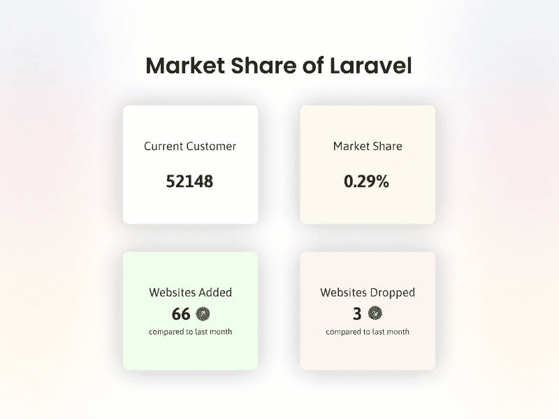
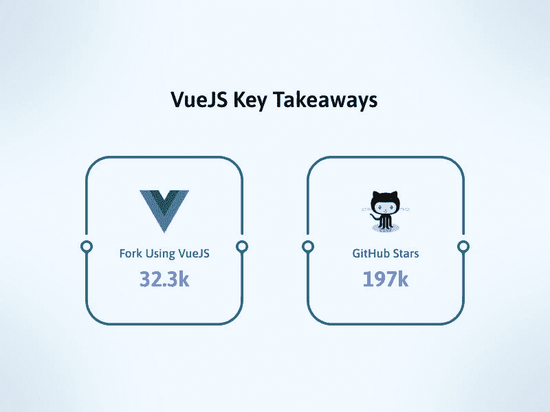

# 为什么 Laravel 和 VueJS 是全栈开发的完美组合？

> 原文：<https://medium.com/javarevisited/why-laravel-and-vuejs-make-a-perfect-combination-for-full-stack-development-bea8d1fd6c3f?source=collection_archive---------0----------------------->

为什么 Laravel 和 VueJS 是全栈开发的完美组合？

[Laravel](/javarevisited/7-best-laravel-online-courses-for-beginners-and-php-developers-61deac95f6b4) 和 [VueJS](/javarevisited/top-5-online-courses-to-learn-vue-js-in-2021-249e66b60646) 是创建全栈应用的强大而方便的框架。由于其灵活性和效率，这两种方法在创业公司、小企业和大企业中越来越受欢迎。

有许多方法可以用这两种框架创建全栈应用程序，但是让我们来看看使这种组合如此有用和广泛使用的一些重要好处。所以没有更多的延迟，我们开始吧:

我们将在这篇博客中探讨这些话题:

*   什么是 Laravel？
*   拉勒维尔简史
*   VueJS 是什么？
*   VueJS 简史
*   为什么 Laravel + VueJS 是全栈开发的绝佳组合
*   包扎

所以让我们开始吧！

# 什么是 Laravel？

Laravel 是一个免费的开源 PHP web 框架。它非常适合创建动态网站，有许多功能支持开发人员在他们的应用程序中打造出色的用户体验。

它包含的一个特性是雄辩的 ORM，通过提供自动绑定到底层数据库表的模型对象，简化了 PHP 开发人员的数据库访问。Laravel 的引擎盖下有更多的东西；它具有高度的可扩展性，可以成为您计划构建的任何 web 应用程序的坚实基础。

*   ***2022 年，全球超过*** [***37745 家企业***](https://www.slintel.com/tech/programming-framework/laravel-market-share) ***已经利用 Laravel 作为编程框架工具。***

*   ***719、739*** [***活跃网站正在利用 Laravel***](https://trends.builtwith.com/framework/Laravel)***；此外，历史上有 817，753 个网站使用过它。***

**Laravel 的主要特性**

**- MVC 支持:** Laravel 支持 MVC 模式，为大型应用开发提供了优秀的基础。

**-雄辩的 ORM:** 如前所述，Laravel 的 ORM 使得开发人员访问数据库更加简单。

**- Blade 模板:** Blade 是一个强大的模板引擎，允许你编写简洁而富有表现力的代码。

**- Artisan CLI:** Laravel 有一个名为 Artisan 的内置命令行界面(CLI)，它为管理您的应用程序提供了许多有用的命令。

**-路线模型绑定:**该功能帮助您将路线绑定到模型，使从数据库中检索数据变得更加容易。

Laravel 还有其他突出的特性，比如单元测试支持、本地化等等。

您在使用 Laravel 核心功能时遇到问题了吗？联系 [**最好的 laravel 开发公司**](https://www.valuecoders.com/top-laravel-development-services-company-india?utm_source=laravel_dev&utm_medium=Guest_blog&utm_id=NKY)****聘请印度的 laravel 开发人员**。它将帮助您获得一位专家来协助您全面使用 Laravel。**

# **拉勒维尔简史**

**Taylor Otwell 在 2011 年 6 月发布了 Laravel 的第一个稳定版本。他在 Jeffrey Way 关于 Laracasts 的优秀文档的支持下，使用 CodeIgniter 构建了它，该文档已经发展成为学习 PHP 的巨大资源库，尤其是在与 Laravel 一起使用时。**

**2014 年 11 月，有消息称泰勒将开源他的工作，并创建 Laravel 基金会来帮助维持这个开源项目。他还把它的许可证从 MIT 改成了 BSD——让用户可以更自由地修改它(并从他们的修改中获利)。**

**此外，泰勒宣布计划为寻找 Laravel proper 中未包含的附加功能的大型公司创建一个名为 Laravel Enterprise 的商业版本。**

*****必读:*** [***为什么 Laravel 是 2022 年最好的 PHP 框架？***](https://www.valuecoders.com/blog/technology-and-apps/laravel-best-php-framework-2017/?utm_source=larave_blog&utm_medium=Guest_blog&utm_id=NKY)**

# **VueJS 是什么？**

**VueJS 是一个用于构建用户界面的渐进式框架。它被从头设计为可增量采用，这意味着您可以轻松地在现有项目中使用它，而无需大量重写。**

**[Vue](https://www.java67.com/2020/07/5-free-courses-to-learn-vuejs-in-2020.html) 基于虚拟 DOM 实现，以最小的资源占用实现了令人难以置信的速度。Vue 与其他库或框架无缝集成，如 [React](https://javinpaul.medium.com/top-5-courses-to-learn-react-js-in-2019-best-of-lot-fa02cd96cdf0) 、 [Angular](/javarevisited/is-full-stack-web-development-with-angular-specialization-on-coursera-worth-it-review-e1077792f6af) ，甚至 jQuery。也很好学，用起来简单！**

*   **[***2，014，826 个活跃网站***](https://trends.builtwith.com/javascript/Vue) ***正在使用 VueJS，另外还有 1，476，314 个历史上使用过 vue js 的网站。*****
*   *****VueJS 在 Github 上拿到了*** [***197k 颗星星***](https://github.com/vuejs/vue) ***。*****

****

****VueJS 主要特性****

****-虚拟 DOM:** VueJS 使用虚拟 DOM 来更快地渲染和重新渲染你的应用。**

****-增量采用:**您可以在现有项目中开始使用 VueJS，而无需重写代码。**

****-与其他库或框架的集成:** VueJS 与其他库或框架配合得很好，可以很容易地集成到您现有的开发工作流中。**

****-双向绑定:** VueJS 提供双向绑定，使您的数据在前端和后端之间保持同步变得更加容易。**

**VueJS 还提供了许多其他特性，比如服务器端渲染、组件缓存、动画和过渡等等。为了高效地使用 VueJS 的特性和功能， [**雇佣 VueJS 开发人员**](https://www.valuecoders.com/hire-developers/hire-vuejs-developers?utm_source=hire_vue&utm_medium=Guest_blog&utm_id=NKY) 在最好的 **VueJS 开发公司**工作。**

*****也读:***[***vue js 开发公司 2022 年 20 强***](https://www.valuecoders.com/blog/technology-and-apps/top-10-vuejs-development-companies/)**

# **VueJS 简史**

**早在 2013 年，谷歌的开发团队希望创建一个 JavaScript 框架，以改进他们认为 Angular 的 shortcomings‌.我们的目标是创建一个比 Angular 更轻量级和简单的东西，同时保持它的所有功能。**

**他们最终构建了一个名为 Vue 的新框架，该框架在 GitHub 上作为开源项目发布，获得了麻省理工学院的许可，并附有完整的文档，因此迅速流行起来。**

**自最初发布以来，Vue 一直在不断发展，创建了一个丰富的插件或组件库，您可以轻松地将这些插件或组件集成到您的网站或来自 Bitovi & Auth0 等知名提供商的应用程序中。你可以在他们的官方包管理器——Nuxtjs 上找到这些包。**

*****你可能会觉得有意思:***[***Angular vs . React vs . Vue:哪个适合你？***](https://www.valuecoders.com/blog/technology-and-apps/vue-js-angularjs-reactjs-updates-2017/?utm_source=vue_rea_ang&utm_medium=Guest_blog&utm_id=NKY)**

# **为什么 Laravel + VueJS 是全栈开发的绝佳组合**

**通过使用 Laravel 和 VueJS 的组合，你可以使[全栈开发](/javarevisited/top-10-online-courses-to-become-a-fullstack-web-developer-in-2020-d608a6b63232)过程变得更加容易。也可以在开发全栈 app 的同时发现问题；既然如此，你 [**雇佣全栈开发者**](https://www.valuecoders.com/hire-developers/hire-full-stack-developers?utm_source=hire_full&utm_medium=Guest_blog&utm_id=NKY) 。他们会帮助你从零开始形成全栈软件。**

**让我们来看看‌look 在一些‌reasons ‌Laravel 和 VueJS 作为一对在全栈开发中合作得如此之好:**

## **1.反应式事件驱动应用**

**在反应式应用程序中，事件在发生时被推送到组件，而不是等待来自用户界面的轮询或请求。它允许您创建响应速度更快的应用程序，而不需要应用程序组件进行持续的数据轮询。**

**VueJS 是一个优秀的框架，它使用单文件组件方法来构建反应式应用程序，这使得将您的代码组织成可重用的小功能块在整个应用程序中使用变得容易。**

**Laravel 是围绕事件驱动编程构建的，这使得创建模块化代码变得容易，当应用程序中发生事件时，这些代码可以有效地响应。这两个框架使得构建反应式应用程序比以往任何时候都更容易！**

## **2.单页应用程序**

**单页应用程序(SPA)是加载单个 HTML 页面并根据需要动态更新该页面的应用程序，无需完全刷新浏览器窗口。**

**spa 比传统网站更加用户友好，因为它们允许用户像使用原生移动应用程序一样与你的应用程序进行交互。不过，它们也需要服务器端代码来处理所有这些动态请求，以便正常工作。**

**同时使用 Laravel 和 VueJS 可以很容易地构建功能强大的 spa，可以在任何设备上快速加载并高效运行！这两种框架都使用 JavaScript 作为主要语言，如果您已经熟悉其中一种或两种语言，那么学习起来会很容易。**

**通过 Laravel 和 VueJS 的协同工作，您的应用程序可以快速启动并运行，而且看起来非常棒。！**

## **3.应用程序安全性**

**Laravel 的构建考虑到了应用程序的安全性，这意味着它有几个内置功能，使您的应用程序更加安全。这些包括 CSRF 保护，密码哈希，输入验证，等等！**

**[安全性](https://javarevisited.blogspot.com/2020/03/top-5-courses-to-learn-cyber-security.html)是许多企业的重中之重，所以很高兴知道您可以在 Laravel 上构建应用程序，而不用从第一天起就担心这些事情！Laravel 关注开箱即用的安全性，使得构建安全的应用程序变得更加容易。**

**VueJS 具有内置功能，默认情况下有助于使您的应用程序更加安全——包括其模板编译器(具有自动 HTML 转义)和默认情况下的严格模式。**

**这些功能共同确保您的应用程序尽可能安全，而不必担心它！虽然这两个框架都很好地简化了安全性，但是毫无疑问，一起使用它们比单独使用更容易。**

## **4.灵活的数据库访问**

**Laravel 和 VueJS 都允许您从代码中轻松地访问数据库，这意味着您可以快速构建 web 应用程序，而无需了解数据库如何工作或如何将它们连接到您的代码的专业知识。**

**无论您想要简单的 CRUD 功能还是需要复杂的查询，这两个框架都让您开箱即可轻松访问。凭借其对关系数据库的支持，如 [MySQL](/@javinpaul/top-5-courses-to-learn-mysql-in-2020-4ffada70656f) 和 [PostgreSQL](/javarevisited/7-best-free-postgresql-courses-for-beginners-to-learn-in-2021-3bf369d73794) ，以及 [NoSQL](/javarevisited/5-best-nosql-database-programmers-and-developers-can-learn-42a0bdfa9a12) 选项，如 [MongoDB](/javarevisited/5-best-mongodb-courses-to-learn-nosql-for-beginners-in-2020-42df5af5496c) 、 [CouchDB](https://javarevisited.blogspot.com/2021/12/top-5-courses-to-learn-couchdb-for.html) 、 [Redis](https://javarevisited.blogspot.com/2022/02/top-5-courses-to-learn-redis.html) 等。，Laravel 为您提供入门所需的一切；有了数据库，编程在任何时候都没有！**

**它还内置了对迁移的支持，以跟踪数据库 schema‌.的变化这使得维护一个干净、有组织的数据库变得容易，而不需要从头开始编写大量代码！**

## **5.无服务器部署**

**无服务器部署是一种部署应用程序的新方法，它消除了将应用程序部署到服务器的许多麻烦。通过无服务器部署，您可以部署您的应用程序，而无需担心设置或维护服务器来托管它——您只需上传您的代码，并让云提供商如 [Amazon Web Services](/javarevisited/5-best-free-online-courses-for-aws-certification-exams-preparation-51af06c258e9) (AWS)处理其他一切！**

**这使得快速部署应用变得容易，因为您不需要现场服务器管理员或 [DevOps](/javarevisited/13-best-courses-to-learn-devops-for-senior-developers-in-2020-a2997ff7c33c) 团队来开始。它还通过消除与整天运行服务器相关的不必要成本来帮助您节省资金，以便您的应用程序可以在线！**

**虽然这两种框架都使应用程序的部署变得容易，但是将它们结合使用可以让您在部署应用程序时利用它们的优势。借助 Laravel 对 [AWS Lambda 函数](/javarevisited/7-best-serverless-and-aws-lambda-courses-to-learn-in-2021-de1820111c85)的内置支持以及与 Heroku 和 Digital Ocean 等其他服务的开箱即用能力，部署新应用程序比以往任何时候都更容易！**

**该框架为您提供了开箱即用所需的一切，因此入门既快速又轻松——然后让您专注于构建优秀的应用程序，而不是‌configuring 服务器。**

## **6.数据库迁移**

**在构建 web 应用程序时，您经常需要使用数据库来存储数据。作为开发人员，您的关键任务之一是确保您的数据库模式始终保持最新。**

**这可能是一个复杂的过程，因为它需要手动跟踪更改并相应地更新您的数据库——如果您犯了任何错误，它们可能会导致许多问题！**

**为了帮助防止这些问题的发生，许多开发人员选择使用数据库迁移工具，如 Flyway 或 Sequel Pro。这些工具允许您编写脚本，在任何需要的时候自动更新您的数据库，因此以后更新时不会出错。**

**有了 Laravel 和 VueJS 对迁移的支持，您可以使用这些工具来帮助您的数据库模式始终保持最新。这使得添加新功能或更改现有功能变得容易，而不用担心出错！**

**还可阅读:[**Laravel 综合指南:著名 PHP 框架**](https://www.valuecoders.com/blog/technology-and-apps/laravel-open-source-php-framework/?utm_source=lavael_guide&utm_medium=Guest_blog&utm_id=NKY)**

# **包扎**

**因此，如果你已经考虑过在你的项目中使用一个单一的框架，‌use 的 Laravel 和 Vuejs 组合。它们相互补充以提供丰富的特性集，并且所有这些都可以以易于使用的方式实现。**

**这两种技术的优势使得设计全栈软件更加容易，为用户提供直观的体验，而不必担心不同框架或工具之间的兼容性问题。**

**为了在全栈开发中高效充分地利用 Laravel 和 VueJS，可以 [**从印度最好的全栈 app 开发公司雇佣专门的开发团队**](https://www.valuecoders.com/dedicated-development-teams?utm_source=dedi_dev_team&utm_medium=Guest_blog&utm_id=NKY) 。它将帮助您以合理的成本开发高质量的端到端解决方案。**