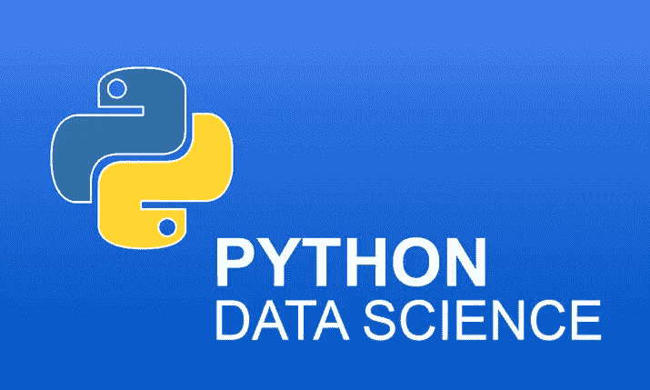
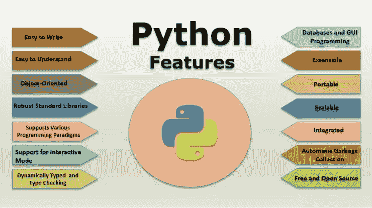

# 为什么 Python 编程语言在数据科学中很重要？

> 原文：<https://medium.com/javarevisited/why-python-programming-language-is-important-in-data-science-beb4a7f91f75?source=collection_archive---------1----------------------->

# 用于数据科学的 Python

在开始学习数据科学之前，有一个问题会让一个有抱负的数据科学家想到“**数据科学家使用的最广为人知的语言是什么？”。**数据科学家使用的编程语言有很多，比如 [Python](https://hackernoon.com/top-5-courses-to-learn-python-in-2018-best-of-lot-26644a99e7ec) 、 [R](https://hackernoon.com/5-free-r-programming-courses-for-data-scientists-and-ml-programmers-5732cb9e10?source=extreme_sidebar---------0-2--------------------) 、 [C++](/javarevisited/top-10-courses-to-learn-c-for-beginners-best-and-free-4afc262a544e) 。但是 Python 在其中占有独特的地位。

Python 是一种面向对象、开源、适应性强且简单易学的编程语言。它有丰富的库和工具，使数据科学家的任务变得简单。

此外，Python 有一个巨大的社区基础，工程师和数据科学家可以在这里征求他们的查询并回答其他人的问题。数据科学即服务使用 Python 已经有一段时间了，它将继续成为数据科学家和开发人员的首选。

[***关于 Python 编程你需要知道的一切！***](https://techvidvan.com/tutorials/python-tutorial/)

## **Python 编程语言:概述**

Python 在 80 年代后期就已经出现了，并且从那时起已经从团结发展到质量。今天，这种重要的编程语言被用于软件开发、移动应用程序开发、web 开发以及数字和科学数据的检查和注册。

你会惊讶地发现，主要的在线平台，例如，**谷歌、Dropbox、Instagram、YouTube、**和**Spotify**——都是用 Python 开发的。

Python 最初用于自动化冗余任务、原型化应用程序以及这些应用程序在不同语言中的使用。由于简洁明了的代码和广泛的文档，它相对更容易学习和理解。比 Python 更有趣的是，它还可以用于商业和广告等非技术领域，帮助专家进行数据分析。

# **Python 的特性**

Python 的一部分重要亮点是:

**1。Python 是一种渐进式语言，所以变量是自动定义的。**

**2。与其他编程语言相比，Python 可读性更强，并且使用更少的代码来完成类似的任务。**

**3。** Python 是专门定型的。这样，开发人员需要手动转换类型。

**4。** Python 是一种解释型语言。这意味着程序不需要编译。

**5。** Python 灵活方便，可以有效运行在任何平台上。它适应性强，可以与其他第三方软件有效集成。

</better-programming/top-5-courses-to-learn-python-in-2018-best-of-lot-26644a99e7ec>  

## **Python 的重要性:**

数据科学咨询组织正在授权他们的开发人员和数据科学家将 Python 作为一种编程语言来使用。在极短的时间内，Python 已经成为众所周知和最重要的编程语言。

数据科学家需要管理大量被称为大数据的数据。凭借简单的使用和大量的 python 库，Python 已经成为处理大数据的流行选择。

## 让我们详细讨论一下 Python 在数据科学中的重要性:

## **使用方便**:

Python 简单易用，学习曲线很快。新的数据科学家可以很容易地学习 Python，因为它的语法简单，易于理解。Python 还提供了许多数据挖掘工具，有助于更好地处理数据。比如 Rapid Miner，Weka，Orange，等等。

Python 对数据科学家来说很重要，因为它有许多有用且易于使用的库，如 Pandas、Numpy、Scipy、Tensorflow 等等。

[***熟练的 Python 程序员必须熟知的概念***](https://dev.to/anujgupta/9-concepts-of-python-that-you-cannot-afford-to-miss-4ncj)

## **Python 灵活:**

Python 不仅能让你创建软件，还能让你处理数字和逻辑数据的分析、计算和 web 开发。

事实上，Python 在 web 上变得无处不在，控制着各种具有 Web 开发框架的著名网站，如 TurboGears、Django 和 Tornado。

它非常适合有应用程序和 web 开发天赋的开发人员。毫不奇怪，大多数数据科学家都倾向于这种方式，而不是市场上现有的下一种编程方式。

<https://dev.to/javinpaul/top-5-places-to-learn-python-programming-for-free-m4c>  

## **Python 构建了更好的分析工具:**

数据分析是数据科学的必要组成部分。数据分析工具提供关于不同框架的信息，这些信息对于评估任何企业的绩效都很重要。Python 编程语言是构建数据分析工具的最佳选择。

Python 可以轻松地提供更好的知识，从大数据集中获取示例和关联数据。Python 在自助服务分析中也非常重要。Python 同样帮助数据挖掘组织更有可能为了他们的利益处理数据。

## **Python 对深度学习意义重大:**

Python 有很多包，如 Tensorflow、Keras 和 Theano，它们正在协助数据科学家开发深度学习算法。Python 在深度学习算法方面给予了优越的帮助。

深度学习算法的灵感来自于人脑架构。它设法建立人工神经网络，重现人类思维的行为。深度学习神经网络对不同的输入参数进行加权和偏置，并给出期望的输出。

<https://dev.to/javinpaul/11-best-resources-to-learn-data-science-and-machine-learning-in-2020-2od>  

## **庞大的社区基础:**

Python 有一个庞大的工程师和数据科学家社区，如 Python.org、Fullstackpython.com、realpython.com 等。Python 开发者可以向社区传达他们的问题和想法。Python 包索引是探索 Python 编程语言不同天际线的绝佳场所。Python 开发人员不断对语言进行改进，帮助它随着时间的推移变得更好。

## 尾注:

数据科学中的 Python 使数据科学家能够在更短的时间内完成更多的工作。Python 是一种适应性很强的编程语言，可以被有效地理解，而且非常令人惊奇。

Python 适应性很强，可以在任何环境下有效工作。此外，只需稍加修改，它就可以在任何操作系统上运行，并且可以与其他编程语言集成。这些品质决定了 Python 是开发人员和数据科学家的首选。

你可能喜欢的其他 **Python 编程书籍和课程**

*   [2020 年学习 Python 的 10 个理由](https://javarevisited.blogspot.com/2018/05/10-reasons-to-learn-python-programming.html)
*   [初学者学习 Python 的 5 大课程](https://javarevisited.blogspot.com/2018/03/top-5-courses-to-learn-python-in-2018.html)
*   [2020 年学习 Python 编程的前 5 本书](https://javarevisited.blogspot.com/2019/07/top-5-books-to-learn-python-in-2019.html#axzz6CF1B6UO6)
*   [学习数据科学和机器学习的 10 门课程](https://dev.to/javinpaul/10-data-science-and-machine-learning-courses-for-programmers-looking-to-switch-career-57kd)
*   [Python 和 JavaScript——从哪个开始比较好？](https://javarevisited.blogspot.com/2019/05/python-vs-javascript-which-programming-language-beginners-should-learn.html)
*   [深入学习 Python 的 10 门免费在线课程](https://javarevisited.blogspot.com/2018/12/10-free-python-courses-for-programmers.html)
*   [5 Python 中的数据科学与机器学习课程](https://javarevisited.blogspot.com/2018/03/top-5-data-science-and-machine-learning-online-courses-to-learn-online.html)
*   [面向程序员的 10 门 Python 课程和认证](/better-programming/top-5-courses-to-learn-python-in-2018-best-of-lot-26644a99e7ec)
*   [学习 Python 的十大免费教程](https://dev.to/javinpaul/top-5-places-to-learn-python-programming-for-free-m4c)
*   [学习数据科学的五大 Python 书籍](https://javarevisited.blogspot.com/2019/08/top-5-python-books-for-data-science-and-machine-learning.html)
*   [Python vs . Java——初学者应该学习哪种编程语言？](https://javarevisited.blogspot.com/2018/06/java-vs-python-which-programming-language-to-learn-first.html)
*   [面向程序员的 10 本免费 Python 编程书籍](http://www.java67.com/2017/05/top-7-free-python-programming-books-pdf-online-download.html)

<https://javarevisited.blogspot.com/2020/02/10-best-coursera-courses--for-python.html> 