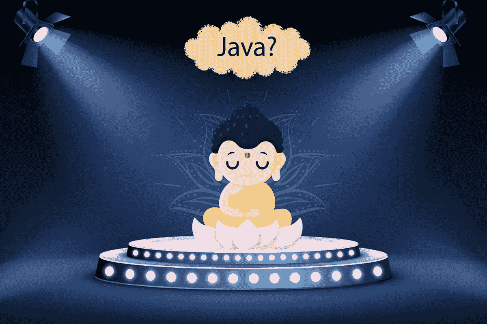
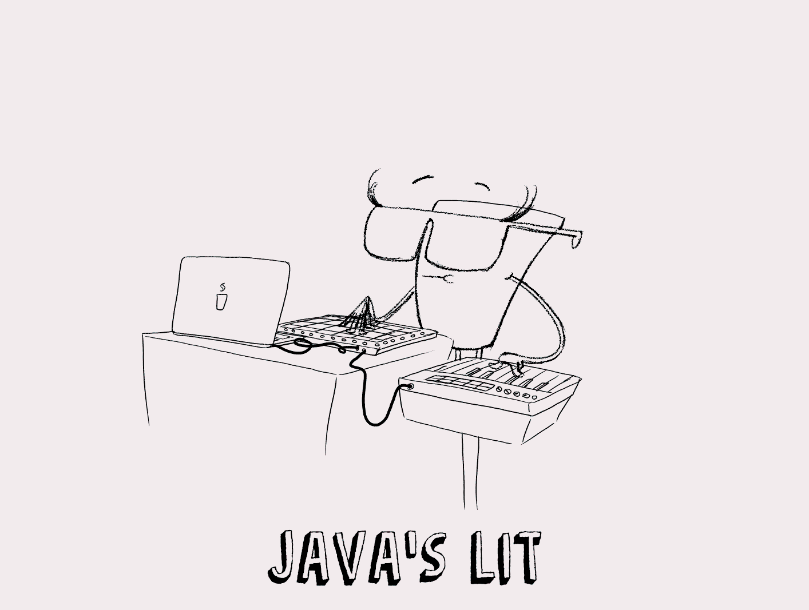
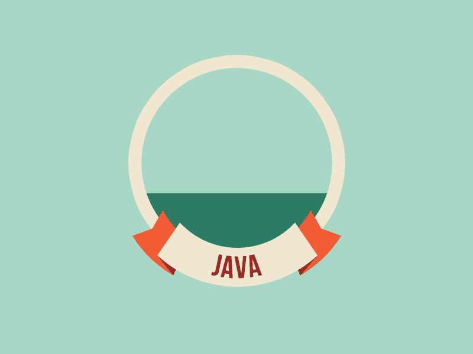

# Python 时代我为什么要选择 Java？

> 原文：<https://medium.com/javarevisited/why-should-i-learn-java-in-the-era-of-python-42a752f19978?source=collection_archive---------0----------------------->

## 学习 Java 仍然值得的原因

> “Java 不是独立于平台的；它是一个平台。”

# 介绍

不可否认，过去几年是 Python 的时代。Python 这些年的统治地位不需要任何认可。如今，编程爱好者对学习 Python 非常着迷。

尽管 Java 曾经在程序员中有过同样的狂热，相信我，它仍然有一些优势要向 it 界证明。
***这可能是 Python 的时代，但 Java 一点也没有失去它的价值。***



我们经常发现自己处于一个两难的境地，即哪种编程语言将证明自己是持久的，并将在许多方面塑造我们的职业生涯。

## [Java 为什么这么受欢迎？](https://techvidvan.com/tutorials/applications-of-java/)

作为一名程序员，一个人可能会寻求快速的进步，而选择最好的编程语言是你开始的基础。即使你试图找到最好的编程语言，首先，你会发现许多不同的选择。

至少有六种最流行的编程语言，它们的排名随着时间不断变化。因此，我们不能说任何一种语言是最好的语言，因为它们都有不同的用途。如果你需要更多关于 Java 流行的原因，你可以看看这篇文章 [**为什么 Java 是最好的编程语言**](https://javarevisited.blogspot.com/2018/07/10-reasons-to-learn-java-programming.html) **对于初学者和有经验的人都一样**

[](https://dev.to/javinpaul/why-java-is-the-best-programming-language-to-learn-coding-for-beginners-n89) [## 为什么 Java 是初学者学习编码的最佳编程语言？

### 披露:这个帖子包括附属链接；如果您从…购买产品或服务，我可能会收到报酬

开发到](https://dev.to/javinpaul/why-java-is-the-best-programming-language-to-learn-coding-for-beginners-n89) 

# 最大的战役

在这里，您面临着在 Java 和 Python 之间犹豫不决的局面。这可能是编程爱好者最近遇到的最常见的困惑。

我会支持你的。我会让你意识到为什么守旧派仍然很酷。

根据 2020 年 2 月的 **TIOBE** 指数， [**Java**](/javarevisited/top-5-java-online-courses-for-beginners-best-of-lot-1e1e240a758?source=---------14------------------) 稳坐最受欢迎搜索引擎搜索次数第一的位置。

而 **Python** 语言位居第三。

[](https://dev.to/javinpaul/python-or-java-which-is-better-to-learn-to-code-3pj9) [## Python 还是 Java？学编码哪个好？

### 学习编码是一项重要的技能，越来越多的人正在学习编程和 web 开发。是不是…

开发到](https://dev.to/javinpaul/python-or-java-which-is-better-to-learn-to-code-3pj9) 

# 为什么选择 JAVA 而不是 PYTHON？

Java 和 Python 非常相似，是 IT 行业中两个最热门的话题。



## **Java 比 Python 快**

Python 相对较慢，因为它是解释型语言。因为它有一个非常简单的逻辑，但是你一半的时间会花在优化运行时错误上。

## **在 Java 中多线程是可能的**

Java 也支持真正的多线程，而 Python 的线程是虚拟的。它的 JVM 相当可靠。Python 受到 GIL(全局解释器锁)的限制，这不会使它在多线程中出错。

[***知类 Java***](https://techvidvan.com/tutorials/java-class/)

## **Java 是真正的 WORA(编写一次，随处运行)**

用 Java 编译的代码无需重新编译就可以在任何机器上运行，这使得它比 Python 更具可移植性。

## **Java 比 Python 更安全更强大**

Java 是一种更安全的语言，因为它是一种静态类型的语言。Python 是一种动态类型语言，这使得它不安全。Java 比 Python 更明确、更严格，这使得它比 Python 更强大。

## **Java 有一套丰富的 API**

Java 有一个更丰富、更健壮的库和工具生态系统。它丰富的 API 集有助于扩展关于 Java 语言的知识。Python 的主要部分是由脚本小子编写的。

## Java 是非常挑剔的

这不仅对初学者来说是一个很好的品质，对 Java 的经验丰富者和资深者来说也是一样的。程序员通常会犯一些愚蠢的错误，而 Java 非常擅长指出这些错误。像 Python 这样的语言只会将这样的错误作为警告传递，而不会给出编译错误。

## **Java 是一种“常青树编程语言”**

Java 是一种常青树编程语言，在大多数组织中都在使用。Python 不是大多数应用程序的主要语言。

## **Python 太容易了**

有句谚语说，你应该尽可能把事情简单化。Python 因为把事情做得太简单而深受其害。在 Python 中，在不指定变量类型的情况下给变量赋值。在 Java 中，为了初始化一个变量，你必须指定它的类型。

## [**与 Python 亲密接触**](https://sites.google.com/view/learn-python-data-science/home)

**例如 Java 中的**、**，用于声明一个变量**

```
**dataType name = value;**
```

****在 Python** 中，你只需要写**

```
**name = value**
```

**这看起来更好，因为您不需要指定类型，但在实践中会导致许多问题。任何人都可以轻易地覆盖现有的变量，或者意外地创建一个新的变量。所以在 Java 里，如果你做一个类型，写**dog = 5；**它会给出一个错误(未知变量)，而 Python 只会创建一个名为 **dog 的新变量。****

****Python 更容易写，而 Java 更容易读！！****

**下面是在 **Java** 中打印" **Hello World** 的样子:**

```
class MyClass{
      public static void main(String[ ] args) { System.out.println(“Hello World!”); }}
```

**在 **Python** 中也是如此:**

```
def main(): print(“Hello world!”)main()
```

**如果你想学习 Java，你可以看看这些课程:**

**[](/javarevisited/top-5-java-online-courses-for-beginners-best-of-lot-1e1e240a758) [## 面向初学者的 10 大 Java 在线课程

### 如果你是计算机科学专业的毕业生，或者想学习 Java 并且正在寻找一些很棒的资源，比如…

medium.com](/javarevisited/top-5-java-online-courses-for-beginners-best-of-lot-1e1e240a758) 

# 还是没印象？

[](https://javarevisited.blogspot.com/2018/05/top-5-java-courses-for-beginners-to-learn-online.html)

您无法回避这些关于 Java 的有趣事实:

*   大约 95%的企业使用 Java 作为他们的主要语言。这个比例比 C 和其他语言要多得多。
*   Java 在一年内被下载了十亿次。
*   一名 Java 开发人员的平均工资是 83975 美元。
*   今天，Java 合理地运行在超过 10 亿个 Android 应用程序上，因为谷歌的 Android 操作系统使用 Java API(T21)。

# 用 Java 保护您的职业生涯

当你熟悉了 JVM(Java 虚拟机)之后，你就可以很容易地使用与其环境相似的其他语言。比如 Scala，Groovy，Kotlin，Clojure。不管怎样，Java 本身会一直鼓励你进步。

> 毫无疑问，Java 不是世界上最流行的编程语言。！

# 等等！！

## **Java 能做的更多**

> Java 是一个充满机会的海洋。

```
**if(**your goal is getting into AI or ML or Data Science)
then choose **Python****else**(for everything else)
then choose **JAVA**
```

**甲骨文**，作为受欢迎程度的衡量标准，引用统计数据告诉— ***“全世界有 900 万 Java 开发者。”*** 这句话完美地刻画了未来软件开发对 Java 的需求及其演变。

# 结束了！！

***2020 年为什么要学 Java？因为你可以利用面向安全的、灵活的、动态编程语言的所有好处。Java 一直是编程世界的领导者之一。*** Java 无处不在，预计在最近的时间里，它将在**物联网**和**大数据**发展中变得更加重要。

为任何设备构建应用和平台，如计算机、笔记本电脑、游戏控制台、导航系统、终端、监控设施等。，使得 ***Java 成为 Python 世界中最值得学习的编程语言。***

## [因为这份小抄是对所有技术发烧友的款待](https://docs.google.com/spreadsheets/d/1eNBLcKqCVN9zZQvfGUmm5bAzsETqB_ugVOlUtmvJGYU/edit#gid=910850616)** 

****学习 Java 和 Python 的推荐书籍和课程****

*   **[2020 年 Java 开发者路线图](https://javarevisited.blogspot.com/2019/10/the-java-developer-roadmap.html)**
*   **[2020 年 Java 程序员应该学会的 10 件事](https://javarevisited.blogspot.com/2017/12/10-things-java-programmers-should-learn.html#axzz5atl0BngO)**
*   **[2020 年学习 Python 的 10 门免费课程](https://javarevisited.blogspot.com/2018/12/10-free-python-courses-for-programmers.html)**
*   **[我最喜欢的深入学习 Java 的免费课程](/javarevisited/10-free-courses-to-learn-java-in-2019-22d1f33a3915)**
*   **[每个 Java 开发人员都应该阅读的 10 本书](https://javarevisited.blogspot.com/2018/06/10-all-time-great-books-for-java.html)**
*   **[从零开始学习 Python 的前 5 本书](https://javarevisited.blogspot.com/2019/07/top-5-books-to-learn-python-in-2019.html)**

**感谢您阅读本文。如果你喜欢这篇文章，那么请分享给你的朋友和同事。如果您有任何问题或反馈，请留言。**

**[](https://javarevisited.blogspot.com/2019/10/the-java-developer-roadmap.html#123) [## 2020 年 Java 开发者路线图

### 大家好，首先祝大家 2020 新年快乐。我已经分享了很多成为网络的路线图…

javarevisited.blogspot.com](https://javarevisited.blogspot.com/2019/10/the-java-developer-roadmap.html#123)**