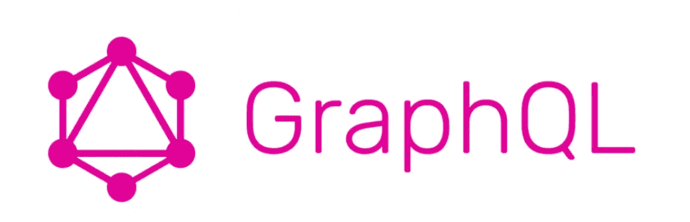
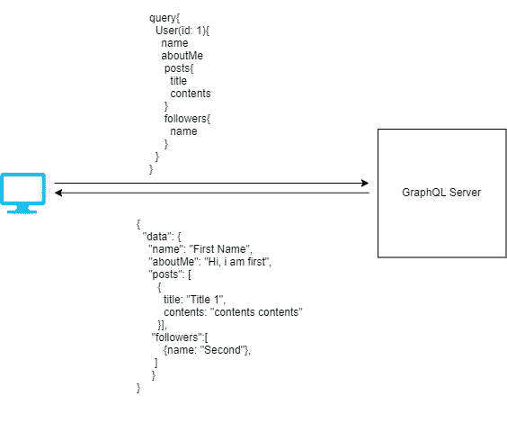

# 为什么您应该考虑将 Graphql 用于您的下一个微服务

> 原文：<https://medium.com/javarevisited/why-you-should-consider-graphql-for-your-next-microservice-1e1f689c43b6?source=collection_archive---------2----------------------->



当您使用微服务时，REST 是当前的首选架构。尽管如此，Rest 架构带来了一些固有的问题，可能会降低开发周期和整个应用程序的性能。脸书意识到 REST 架构的这些问题，作为解决方案，他创建了 GraphQL 架构。GraphQL 于 2015 年由脸书公开，自发布以来，它已被网飞、Shopify、Paypal 等其他巨头采用。

**什么是 GraphQL？**

根据 GraphQL 的官方文档，

> GraphQL 是一种 API 查询语言，也是一种用现有数据完成这些查询的运行时语言。GraphQL 为 API 中的数据提供了完整且易于理解的描述，使客户能够准确地要求他们需要的东西，使 API 更容易随时间发展，并支持强大的开发工具。

与定义混淆？最好首先理解为什么需要 GraphQL，而不是让上面的定义自动对你有意义。

假设你正在开发一个简单的博客网站，比如 Medium，你为每个作者设计的主页如下图所示。

[](https://javarevisited.blogspot.com/2019/05/top-5-courses-to-learn-graphql-in-2019.html#axzz6AGTrQ8NN)

图 1:作者主页

要填充作者主页上的信息，您需要调用下面的 Rest APIs

1.  */users/ < id >* :该 API 将检索作者姓名和作者简介部分。
2.  */users/<id>/posts*:该 API 将检索作者发布的帖子
3.  */users/<id>/followers*:这个 API 将检索我们用户的关注者。

我们已经发现了 [REST 架构](http://javarevisited.blogspot.sg/2015/08/difference-between-soap-and-restfull-webservice-java.html#axzz4qvs40Rha)的 1 个问题；如您所见，即使是填充 1 个页面，我们也要调用 3 个不同的 API，对于每个请求，我们都会有一些网络延迟。因此，应用程序的性能会受到影响。接下来，在调用 request 来获取用户信息之后，我们将从服务器获得如下响应:

```
{
  id: 1,
  name: "First Last",
  dateCreated: "01/01/2020",
  aboutMe: "Hi, I am First",
  dateOfBirth: "01/01/1990"
}
```

对 GetPosts API 的响应将是这样的:

```
{
 "posts":{[
   {
     id: 1
     title: "Title 1"
     contents: "contents cotens"
     claps: 2
     comments:[
          postedby:
          comment:"very infomative"
       ]
    },
   {
     id: 2
     title: "Title 2"
     contents: "contents contents"
     claps: 4
     comments:[
          postedby:
          comment:"very infomative"
       ]
    }, 
   }
]}}
```

对追随者获取列表 API 的响应如下:

```
[
  {
    id: 2,
    name: "First Last",
    dateCreated: "01/01/2020",
    aboutMe: "Hi, I am First",
    dateOfBirth: "01/01/1990"
  }
]
```

从上面的回复中，您可以发现另一个关于[REST API](/javarevisited/why-spring-is-the-best-framework-for-developing-rest-apis-in-java-784590e484a4)的问题，我们在回复中获得了比我们实际需要的更多的信息。这个问题也就是通常所说的过度抓取。在用户信息响应中，您可以看到我们只需要姓名和关于我，其余字段对我们没有用处。

同样，在文章 API 中，我们也只要求文章标题和内容，其余的字段都是浪费。我们正在以字段的形式下载额外的数据，我们甚至不打算使用。

如果您想知道**为什么我们不创建一个 Rest API，包含页面所需的所有字段，如用户信息、帖子和关注者，我们在技术上可以做到这一点**。尽管如此，我们永远不应该这样做，因为它将我们的前端和后端紧密耦合，如果前端有任何变化，它将需要后端的变化。

总而言之，到目前为止讨论的 Rest API 的问题有:

1)我们需要调用多个端点来收集所需的信息。

2) [Rest API](/javarevisited/top-5-books-to-learn-web-services-in-java-soap-rest-22d92adbefc1) 给出了比实际需要更多的数据，所有这些信息都需要由客户端下载。

现在让我们看看当我们的服务器支持 [graphQL 查询](/javarevisited/top-5-graphql-tutorials-and-courses-for-beginners-fb5543506fc2?source=---------75------------------)时，同样的情况将如何运行。

[](https://dev.to/javinpaul/5-best-courses-to-learn-graphql-in-2020-2fo5)

挺甜蜜的。我们设法在一个请求中做了同样的事情，为此我们调用了 3 个不同的 rest APIs，而且，作为响应，我们只得到必需的字段。这对你来说可能看起来很小，但是说我们的博客网站已经变得很受欢迎，数百万作者正试图访问他们的主页；在这种情况下，graphQL 的工作速度将明显快于 Rest。

现在，GraphQL 的早期定义对您有意义吗？我想现在已经很清楚了，GraphQL 客户端可以向服务器请求所需的确切信息，对吗？

**GraphQL 优于 Rest 的优势**
*1)避免过度提取和提取不足*:Rest API 最大的问题之一是过度提取和提取不足，使用 graph QL 很容易解决。正如我们在上面的例子中看到的，我们必须为 Rest 调用多个端点，因为我们无法从一个 Rest API 中获得所有信息，而且我们获得的数据也比我们需要的多。

2) *前端快速产品迭代:*假设未来我们需要在前端增加更多的数据；我们可以通过更改 GraphQL 查询轻松实现这一点。在使用 GraphQL 的情况下，我们最好永远不要改变端点。

更好的开发体验:如果你曾经测试过 Rest API，你知道为了创建 Rest API 文档，我们需要一些像 swagger 这样的工具，而 GraphQL 的文档是自动生成的。不像 [Rest](/javarevisited/21-spring-mvc-rest-interview-questions-answers-for-beginners-and-experienced-developers-21ad3d4c9b82) ，使用像 [postman](/javarevisited/7-best-courses-to-learn-postman-tool-for-web-service-and-api-testing-f225c138fa5a?source=---------13------------------) 这样的测试工具，你不知道对一个特定端点的请求会是什么样子；在 GraphQL 中，我们有[graph QL](https://github.com/graphql/graphiql)，它显示了带有您正在运行的请求的模式信息的文档，使开发人员的工作变得更加容易。

**结论** 本文只是对 GraphQL 的一个基本介绍。我们已经讨论了为什么 GraphQL 比 Rest 更好。这是否意味着 graphQL 将完全取代 Rest？任何事物都有它的优点和缺点，GraphQL 也有它的缺点，就像在 GraphQL 中实现缓存是困难的，并且它增加了应用程序的复杂性。目前，我们可以假设 Rest 和 GraphQL 都将存在，好消息是您也可以在同一个微服务中实现 GraphQL 和 Rest 端点。

页（page 的缩写）s:如果你对 SpaceX 感兴趣，他们已经公开了他们的 GraphQL API，从中你可以获得很多信息，比如他们最近的太空任务，他们火箭的规格，等等。您可以在这里查看 API [并将其作为一个平台来学习 GraphQL 查询是如何工作的。](https://api.spacex.land/graphql/)