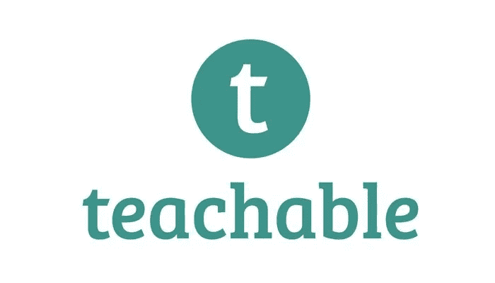
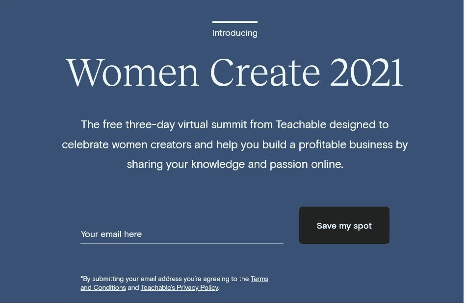

# 为什么每个开发者都应该在 2022 年创建在线课程

> 原文：<https://medium.com/javarevisited/why-you-should-create-an-online-course-in-2019-and-how-teachable-can-help-you-10cdceee9ca0?source=collection_archive---------1----------------------->

## 而且，如何教可以帮助你…

你有没有考虑过创建一个在线课程？

如果你有，现在是时候了！

> 研究表明，到 2025 年，在线教育行业将超过 3250 亿美元。

你知道这意味着什么吗？

作为你所选择的行业或利基市场的课程创造者，你有*巨大的* *机会*。

创建一个在线课程是我一直想做的事情，我也写了关于 [**为什么程序员应该创建一个在线课程**](https://javarevisited.blogspot.com/2019/06/why-programmers-should-create-and-sell.html) 的博客

 [## 为什么每个程序员或博客作者都应该在 2022 年创建在线课程

### 我经常收到类似这样的问题:程序员应该创造另一种收入来源，还是应该创造…

javarevisited.blogspot.com](https://javarevisited.blogspot.com/2019/06/why-programmers-should-create-and-sell.html) 

# 为什么每个博主或开发者都在 2022 年创建在线课程？

因为我知道通过一对多的商业模式，我有潜力产生更大的影响，帮助改变更多人的生活，而不是一对一的工作。

不仅如此，一旦我创建了我的课程，我就可以通过自动化销售和营销来利用我的时间，从而建立一个近乎被动的收入流。

如果你认为这听起来好得不像是真的，再想想吧！

每天早上，成千上万的课程创建者打开他们的收件箱，看到一夜之间课程销售的付款通知。

这些都是像你我一样的普通人，他们渴望激励、赋权并与世界各地的人们分享他们的知识。

你知道吗？

没有什么能阻止你追随他们的脚步。

如果你想了解更多关于创建和销售在线课程的信息，我强烈推荐你加入 Teachable 的 [**快速入门网上研讨会，这是从专家那里学习如何免费创建在线课程的最佳场所之一，他们也是 Teachable 上成功的课程创建者**](https://teachable.sjv.io/c/1193463/998807/12646)

此外，还有一个 [**女性创造 2022:一个可教的峰会**](https://teachable.sjv.io/c/1193463/1008095/12646) ，专门为授权、庆祝和促进女性领导的商业、创业和创造力而设立。

> 这是一个为期三天的免费活动，围绕如何在 2022 年及以后获得资金、心态、营销和更多权利举办研讨会和会议。

由排名第一的课程创作平台 [Teachable](https://teachable.sjv.io/c/1193463/998814/12646) 主办的 *Teachable Live* 是一个**免费的为期三天的在线会议**，面向那些希望提高收入和影响力的课程创作者。

自 2015 年以来， [Teachable](https://teachable.sjv.io/c/1193463/998814/12646) 一直在举办为期多天的虚拟会议，为像我们这样的课程创作者提供向世界上最成功的课程创作者学习的机会。

从 9 月 24 日到 26 日，你将有机会参加由行业领导者主持的 13 个高度可操作的虚拟培训课程，包括 [Marie Forleo](https://medium.com/u/83a288a851a?source=post_page-----10cdceee9ca0--------------------------------) 、 [Pat Flynn](https://medium.com/u/5a8c400169ef?source=post_page-----10cdceee9ca0--------------------------------) 、 [Chris Ducker](https://medium.com/u/7fea37274a34?source=post_page-----10cdceee9ca0--------------------------------) 、Sheri Salata、 [Nicole Walters](https://medium.com/u/88c8a8255911?source=post_page-----10cdceee9ca0--------------------------------) 等等。

在正常情况下，你需要投资 1000 多美元才能买到一张像这样阵容的为期三天的会议门票。

更不用说你可能需要在旅行、食物和住宿上花费数百美元。

或者这三天——加上旅行和恢复时间——你需要从你的孩子、家庭、工作、生意和日常生活中抽出来。

与“传统”会议不同， *Teachable Live* 是免费的，所有人都可以参加。

只要您有稳定的互联网连接，您就可以在自己舒适的家中参加现场直播，或者在您最想看到的事件发生时，无论您身在何处。

你甚至不需要换下你的睡衣，除非你想！

也就是说， [Teachable](https://teachable.sjv.io/c/1193463/998814/12646) 认识到你可能无法参加每一次现场会议——特别是如果你有 9-5 或现场会议，或者生活在不同的时区。

以下是参加 2022 年[女性创造峰会](https://teachable.sjv.io/c/1193463/1008095/12646)的链接

你不仅有机会从已经建立了数百万美元在线教育业务的课程创建者那里窃取一两个技巧…

但是当你出现在现场时，你也将有机会得到你的问题的答案！

在峰会结束时

*   如何选择最有利可图的课程主题，验证它，创建您的内容，并规划您的整个发布。
*   如何增加一个充满有兴趣的潜在学生的邮件列表？
*   启动在线课程业务时要避免的新手错误(以及应该做些什么！)
*   如何克服许多新的创造者和企业家遇到的精神障碍？
*   如何利用社交媒体扩大业务规模？
*   还有更多！

这种独一无二的活动一年才有一次(去年我错过了:-()，我等这个活动等了很久了。如果你也热衷于创建一个在线课程，我强烈建议你加入我的行列！

 [## 可教:创建和销售在线课程和辅导

### 利用企业家使用的最佳在线商业平台，创建和销售在线课程和辅导服务…

teachable.sjv.io](https://teachable.sjv.io/c/1193463/998814/12646)