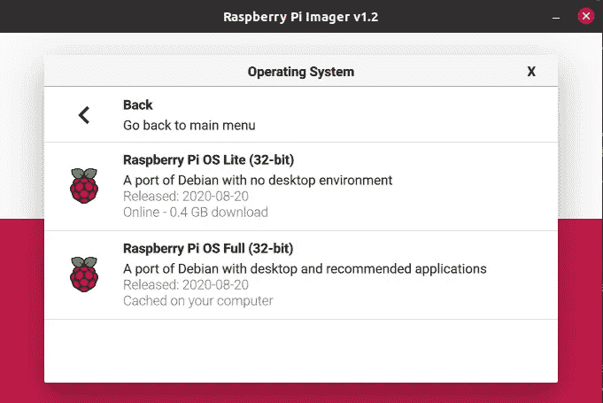
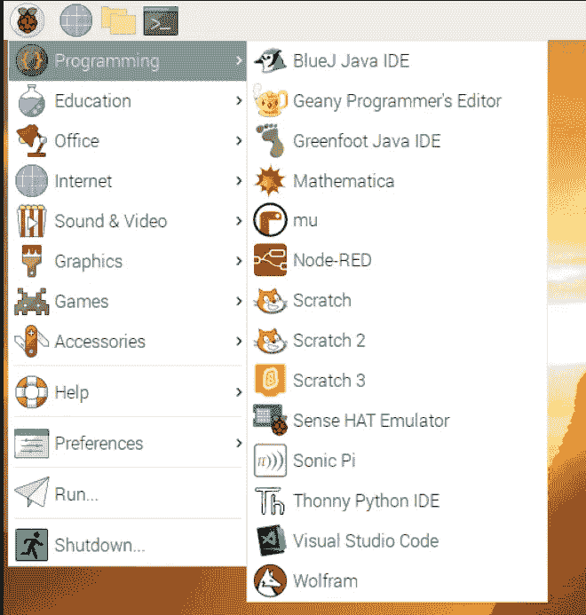
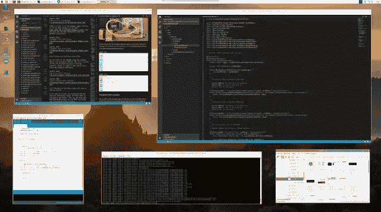

# 为什么你应该学习在树莓派上编程

> 原文：<https://medium.com/javarevisited/why-you-should-learn-to-program-on-the-raspberry-pi-da4a039bb02b?source=collection_archive---------1----------------------->

在这篇文章[“Java 与 Python——程序员应该首先学习哪种编程语言？”通过](https://javarevisited.blogspot.com/2018/06/java-vs-python-which-programming-language-to-learn-first.html)[贾文保罗](https://twitter.com/javinpaul)，你可以找到两种最流行的编程语言之间的比较。当然，作为一名 Java 开发人员，我更喜欢哪个并不神秘；-)

但是比语言更重要的是你正在使用的电脑！让我告诉你为什么我认为树莓派是完美的入门电脑…

Raspberry Pi 项目的目标是**制造一台所有人都买得起的廉价电脑**。如果你没有电脑屏幕，你可以将它连接到你的电视上，根据你的预算，有不同的版本可供选择。


如果你想快速入门，就买[“Raspberry Pi 4 桌面套件”(130€)](https://www.raspberrypi.org/products/raspberry-pi-4-desktop-kit/) 吧，里面包括板卡、电源、HDMI 线、机箱、预装操作系统的 microSD 卡。你只需要增加一个显示器或电视。

# 为什么要用树莓派？

## 价格

如果你已经有一个电源，电缆，和/或 microSD 卡，你可以从 40€起购买板本身。是的，事实上，这是一个小型主板上的完整 PC 的起始价格！

## 拉斯比安操作系统(完整版)

有不同的操作系统可用于 Raspberry Pi，但完美的起点是“Raspbian OS (full)”，它可以通过免费的[“Imager”工具](https://www.raspberrypi.org/downloads/)复制到 microSD 卡上。

[](https://www.youtube.com/watch?v=QVkSSeoW8QI)

当您使用此操作系统时，您从第一分钟就准备好开始工作，因为这些工具是预安装的:

[](https://www.youtube.com/watch?v=dzoMl8zJe_M&list=PL9dgg099E8S3PDWZGi1Q71gJJJGX1o-uw&index=2)

我自己只在这个列表中添加了“Visual Studio 代码”。该程序在 Raspbian OS 版本中无法通过官方网站获得，但请按照以下步骤通过终端安装:

```
$ cd /home/pi/ 
$ wget https://github.com/stevedesmond-ca/vscode-arm/releases/download/1.28.2/ vscode-1.28.2.deb 
$ sudo apt install ./vscode-1.28.2.deb
```

## 多种编程语言

做出你的选择: [Java](/javarevisited/10-books-java-developers-should-read-in-2020-e6222f25cc72) ， [Python](/javarevisited/8-projects-you-can-buil-to-learn-python-in-2020-251dd5350d56?source=---------10-----------------------) ， [JavaScript](/javarevisited/10-best-online-courses-to-learn-javascript-in-2020-af5ed0801645) ，…或者从基础做起。你们都可以在树莓派上运行和使用它。

正如你在上面的截图中看到的，有多种工具可以用于所有这些编程语言。

## GPIOs

当您查看 Raspberry Pi 板时，您会发现有 40 个引脚(2 排，每排 20 个)。那些是通用输入/输出。其中一些可以用作数字输入或输出引脚，这意味着 0 伏为关，3.3 伏为开。你能用它做的事情多得惊人！

这些 GPIOs 引脚甚至是树莓 Pi 如此成功的主要因素之一！正如我在与 Adam Bien (airhacks.fm) 的播客中所讨论的，你确实可以找到一台便宜的二手笔记本电脑，包括电池、屏幕等。但是你永远也不能像用[树莓派](https://www.java67.com/2020/06/top-5-course-to-learn-internet-of-things-IoT.html)那样简单地构建结合软硬件的实验。

在这篇关于 [Oracle Java Magazine](https://blogs.oracle.com/javamagazine/getting-started-with-javafx-on-raspberry-pi) 的长文中，您可以找到一个 Java 应用程序的详细步骤，该应用程序有一个用户界面来控制 led 并在图表上显示距离传感器的测量结果。

## 权力

最新的 Raspberry Pi 4 速度很快，有 2、4 或 8GB 内存可供选择。我写了一整本书，并在上面创建了许多不同的 Java 应用程序。你可以连接多达两个 4K 显示器，所以有很大的空间来拥有不同的应用程序，终端，文件浏览器等。已经有一个这样的 4K 屏幕是程序员的天堂！



# 《树莓派上的 Java 入门》一书

如果你想在 Raspberry Pi 上开始尝试 Java，我可以强烈推荐我的书[，这本书通过大量示例引导你完成入门的所有步骤](https://webtechie.be/books/)。

Leanpub 上有[电子书，Elektor](https://leanpub.com/gettingstartedwithjavaontheraspberrypi) 上有[纸质书。如果你想深入例子的来源，看看这个](https://www.elektor.com/getting-started-with-java-on-the-raspberry-pi) [GitHub 库](https://github.com/FDelporte/JavaOnRaspberryPi)。

如果你喜欢课程，Udemy 上还有一门课程— [在 Raspberry PI 上使用 Java 和 Java FX](https://www.youtube.com/redirect?q=https%3A%2F%2Fbit.ly%2F3jrtns3&event=video_description&v=dzoMl8zJe_M&redir_token=QUFFLUhqbkR4Mnh4bWdDaThkeXhKQmJrTlU0R3NBZ25BUXxBQ3Jtc0ttX0lEY3BHeDJSRFhfSWFMZE04T1FQNkZNaTUzb0VCRW1HcGt6SzRTbXo1blQyNjJBeEg0RWVMV1M0clRJdl9Jamk3ZUdQTW50NUR4NXhPVmpMVXMxSXVQSjVPaWpUVGl3NV80LXFnaXhlTmhjZUgwOA%3D%3D)来学习更多关于在 Java 中使用 Raspberry PI 的知识。

[](https://www.youtube.com/redirect?q=https%3A%2F%2Fbit.ly%2F3jrtns3&event=video_description&v=dzoMl8zJe_M&redir_token=QUFFLUhqbkR4Mnh4bWdDaThkeXhKQmJrTlU0R3NBZ25BUXxBQ3Jtc0ttX0lEY3BHeDJSRFhfSWFMZE04T1FQNkZNaTUzb0VCRW1HcGt6SzRTbXo1blQyNjJBeEg0RWVMV1M0clRJdl9Jamk3ZUdQTW50NUR4NXhPVmpMVXMxSXVQSjVPaWpUVGl3NV80LXFnaXhlTmhjZUgwOA%3D%3D)

*原载于*[*https://web techie . be*](https://webtechie.be/post/2020-09-07-learn-programming-on-raspberry-pi/)*。*