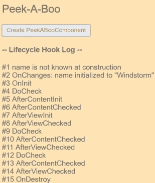

# 为什么不应该在 Angular HTML 中使用函数

> 原文：<https://medium.com/javarevisited/why-you-should-not-use-functions-in-angular-html-f445371a4b6b?source=collection_archive---------0----------------------->

Angular 最佳实践集

# 介绍

如果你在一个稍微复杂一点的项目中使用 Angular，你将——很有可能——开始编写组件函数来编辑或转换某种你想在组件中显示的数据。如果你不熟悉 Angular 的方法，你可以使用你在 HTML 文件中写的函数，你会发现它很有效！。所以一切都很好，不是吗？

不幸的是，不尽然。在本教程中，您将了解为什么这是一个非常糟糕的实践，以及如何以一种干净、可维护的方式解决这个问题。

# 先决条件

要理解为什么在 [HTML](/javarevisited/10-best-html-and-css-courses-for-beginners-in-2021-6757eec00032) 中调用函数是非常糟糕的，如果你过度使用它，会大大降低你的应用程序的速度，你需要了解有角度的[生命周期钩子](https://angular.io/guide/lifecycle-hooks)。

简而言之，这些是一堆函数，具体来说就是**15**函数，每次创建、编辑并最终销毁组件时都会执行这些函数，这是检测应用程序变化的角度方式。

> Angular 在每个 DOM 事件之后运行的[变化检测](https://angular.io/guide/glossary#change-detection)过程中寻找数据绑定值的变化:每次击键、鼠标移动、定时器滴答和服务器响应。

图 1 显示了从创建一个组件的第一步到销毁该组件所执行的所有生命周期挂钩。更多信息请参见[官方文件](https://angular.io/guide/lifecycle-hooks#peek-a-boo)。

图 1:躲猫猫日志

# 问题

因此，你可以想象一下，如果你有一个像样的应用程序，你以嵌套的方式组织你的组件，以利于代码的可重用性，你有一个组件下面有 10 个嵌套组件，你有一个函数在最少嵌套的组件中调用。对于任何 DOM 事件，这个函数将被调用大约 15 x 10 = **150 次**！

除了降低应用程序的速度之外，如果您在调用的这些函数中有任何逻辑，那么您就冒着破坏这种逻辑的风险，并且您在应用程序中引入了一个巨大的不可预测性来源。

那么，如何将函数调用的范围限制为仅当其输入发生变化时，而不是其他情况呢？

# **管道救援**

Angular 有一个很大的用途，叫做管道，你可以在这种情况下使用，请参考这里的[官方文件](https://angular.io/guide/pipes)。如果您熟悉 Linux 管道，那么几乎没有什么新东西需要学习。如果没有，那么继续阅读。

基本上，pipes 允许您对输入执行转换代码并返回结果，就像任何普通函数一样， ***但是，*** [Angular](/javarevisited/10-courses-to-learn-angular-for-web-development-6da1bd2856dc) 只在检测到输入值或引用的变化时才执行管道，而不是所有的生命周期挂钩。

因此，编写前面提到的代码片段的更好方法如下:

现在，您可以创建一个如下所示的管道:

这个重构步骤还将有助于提高整个应用程序的代码可重用性，因为您现在可以在应用程序中的任何地方使用这个管道，而不需要在需要使用的每个组件中编写转换逻辑，就像使用[普通 JS](/javarevisited/my-favorite-free-tutorials-and-courses-to-learn-javascript-8f4d0a71faf2) 函数一样。

管道通过`args`数组接受不确定数量的参数。您可以将任何其他参数传递给它，并稍后在`transfom` 函数中访问它们。

# 警告

请记住，管道的这种行为仅适用于原始输入值，如`String`或`Number`，或者一个对象引用。这意味着如果您将一个数组传递给管道，然后您通过添加/移除一个项目来更改[数组](/javarevisited/two-sum-coding-problem-how-to-find-all-pairs-which-adds-to-a-given-sum-in-an-array-in-java-a396be0f308d)，管道将**不会检测到**这种更改。至于管道，这是对象的相同参考。

要解决这个问题，你有两种可能:

1-每次编辑[数组](/javarevisited/20-array-coding-problems-and-questions-from-programming-interviews-869b475b9121?source=---------15------------------)时返回一个新数组(新引用)(推荐给性能苛刻的应用)。

2-使管道不纯，它本质上将像一个函数，将在所有的生命周期钩子中执行。