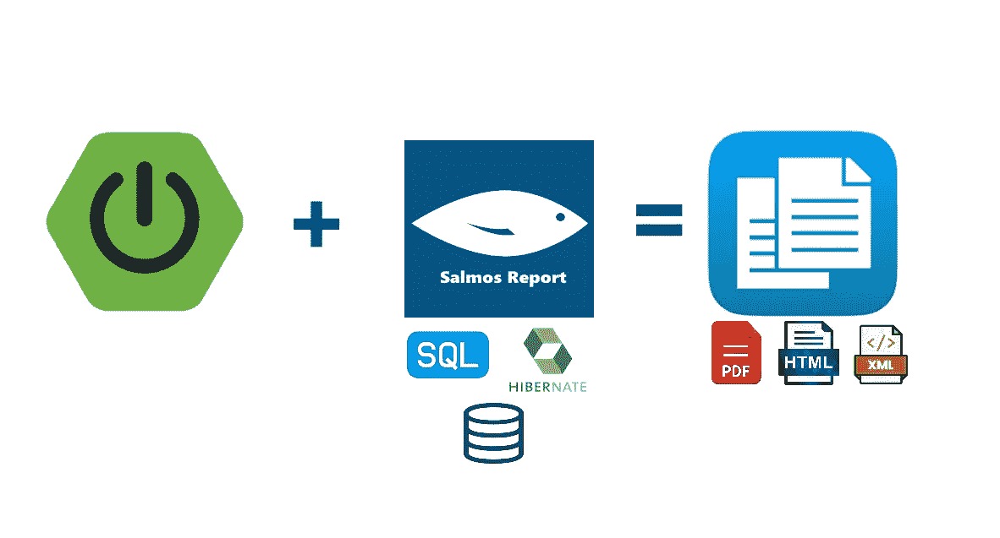

# 使用 Spring boot 中的 Salmos 报告，只需几行代码就可以生成报告

> 原文：<https://medium.com/javarevisited/with-salmos-report-in-spring-boot-generate-reports-in-few-lines-of-code-b5212486b921?source=collection_archive---------1----------------------->



从存储在数据库中的数据生成报告一直是应用程序开发的重要部分之一。以及报告的标题、列标题、内容方向、样式、字体等。大多数情况下，报告中存在数字信息，应该在报告的页眉或页脚部分进行汇总。此外，有时我们需要导出不同结构或格式的数据，如 XML、JSON、PDF 或其他自定义结构。

尽管像 Jasper 这样的现有库已经非常全面和成熟，但是当您需要制作简单的小报告时，使用它基于 xml 的配置和环境设置可能会令人沮丧和困惑。在我的上一个项目中，我寻找一个包含电池的 Spring 替代库，它易于设置和使用，不幸的是我没有找到(也许我没有很好地搜索)。我决定启动一个开源项目，在 Spring boot 中开发一个易于配置和易于使用的库，用几行代码就可以快速生成报告。

在付出了一些努力后，我实现了我心中的想法。现在，它不仅可以使用 SQL 查询和 JDBC 数据源直接从数据库中读取数据，还可以通过对象列表(例如 Hibernate 检索的实体对象列表)来提供数据。到目前为止，它可以产生 Html，xml，pdf 和自定义格式的报告。

该插件的当前版本是 2.1.0，可以通过 maven 或 grade 导入，如:

```
<dependency>
  <groupId>io.github.birddevelper</groupId>
  <artifactId>salmos-report-spring-boot-starter</artifactId>
  <version>2.1.0</version>
</dependency>
```

```
implementation 'io.github.birddevelper:salmos-report-spring-boot-starter:2.1.0'
```

这个插件中有 3 个主要的类来为你创造令人惊奇的东西。

*   HtmlReportMaker :从给定的 sql 查询或对象列表中检索的记录生成 HTML 表格的类。您可以指定报告的标题，表格可以用 css 类进行样式化，并且您可以选择在表格的最后一行汇总哪一列。您可以指定是否希望表包含索引列。此外，您可以定义一个模板并将其用于您的报告:

```
import io.github.birddevelper.salmos.HtmlReportMaker;
import io.github.birddevelper.salmos.setting.HtmlReportTemplate;
import io.github.birddevelper.salmos.setting.SummaryType;

@Service
public class ReportService {

    @Autowired
    DataSource dataSource;

    public String generateReport() {

        // Creating instance of HtmlReportMaker
        HtmlReportMaker hrm = new HtmlReportMaker(dataSource);
        // specify columns of data that must be summarized in table footer row
        hrm.addSummaryColumn("Age", SummaryType.AVERAGE);
        hrm.addSummaryColumn("Salary", SummaryType.SUM);

        // template specifies the report table appearance
        HtmlReportTemplate myTemplate = new HtmlReportTemplate();
        myTemplate.setTableCssClass("tblReport");
        myTemplate.setEvenRowCssClass("myEvensRow");
        myTemplate.setOddRowCssClass("myOddsRow");
        myTemplate.setHeaderRowCssClass("myheader");
        myTemplate.setRightToLeft(true);
        myTemplate.setRowIndexHeader("#");
        myTemplate.setRowIndexVisible(true);

        hrm.setTemplate(myTemplate);

        //  summary section numbers decimal point setting
        hrm.setSummaryDecimalPrecision(1);

        //  summary section numbers seperated by comma 
        hrm.setSummaryCommaSeperatedNumbers(true);

        // show  row's index
        hrm.isRowIndexVisible(true);

        // set the query retrieving data from database
        hrm.setSqlQuery("select fullname as 'Name', age as 'Age', salary as 'Salary'   from chamber limit 0,10");

        return hrm.generate();

    }
}
```

*   **XmlReportMaker** :从给定的 sql 查询或对象列表中检索到的记录生成 XML 文档的类。使用这个类，您可以生成两种类型的 xml。在**RecordColumnAsElementAttribute**模式中，它将行的每个字段嵌入其元素标签中，如下所示作为其属性:

```
<students><student id=”1" firstname=”Alex” lastname=”Tailor” 
birthdate=”1980/09/19" /><student id=”2" firstname=”Alice” lastname=”James” birthdate=”1988/06/22" />
.
.
.</students>
```

在**RecordColumnAsElementChild**中，它添加行的每个字段作为其子标签，如下所示:

```
<students><student >
    <id>1</id>
    <firstName>Alex</firstName>
    <lastName>Tailor</lastName>
    <birthdate>1980/09/19</birthdate>
</student><student >
    <id>1</id>
    <firstName>Alice</firstName>
    <lastName>James</lastName>
    <birthdate>1988/06/22</birthdate>
</student>
.
.
.</students>
```

xml 生成器的示例代码:

```
import io.github.birddevelper.salmos.XmlReportMaker;
import io.github.birddevelper.salmos.setting.SummaryType;
import io.github.birddevelper.salmos.setting.XmlReportElementType;
@Service
public class ReportService {

    @Autowired
    DataSource dataSource;

    public String generateXMLReport() {
        // Creating instance of XmlReportMaker
        XmlReportMaker xrm = new XmlReportMaker(dataSource);

        // specify columns of data that must be summarized (they will put in root element as attribute) 
        xrm.addSummaryColumn("Age", SummaryType.AVERAGE);
        xrm.addSummaryColumn("Salary", SummaryType.SUM);

        // summary section numbers decimal point setting
        xrm.setSummaryDecimalPrecision(0);

        xrm.setRootElementName("Persons");
        xrm.setChildElementName("person");

        // this line set the generator to put row data in attributes of row element
        xrm.setXmlReportElementType(XmlReportElementType.RecordColumnAsElementAttribute);

        // set the query retrieving data from database
        xrm.setSqlQuery("select fullname as 'Name', age as 'Age', salary as 'Salary'   from chamber limit 0,10");

        return xrm.generate();
    }
}
```

*   GeneralReportMaker :这个类以任何给定的结构和格式生成输出。这个类中的报表有三个部分:页眉、正文和页脚。您可以为 body 设置一个模板，它会在查询结果的每一行中重复。在页眉和页脚部分，您可以使用::[您的列名]Summary 对指定的列进行汇总。此外，页眉、正文和页脚可以从资源文件、InputStream 或 pour String 加载:

```
import org.log.carvan.utils.GeneralReportMaker;
import io.github.birddevelper.salmos.setting.SummaryType;

@Service
public class ReportService {

    @Autowired
    DataSource dataSource;

    public String generateUniversalReport() {

        GeneralReportMaker grm = new GeneralReportMaker(dataSource);
        // load template from file located in resources 
        grm.loadTemplateBodyFromFile("templates/salmosTemplates/template1.html");

        // set the query retrieving data from database
        grm.setSqlQuery("select fullname as 'Name', age as 'Age', salary as 'Salary'   from chamber limit 0,10");

        // specify columns of data that must be summarized 
        grm.addSummaryColumn("Age", SummaryType.AVERAGE);
        grm.addSummaryColumn("Salary", SummaryType.SUM);

        // set footer template with String (to have a column summary in footer, you should use ::[column name]Summary in template 
        grm.setTemplateFooter("<p ><b> Age Average >> ::AgeSummary ---- Total Salary >> ::SalarySummary </b> </p>");

        return grm.generate();

    }
}
```

## 从对象列表生成(例如:休眠输出)

从版本 2.0.0+开始，您可以根据对象列表生成报告，例如 hibernate 获取的实体列表。在这种情况下， **HtmlReportMaker** 类必须用 **ObjectFactory 初始化。**在我们启动 **HtmlReportMaker** 之前，我们应该创建 **ObjectFactory** 和指定我们希望在报表中显示的实体的字段及其 HashMap 格式的标题，在下面的例子中， **fieldMap.put("age "，" Age")** ，指定要在报表中显示的学生实体的 **"age"** 字段，标题为 **"Age"** 。然后我们在 **Objectfactory 中加载对象列表。**最后我们用 **Objectfactory 初始化 **HtmlReportMaker** 。**

```
import io.github.birddevelper.salmos.XmlReportMaker;
import io.github.birddevelper.salmos.setting.SummaryType;
import io.github.birddevelper.salmos.setting.XmlReportElementType;
import lombok.Getter;
import lombok.Setter;
@Service
public class ReportService { @Getter
    @Setter
    public class Student {
        private String name;
        private int age;
        private Date birthDate;
        private List<String> skills;

    }

    @AutoWired
    StudentRepository studentRepository; public String generateHTMLReport() { List<Student> studentList = studentRepository.findAll(); // Mapping the class fields to report columns (here we want only name and age, the reset of entity fields will be ignored)
        Map<String,String> fieldMap = new HashMap<>();
        fieldMap.put("name", "Full Name");
        fieldMap.put("age", "Age");

        // buidling instance of ObjectFactory class
        ObjectFactory objectFactory = new ObjectFactory();

        // setting mapping fields
        objectFactory.setReportFields(fieldMap);
        // setting entity lists
        objectFactory.loadObjects(studentList);

        // building instance of HtmlReportMaker with ObjectFactory as input parameter
        HtmlReportMaker htmlReportMaker = new HtmlReportMaker(objectFactory);

        // generate report
        return htmlReportMaker.generate();
    }
}
```

我希望我能添加更多像 excel 导出这样的功能，使它更有用。不要犹豫，给一个评论。

github 上的项目资源库:[https://github . com/bird developer/salmos-report-spring-boot-starter](https://github.com/birddevelper/salmos-report-spring-boot-starter)。