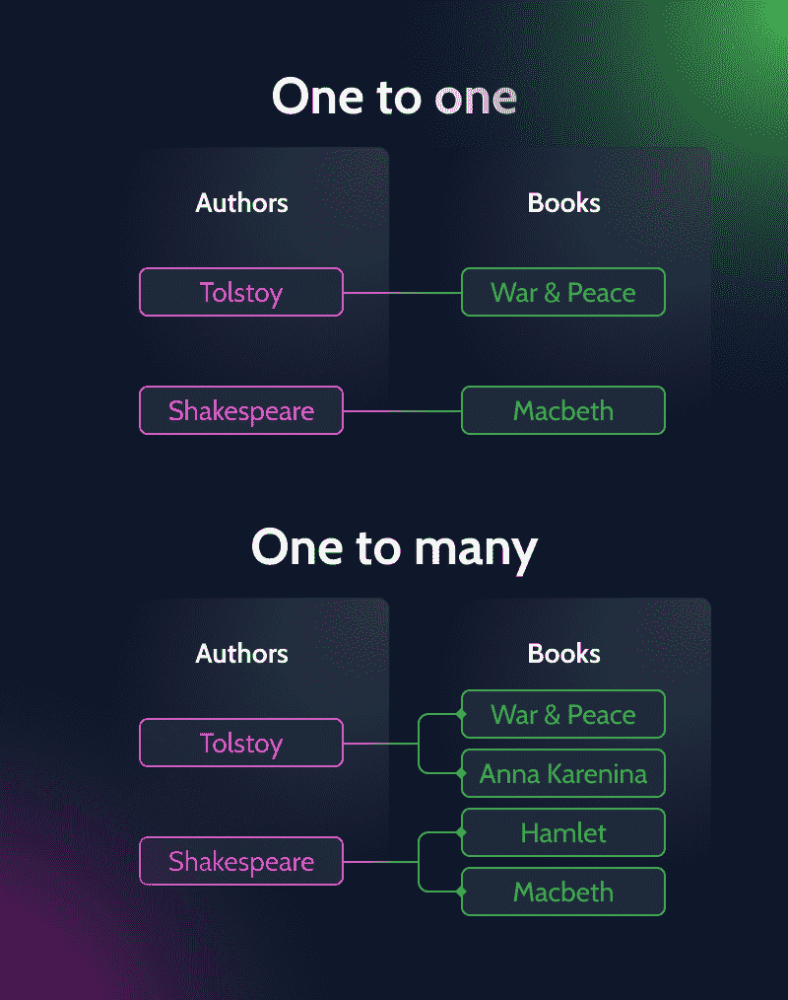
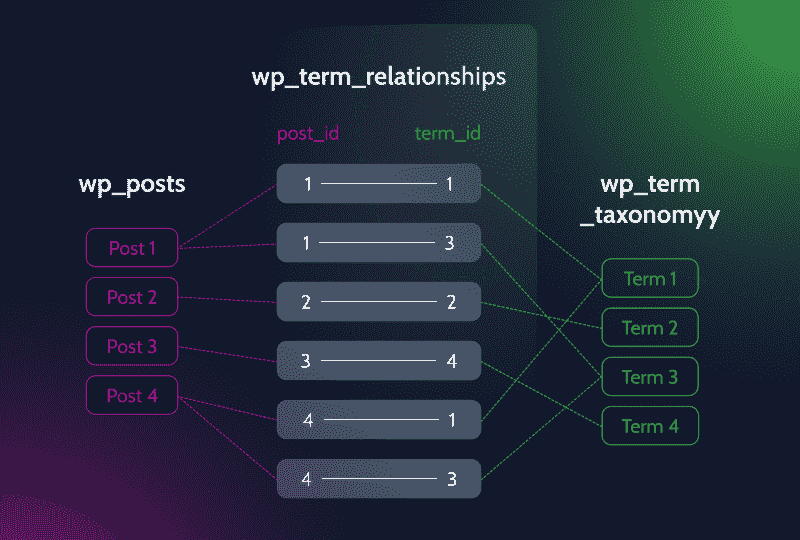
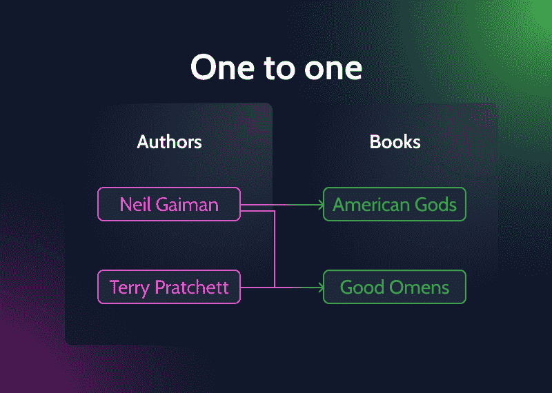

# WordPress 关系解释

> 原文：<https://medium.com/javarevisited/wordpress-relationships-explained-5f3ecb521359?source=collection_archive---------0----------------------->

*什么是* ***WordPress 关系*** *，如何掌握它们？这些问题看起来很简单，但是许多第一次开发的人可能无法回答。今天，我会偷看一幕，让你看清关系的每一件小事和它们的类型。*

首先，你需要建立 WordPress 关系，在属于一个单独的 [WordPress 站点](/javarevisited/5-best-wordpress-courses-for-beginners-and-experienced-website-developers-b45f7976ee40)的不同数据项之间建立联系。第二，设置你喜欢的关系类型。

有三种主要的 WordPress 关系类型可供选择:一对一、一对多和多对多。我一会儿就去找他们。

第三，正确设置的关系将 WordPress 开发项目提升了一个档次。作为一名[网站开发者](/javarevisited/10-best-coursera-courses-for-web-development-and-web-design-9ec54ed92dd9)，你将能够对网站进行动态修改。这意味着您可以在管理面板中调整所需的元框数据和自定义字段，更新将立即出现在前面的任何地方。

来源: [FAVPNG](https://favpng.com/png_view/table-one-to-one-entity-relationship-model-one-to-many-many-to-many-database-png/NFX1Nipa)

你已经上钩了吗？

继续阅读，了解更多关于 WordPress 关系类型、它们的例子和用例。

# 一对一

它是最简单的数据库关系类型。一对一关系表示*两个数据库记录、两个自定义帖子类型、两个帖子等之间的线性连接。*当只有一个父帖子和一个相关的子帖子时，这是可能的，反之亦然。

一般来说，这些数据会放入一个 [DB 表](https://javarevisited.blogspot.com/2021/05/sql-and-database-phone-interview-questions.html)中，并存储在同一行中。一对一的关系存在于:

*   帖子 ID 和帖子内容；
*   post ID 和 post slug
*   帖子标题和帖子内容；
*   用户 ID 和用户名；
*   评论 ID 和评论内容等。

# 一对一关系用例

因为一个子帖子只能与一个帖子的父类型相关，所以没有什么例子可以引用。然而，一个国家与其首都 T21 之间的联系是一对一的关系，因为一个首都城市总是独一无二的。

# 一对多

一对多是最常用的 WordPress 关系。这意味着一个数据库记录可以同时与多个其他项目相关联。简单地说，一个父帖子类型可以链接到许多子帖子页面。

来源:Medium.com

一对多关系延伸到帖子，如前所述，*帖子元数据、用户、评论和术语*。因此，看到后介入关系和非后介入关系的区别是至关重要的。至于涉及帖子的 WordPress 关系，它们如下。

# 员额对员额

通常，posts 2 posts 关系涵盖了来自同一个数据库表 **wp_posts** 的不同帖子属性和附件之间的链接。当一个通用帖子类型有几个子类型，包括子帖子、页面和附件时，这是一种经典的父子关系。

# 帖子到帖子元数据

一篇文章可以有许多元属性，如*文章 ID、元 ID、元关键字、元值、*等。但是这些帖子元数据将专门链接到它们的父帖子。

# 帖子到评论

注释位于 **wp_comments** DB 表中。数据库表可以存储*评论 ID、评论内容、批准状态、作者详细信息，如姓名、电子邮件地址、*等。同样，评论与一个给定的 WP 帖子有关，可以链接到 **wp_users** DB 表，给网站开发者提供在用户和评论之间建立联系的选项。

# 发布给用户

最后但并非最不重要的一点是，文章与用户的相关性。它与上面提到的 WordPress 关系略有不同，因为用户是 post 的父代，而不是相反。每个 WordPress 用户可以写任意多的帖子，这些帖子将不可避免地通过用户 ID 字段链接到 **wp_users** DB 表。

我列举了帖子和附属数据之间的关系。尽管如此，你应该知道还有其他不涉及职位的关系。

*   **用户对用户元数据**。它是两个 WordPress 数据库表之间的连接——WP _ users 和 wp_usermeta。一个用户可以有几个元数据记录，而每个元数据项将只与该用户相关联。
*   **注释对注释元数据**。关系类似于上面描述的关系。WordPress 网站上的一个评论可以有很多相关的条目，但是这些元数据只适用于一个评论。
*   **用户意见**。当注册用户在网站上留下评论时，记录会直接进入 wp_comments DB 表。用户和评论之间形成的联系是一对五的关系，因为一个用户可以留下任意多的评论。

# 一对多关系用例

## 👨🏻‍💼代理和属性🏡

假设你有一个房地产销售和租赁网站。几家房地产代理商为精选的房产做广告。一个代理可以被设置为同时代表几个项目，但是多个代理不能代表一个属性。

## 🏋🏻‍♀️健身教练和会议🏐

说到一个健身房网站，可以有多个健身教练在那里工作。一个特定的健身教练每周可以主持尽可能多的锻炼会议，这意味着一对多的联系。

毫无疑问，我可以举出更多的例子——没有限制。我只是希望你已经掌握了这个想法，因为所有的用例将主要是相似的。

# 多对多

最后，我们到达了最后一个检查站。**多对多关系**，也称为双向关系，是一种*模式，任何数据库记录都可以链接到许多其他记录，反之亦然*。WordPress 主要用它来关联分类术语和帖子。

一个**术语**可以分配给**多个帖子页面**，而**一个帖子**可以有**多个术语**分配给它。

在后端，这个过程中涉及的不是两个而是三个数据库表。前两个是实际的数据表——像 **wp_posts** 和 **wp_term_taxonomy** 。第三个是一个连接表，存储来自两个数据表的关键数据。

现在，你必须真正注意。

为了链接第一个表中的文章和第二个表中的术语，WordPress 获取所需的**文章 ID** 和**术语 ID** ，将它们放在第三个表中。这就是我们所说的记录。

连接表可以为文章和术语注册多个记录，从而创建双向关系。

来源: [Envato Tuts+](https://code.tutsplus.com/tutorials/understanding-and-working-with-relationships-between-data-in-wordpress--cms-20632)

从上面的例子可以看出，一篇文章同时链接到几个术语。相反，一个术语适用于多个不同的职位。

简而言之，这就是多对多 WordPress 关系的工作方式。

# 多对多关系用例

## 🗣演讲人和活动🏛

想象一下，你有一个 meetup 网站，不同的演讲者在那里参加不同的活动。一个演讲者可以在一个特定的事件中发表演讲，而同一事件有几个其他的演讲者参加。

## ✍🏻作者和书籍📖

一本书可以由一个作者写。同一个作者可以写很多书。另一本书可以同时由几个作者来写。当你搜索它的时候，你会不可避免地发现它的作者和合著者。你明白了吗？😉

来源:[Medium.com](https://chathuranga94.medium.com/sql-snippet-foreign-keys-c45704d2eb78)

⚙多对多可能是最具挑战性的关系类型。为了创建多对多的关系，您需要一个允许建立双向连接的定制文章类型插件。

可以是 [**MB 关系 by MetaBox**](https://metabox.io/plugins/mb-relationships/) **，** [**双向 Post 关系字段 by ACF**](https://www.advancedcustomfields.com/resources/bidirectional-relationships/) **，** [**JetEngine 关系**](https://crocoblock.com/features/?ref=2817&_feature=326) 等等。

# 最后的想法

一旦你理解了 WordPress 关系背后的逻辑，建立这种关系是显而易见的。

*   **一对一**是两个数据库项之间最简单的连接类型。
*   父项和子项之间可能存在一对多关系。一个父级可以有多个子项，而子级只能有一个父级。
*   **多对多**是最复杂的关系类型。它是两个双向数据库项目之间的直接链接。换句话说，一篇文章可以与几个术语相关联，同样的术语可以同时与这篇文章和其他文章相关联。

希望我今天没有引起更多的混乱。完全相反；今天你学到了新的东西，当听到神圣的词语时，你将不再昏厥。祝你好运！