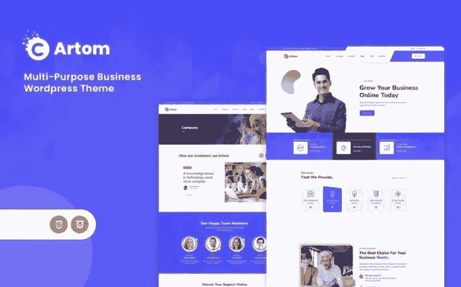
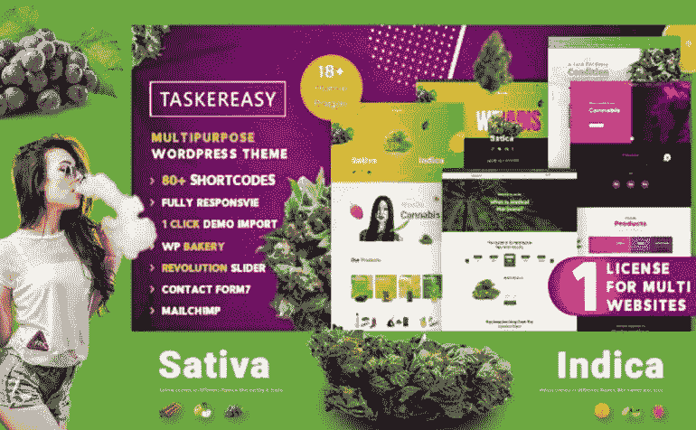
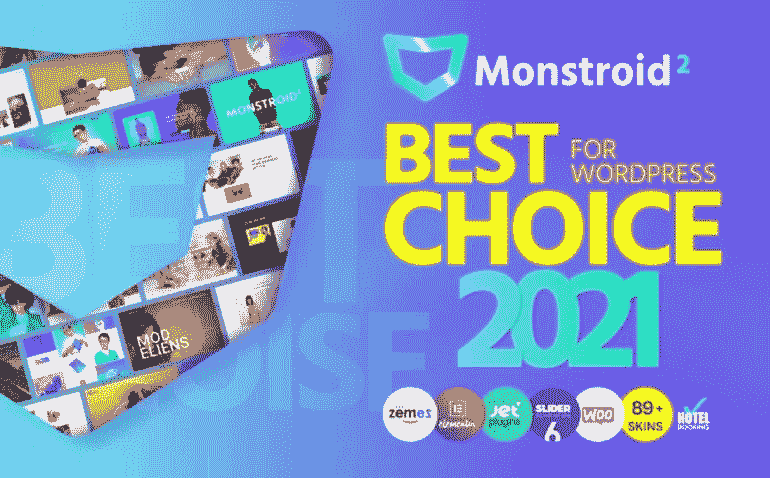
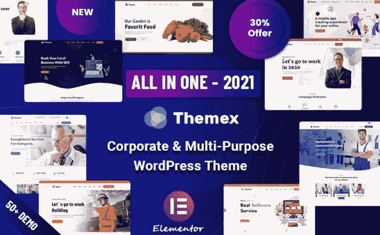
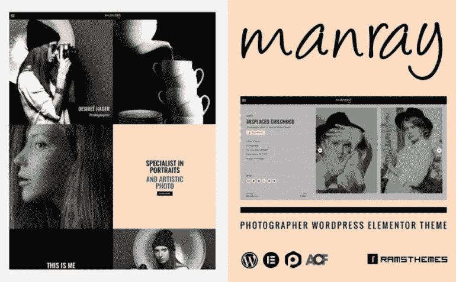
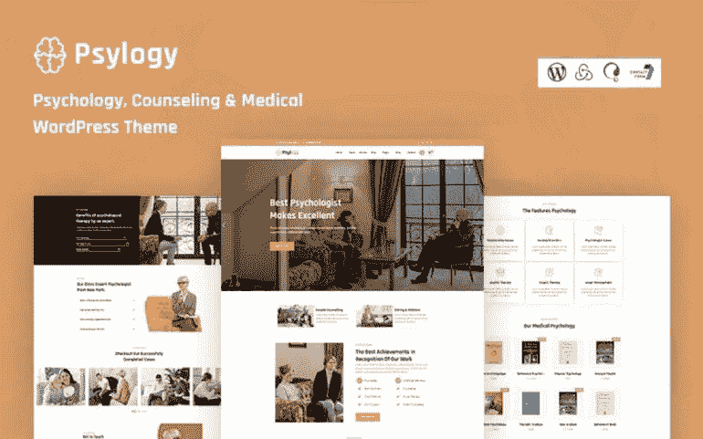
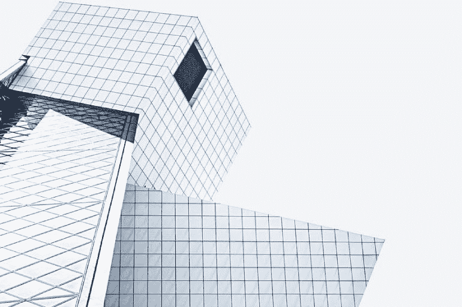
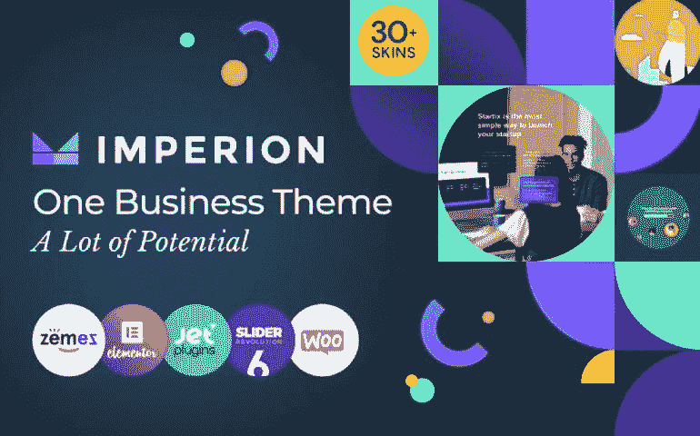
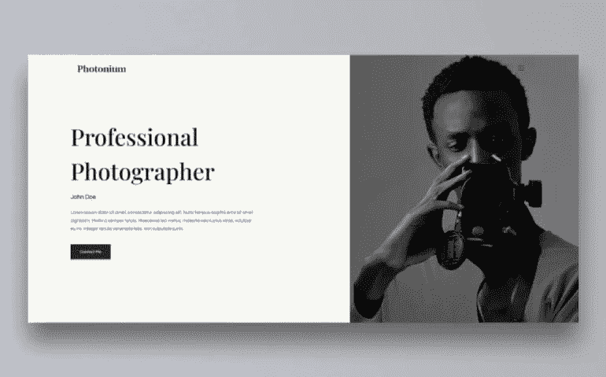

# WordPress 网站设计:给你的在线项目带来新东西的 5 个趋势

> 原文：<https://medium.com/javarevisited/wordpress-website-design-5-trends-to-bring-something-new-to-your-online-projects-bc0627e94d95?source=collection_archive---------2----------------------->

网页设计就是对未来的预测。由于与技术的联系，数字领域每年都成为动画、交互性和完全沉浸感新发展的展示窗口。你知道网页设计的趋势是周期性的。数字领域的设计趋势比物理环境变化更快。数码时代的事物变化很快，因为修改它们很容易。几十年后出现的传统设计趋势可能会在几年内以数字方式出现。这使得数码产品对当前的趋势、时尚和品味更加敏感。这种持续的改变对我们的印象有一种奇怪的影响，那就是设计的过去和未来。一个变化导致另一个变化，又导致另一个变化，我们走向未来。在设计中，有一个普遍的真理:我们汲取过去的经验，并为未来而改造它。今天，我们的任务是谈论你应该考虑的 WordPress 网站设计趋势。我们还为每个趋势准备了几个例子。在我们开始之前，不要忘记我们的促销代码“ **javarevisited5** ”，它给**WordPress 主题**5%的折扣。

# 用这 5 个最新趋势改进你的 WordPress 网站设计

# 1.视差滚动

当视差滚动效果在 2011 年首次出现在网上时，它成为了一种新鲜而迷人的网页设计趋势。这是一种网页设计趋势，当滚动时，背景材料(如图像)的移动速度比前景材料慢。换句话说，它已经巩固了自己作为一个基本设计工具的地位。

artom——商务 WordPress 主题

Artom 是一个创造性的和复杂的主题，将成为不同的商业相关网站的完美匹配。你可以自由地创建一个关于你的创业、咨询机构、软件和其他主题的在线项目。它采用了完全响应的设计。人们将准备好通过所有现代设备来熟悉你的业务。它还包括博客和作品集功能。你可以分享你的视觉内容和额外的信息来吸引你的观众，引起更多的兴趣。

主要特点:

*   背景视频；
*   下拉菜单；
*   谷歌地图；
*   团队成员；
*   画廊。

[在 MonsterONE](https://www.templatemonster.com/wordpress-themes/artom-business-wordpress-theme-219509.html?aff=javarevisited&utm_campaign=tmwordpressthemes&utm_source=mediumjavarevisited&utm_medium=referral) 购买 | [免费下载](https://www.templatemonster.com/monsterone/tm-membership/?id=219509&tmaff=themebeyond?aff=javarevisited&utm_campaign=tmwordpressthemes&utm_source=mediumjavarevisited&utm_medium=referral)

## 大麻多用途主题

Taskereasy 是一个灵活而强大的现成软件，它会让你的 WordPress 网站设计与众不同。它包括现成的五个主题和 19+主页布局。它们中的每一个都可以通过单击来安装。这个包还包括著名的 WPBakery Builder，它可以让你修改各种各样的内容。还有六种博客类型和两种组合布局可供选择。由于特定集成的可用性，人们也将渴望注册您的邮件。

主要特点:

*   30+内页；
*   五头；
*   联系方式；
*   旋转滑块；
*   背景视频。

[在 MonsterONE](https://www.templatemonster.com/wordpress-themes/taskereasy-cannabis-multipurpose-wordpress-theme-110289.html?aff=javarevisited&utm_campaign=tmwordpressthemes&utm_source=mediumjavarevisited&utm_medium=referral) 购买 | [免费下载](https://www.templatemonster.com/monsterone/tm-membership/?id=110289&tmaff=slidesigmathemes?aff=javarevisited&utm_campaign=tmwordpressthemes&utm_source=mediumjavarevisited&utm_medium=referral)

# 2.多功能性质

多用途主题允许你创建几乎任何类型的网站。它们经常提供全面的特性列表和大量内置特性。使用多用途设计可以让你建立自己的品牌，让你的公司焕然一新。

## Monstroid2 多用途模块化 WordPress 元素或主题

Monstroid2 是一个先进和强大的现成解决方案，无疑会使你的 WordPress 网站设计更好。对于无数的目标来说，这是一个了不起的选择。首先也是最重要的，我们必须注意到有几种皮肤可以用于最流行的领域。除此之外，懂编码的一切并不是建立专业网站所必须的。利用用户友好的元素或页面生成器就足够了。您将可以进行实时编辑，无需您付出任何努力。你也可以利用一个优秀的旋转滑块来产生各种视觉效果。

主要特点:

*   音频和视频播放器；
*   联系方式；
*   时事通讯订阅；
*   一键安装流程；
*   1，000 多个预先设计的部分和现成的页面

[在 MonsterONE](https://www.templatemonster.com/wordpress-themes/monstroid2.html?aff=javarevisited&utm_campaign=tmwordpressthemes&utm_source=mediumjavarevisited&utm_medium=referral) 购买 | [免费下载](https://www.templatemonster.com/monsterone/tm-membership/?id=62222&tmaff=zemez?aff=javarevisited&utm_campaign=tmwordpressthemes&utm_source=mediumjavarevisited&utm_medium=referral)

## techno-IT 解决方案&多用途 WordPress 主题

一个动态的功能主题，有可能引起 IT 专家的兴趣。它为您提供了 30 多种不同的演示选择。这个包包含了开发一个强大且有吸引力的网站所需的所有特性。为了抓住你的目标受众的注意力，使用联系表格。这将给所有的访问者一个与你的员工交流的机会。也有可能添加一个迷人的旋转木马和一个引人注目的视频。此外，强大的 WPML 功能非常适合需要吸引全球观众的个人。

主要特点:

*   10+页脚样式；
*   Ajax 购物车；
*   背景选项；
*   谷歌字体；
*   无限的颜色选择。

[购买](https://www.templatemonster.com/wordpress-themes/techno-it-solution-service-wordpress-theme-94212.html?aff=javarevisited&utm_campaign=tmwordpressthemes&utm_source=mediumjavarevisited&utm_medium=referral)

## 主题——响应多用途 WordPress 主题

Themex 是另一个适应性很强的主题，有丰富的演示，会让你大吃一惊。对于任何希望促进维修服务、营销、教育、创业、软件和其他领域的人来说，它们可能是一个极好的解决方案。您将能够使用一个广为人知的元素或页面生成器。它是一个可视化的构建器，允许您在不使用代码的情况下修改许多组件。它还允许您访问 80 多个自定义元素、18 种页眉样式和 10 种页脚选项。只需一次点击，您就可以安装所有组件。

主要特点:

*   一键演示导入；
*   WPML 支持；
*   视差效应；
*   背景视频；
*   博客功能。

[在 MonsterONE](https://www.templatemonster.com/wordpress-themes/themex-multipurpose-responsive-wordpress-theme-122890.html?aff=javarevisited&utm_campaign=tmwordpressthemes&utm_source=mediumjavarevisited&utm_medium=referral) 购买 | [免费下载](https://www.templatemonster.com/monsterone/tm-membership/?id=122890?aff=javarevisited&utm_campaign=tmwordpressthemes&utm_source=mediumjavarevisited&utm_medium=referral)

# 3.让用户感到舒适的平静的配色方案

如今，设计师转向更中性的调色板。这些颜色是绿色、淡蓝色、暖棕色或浅粉色。这些不仅使网站的颜色没有黑色或白色醒目，而且它们还有一种自然的平静和放松的效果。

## Guatama 佛教寺庙

Guatama 是佛教寺庙的一个功能齐全的主题，通过其华丽的颜色主题和多个组件将您与互联网世界联系起来。用户将有一个无缝的体验来浏览你的网站，了解更多关于你的寺庙的产品。一个现代化的布局将尽可能展示历史悠久的神圣传统。有了这么多的工具和出色的功能，你可以随着你的社区的发展和你的网站目标的演变而改变和调整材料。还有一个一键演示导入器。这会节省你的时间和精力。

主要特点:

*   WooCommerce 整合；
*   联系方式；
*   Instagram 插件；
*   旋转滑块；
*   视差效果。

[在 MonsterONE](https://www.templatemonster.com/wordpress-themes/guatama-buddhist-temples-wordpress-theme-208634.html?aff=javarevisited&utm_campaign=tmwordpressthemes&utm_source=mediumjavarevisited&utm_medium=referral) 购买 | [免费下载](https://www.templatemonster.com/monsterone/tm-membership/?id=208634?aff=javarevisited&utm_campaign=tmwordpressthemes&utm_source=mediumjavarevisited&utm_medium=referral)

## 摄影师主题

是时候为从事摄影专业的人谈谈一个可爱的 WordPress 网站设计了。它提供了丰富的优化空间的选项，使你的网站更加用户友好。你可以利用有用的滑块，传送带和画廊。它也有丰富的定制选项来调节一系列方面。颜色、排版和布局就是这样的例子。您的摄影工作的自定栏，如相机和客户端，也是可用的。

主要特点:

*   Elementor 页面生成器；
*   菜单生成器；
*   最新消息的博客版块；
*   联系方式；
*   三种主页风格可供选择。

[在 MonsterONE](https://www.templatemonster.com/wordpress-themes/manray-photographer-wordpress-theme-189866.html?aff=javarevisited&utm_campaign=tmwordpressthemes&utm_source=mediumjavarevisited&utm_medium=referral) 购买 | [免费下载](https://www.templatemonster.com/monsterone/tm-membership/?id=189866?aff=javarevisited&utm_campaign=tmwordpressthemes&utm_source=mediumjavarevisited&utm_medium=referral)

## Psychology 心理学和咨询响应 WordPress 主题

psychology 是一个专注于心理学的 WordPress 主题，适合心理学家、治疗师、治疗机构和类似的服务。它有理想的设计来突出你所有的主要服务和能力。这个惊人的 WordPress 网站设计提供了广泛的定制选择。你将获得不同的选择，这将使你的心理学和咨询网站脱颖而出。例如，您可以自由添加背景视频。还有一个为你的团队成员准备的相关部分。

主要特点:

*   谷歌地图；
*   下拉菜单；
*   Ajax 功能；
*   与旋转滑块兼容；
*   博客功能。

[购买](https://www.templatemonster.com/wordpress-themes/psylogy-psychology-and-counseling-responsive-wordpress-theme-220392.html?aff=javarevisited&utm_campaign=tmwordpressthemes&utm_source=mediumjavarevisited&utm_medium=referral)

# 4.几何学

几何形状是一个基本而强大的元素，它可以通过视觉构成的使用来提高网站的美学吸引力。也可以利用它们来视觉上分割你的网站。

## imperion——多用途企业主题

这是一个出色的现成解决方案，可供各种组织使用。首先，它提供了无需任何编程知识的一键式安装过程。除此之外，你还可以在十个现成的网站中为各种业务进行选择。它们支持加密货币、金融等主题的展示。强大的 Elementor 页面生成器提供了所需的灵活性，并允许您直观地更改设计。捆绑包中还包括一张醒目的相关照片。

主要特点:

*   全响应设计；
*   时事通讯订阅；
*   高级搜索；
*   联系方式；
*   WPML-准备好了。

[购买](https://www.templatemonster.com/wordpress-themes/62626.html?aff=javarevisited&utm_campaign=tmwordpressthemes&utm_source=mediumjavarevisited&utm_medium=referral) | [在 MonsterONE](https://www.templatemonster.com/monsterone/tm-membership/?id=62626?aff=javarevisited&utm_campaign=tmwordpressthemes&utm_source=mediumjavarevisited&utm_medium=referral) 免费下载

# 5.最低纲领

你听过人们说少即是多吗？如果你看一些不同品牌的网站，你会注意到很多网站的设计中都包含了留白。在文字和照片之间使用宽的白色部分是这种风格的设计趋势。空白可以用来区分站点的各个部分。因此，访问者将能够更好地掌握你的材料。

## hub——创意和商业多用途 WordPress 主题

Hub 是一个设计良好的 WordPress 主题，有一个大的演示集合，用于创建一个出色的个人或公司网站。你可以随意混合几个演示的不同部分。实际上，这是一个完全支持 Elementor 的独一无二的主题。通过复杂的设计定制，你可以在不安装任何额外的 WordPress 插件的情况下获得想要的结果。一切只需点击一下。还有更多选项值得你关注。这些是 80+预先制作的页面，25+页面样式，多种动画效果，等等。

主要特点:

*   现代可过滤投资组合；
*   视差效应；
*   背景视频；
*   酒店预订；
*   兼容 WooCommerce。

[在 MonsterONE](https://www.templatemonster.com/wordpress-themes/hub-creative-and-business-multipurpose-wordpress-theme-212797.html?aff=javarevisited&utm_campaign=tmwordpressthemes&utm_source=mediumjavarevisited&utm_medium=referral) 购买 | [免费下载](https://www.templatemonster.com/monsterone/tm-membership/?id=212797?aff=javarevisited&utm_campaign=tmwordpressthemes&utm_source=mediumjavarevisited&utm_medium=referral)

## Photonium 摄影师作品集 WordPress 主题

Photonium 是一个令人惊叹的 WordPress 网站设计，可以帮助你获得更大的客户群，看起来更专业。它可以在任何设备上运行，外观也很棒，无论是手机、PC 还是平板电脑。由于完全响应设计的可用性，这将成为可能。多亏了大量的功能，你可以自由上传图片，博客，并展示你的专业经验。还有一键导入器。它允许在瞬间安装所有组件。

主要特点:

*   联系方式；
*   背景视频；
*   博客功能；
*   奖励图像；
*   投资组合功能。

[在 MonsterONE](https://www.templatemonster.com/wordpress-themes/photonium-photographer-portfolio-wordpress-theme-218219.html?aff=javarevisited&utm_campaign=tmwordpressthemes&utm_source=mediumjavarevisited&utm_medium=referral) 购买 | [免费下载](https://www.templatemonster.com/monsterone/tm-membership/?id=218219?aff=javarevisited&utm_campaign=tmwordpressthemes&utm_source=mediumjavarevisited&utm_medium=referral)

# 几句话作为结论

这就是数字设计的发展方式，并将继续发展。不是线性进化，而是在今天的技术支持下，对过去的工作进行永久的取样和重新发明。这是一个神奇的创作过程，参与其中并亲眼目睹。这些趋势的美妙之处在于，它展示了全世界的网页设计师在他们的创意领域投入了多少工作。网页设计者通过尝试各种可能增加互动的视觉传达方法来应对这种情况。我们希望更多地了解这些趋势会让你感到兴奋。不要忘了还有一些免费的 WordPress 主题,可以让你的 WordPress 网站设计得更好。感谢阅读！