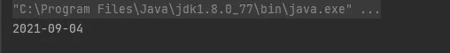
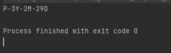
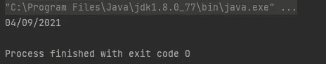
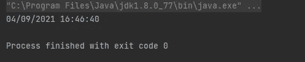
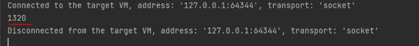

# 在 Java 中处理日期

> 原文：<https://medium.com/javarevisited/working-with-dates-in-java-8-d04f4b04b4b9?source=collection_archive---------2----------------------->


处理日期总是有点复杂，使用日期和日历的人都很了解这一点。但是在 Java 8 中，LocalDate 包含在 java.time 包中，这带来了许多静态方法，使生活变得更容易。

文档在这里:

[https://docs . Oracle . com/javase/8/docs/API/Java/time/local datetime . html](https://docs.oracle.com/javase/8/docs/api/java/time/LocalDateTime.html)

## 获取今天的日期:

```
LocalDate today = LocalDate.*now*();
System.*out*.println(today);
```

[](https://javarevisited.blogspot.com/2015/03/20-examples-of-date-and-time-api-from-Java8.html)

简单。

## 以年为单位计算期间

距离上一届足球世界杯已经过去了多少年？

```
LocalDate today = LocalDate.*now*();
LocalDate worldCupDate = LocalDate.*of*(2018, Month.*JUNE*, 5);
int years = worldCupDate.getYear() - today.getYear();
System.*out*.println(years + " years");
```

[](https://javarevisited.blogspot.com/2017/02/17-examples-of-calendar-and-date-in-java.html)

## 以天数和月数计算周期

这个真的很酷:

```
Period period = Period.*between*(today, worldCupDate);
System.*out*.println(period);
```

就过两次约会。结果:

[](http://www.java67.com/2016/10/how-to-parse-string-to-localdate-in-Java8-DateTimeFormatter-Example.html)

*   3Y = 3 年
*   2M = 2 个月
*   29 天= 29 天

## 格式化日期

我将把它放在巴西标准中，但它也适用于其他几个标准:

```
DateTimeFormatter dateTimeFormatter = DateTimeFormatter.*ofPattern*("dd/MM/yyyy");
System.*out*.println(today.format(dateTimeFormatter));
```

[](http://www.java67.com/2016/10/how-to-parse-string-to-localdate-in-Java8-DateTimeFormatter-Example.html)

## 递增或递减日期

```
System.*out*.println(today.minusYears(1));
System.*out*.println(today.minusMonths(4));
System.*out*.println(today.minusDays(2));

System.*out*.println(today.plusYears(1));
System.*out*.println(today.plusMonths(4));
System.*out*.println(today.plusDays(2));
```

## 但是如果我想要一个小时，一分钟，一秒钟呢？

然后类发生了变化，为此我们可以使用 [LocalDateTime](https://javarevisited.blogspot.com/2017/01/how-to-create-localdatetime-in-java-8.html) ，它的用法非常类似:

```
LocalDateTime now = LocalDateTime.*now*();
System.*out*.println(now);
```

[](http://www.java67.com/2016/03/how-to-convert-javautildate-to-javasqlTimestamp-JDBC.html)

我们还可以格式化:

```
DateTimeFormatter dateTimeFormatter = DateTimeFormatter.*ofPattern*("dd/MM/yyyy HH:mm:ss");

LocalDateTime now = LocalDateTime.*now*();
System.*out*.println(now.format(dateTimeFormatter));
```

结果是:



## [当地时间](https://www.java67.com/2019/05/10-example-of-localdate-localtime-and-localdatetime-zoneddatetime-in-java.html)

我们只能用时间段来表示某些活动的时间，例如，足球比赛的时间:

```
LocalTime hourOfGame= LocalTime.*of*(16, 30);
System.*out*.println(hourOfGame);
```

[](http://www.java67.com/2016/10/how-to-parse-string-to-localdate-in-Java8-DateTimeFormatter-Example.html)

到目前为止，最有趣的部分是我们没有对日期进行任何计算，我们只是询问 API，它就为我们做了。太好了。

## 如何获得一个以天为单位的范围？

我在论坛上看到过几个解决方案，很多行代码，所有工作都是手工完成的。我知道怎么做，很可能你也知道，但是有一个稍微简单的方法:

```
public static void main(String[] args) {
   LocalDate date1 = LocalDate.*of*(2018, Month.*JUNE*, 5);
   var numberOfDays = ChronoUnit.*DAYS*.between(date1, LocalDate.*now*());
   System.*out*.println(numberOfDays);
}
```

结果是:

[](http://javarevisited.blogspot.sg/2015/07/how-to-find-number-of-days-between-two-dates-in-java.html)

今天到此为止。