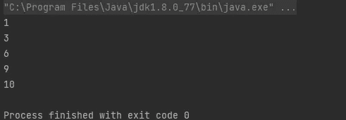
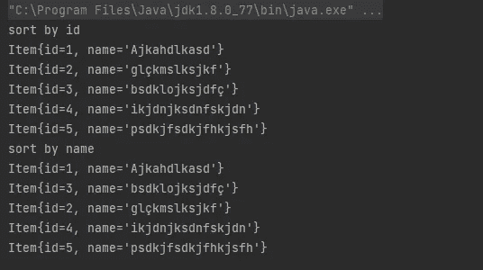

# 在 Java 中使用 Lambdas

> 原文：<https://medium.com/javarevisited/working-with-lambdas-in-java-a27ebce7bc39?source=collection_archive---------1----------------------->

[](https://javarevisited.blogspot.com/2018/08/top-5-java-8-courses-to-learn-online.html)

Lambda 是 Java 1.8 版本中出现的一种替代方案，它为开发带来了便利。在它的使用中，可以推断出一些事情，并且它使得编写匿名类的需要消失了。

很高兴在实践中看到这一点。

官方文档在这里[https://docs . Oracle . com/javase/tutorial/Java/javaOO/lambda expressions . html](https://docs.oracle.com/javase/tutorial/java/javaOO/lambdaexpressions.html)

参见以下代码:

```
public static void main (String [] args) {
    List <String> list = new ArrayList <> ();
    list.add ("teste 1");
    list.add ("teste 2");
    list.add ("teste 3");
    list.add ("teste 4");
    list.add ("teste 5");
}
```

我将使用一个[匿名类](https://javarevisited.blogspot.com/2015/01/how-to-use-lambda-expression-in-place-anonymous-class-java8.html)打印这个列表的每个元素:

```
list.forEach(new Consumer<String>() {
    public void accept(String item) {
        System.out.println(item);
    }
});
```

匿名类是一个作为参数传递的[接口](https://javarevisited.blogspot.com/2012/04/10-points-on-interface-in-java-with.html)的实现。虽然有效，但还有改进的可能。

我将使用[λ](https://www.java67.com/2017/06/10-points-about-lambda-expressions-in-java-8.html)来简化它:

```
list.forEach(item -> {
    System.out.println(item);
});
```

因为消费者接口只有一个方法，所以编译器推断要使用的方法的类型和签名。在上面的例子中，甚至可以去掉{}和；这也是可行的:

```
list.forEach(item -> System.out.println(item));
```

有一件事很有帮助:阅读λ。上面的代码说明了每个项目都将被打印。

很酷吧？

[](https://javarevisited.blogspot.com/2018/07/java-8-tutorials-resources-and-examples-lambda-expression-stream-api-functional-interfaces.html)

现在我要对列表[进行排序](https://www.java67.com/2021/09/java-comparator-multiple-fields-example.html):

```
List<Integer> list = new ArrayList<>();
list.add(1);
list.add(6);
list.add(3);
list.add(10);
list.add(9);

list.sort((item1, item2) -> Integer.compare(item1, item2));

list.forEach(item -> {
    System.out.println(item);
});
```

结果是这样的:

[](https://javarevisited.blogspot.com/2012/01/how-to-sort-arraylist-in-java-example.html)

在这个 [lambda](/javarevisited/8-best-lambdas-stream-and-functional-programming-courses-for-java-developers-3d1836a97a1d) 中，可以看出对于两个条目，整数比较器将进行比较，并将最小的一个返回给列表的 sort()方法。

好的，我使用了[字符串](https://www.java67.com/2018/06/top-35-java-string-interview-questions.html)和[整数](https://javarevisited.blogspot.com/2013/06/how-to-add-two-integer-numbers-without-plus-arithmetic-operator-java-example.html)，有人会说它非常简单，一点也不接近我们在软件开发中使用的复杂对象的实际情况。所以我要创建一个有一些属性的对象，按每个属性排序。

```
public class Item {

    private Integer id;
    private String name;

    public Item(Integer id, String name) {
        this.id = id;
        this.name = name;
    }

    public Integer getId() {
        return id;
    }

    public void setId(Integer id) {
        this.id = id;
    }

    public String getName() {
        return name;
    }

    public void setName(String name) {
        this.name = name;
    }

    @Override
    public String toString() {
        return "Item{" +
                "id=" + id +
                ", name='" + name + '\'' +
                '}';
    }
}
```

和排序:

```
public static void main (String [] args) {

    Item item = novo item (1, "Ajkahdlkasd");

    Item item2 = novo item (2, "glçkmslksjkf");
    Item item3 = novo item (3, "bsdklojksjdfç");
    Item item4 = novo item (4, "ikjdnjksdnfskjdn");
    Item item5 = novo item (5, "psdkjfsdkjfhkjsfh");

    Lista <Item> itens = new ArrayList <> ();

    itens.add (item);
    itens.add (item2);
    itens.add (item3);
    itens.add (item4);
    itens.add (item5);

    System.out.println ("classificar por id");
    itens.sort ((i1, i2) -> Integer.compare (i1.getId (), i2.getId ()));

    itens.forEach (i -> {
        System.out.println (i);
    });

    System.out.println ("classificar por nome");
    itens.sort ((i1, i2) -> i1.getName (). compareTo (i2.getName ()));

    itens.forEach (i -> {
        System.out.println (i);
    });

}
```

结果是:

[](https://www.java67.com/2019/06/top-5-sorting-examples-of-comparator-and-comparable-in-java.html)

也可以使用静态方法[来比较比较器](https://javarevisited.blogspot.com/2021/09/comparator-comparing-thenComparing-example-java-.html)，参见这个例子:

```
System.out.println("sort by name");
items.sort(Comparator.comparing(i -> i.getName()));
```

我认为和兰姆达斯一起工作是一个很好的开始，我们的想法是多练习它以保持活力。

再见。