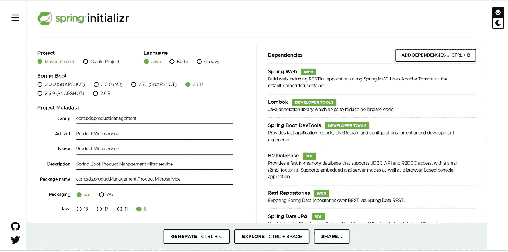
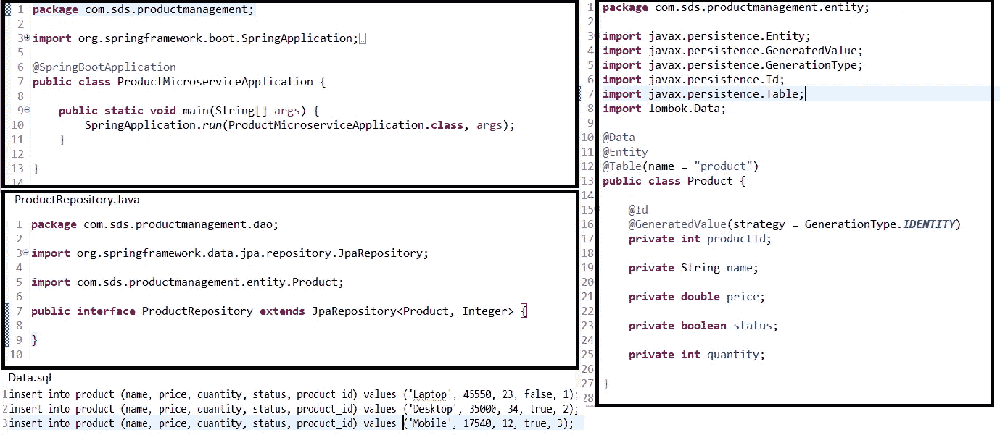
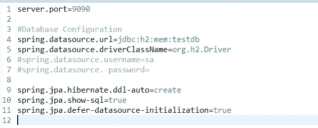
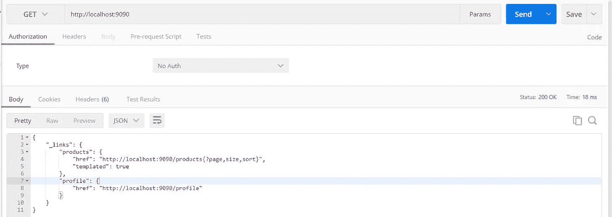
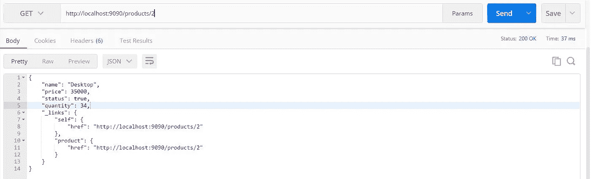
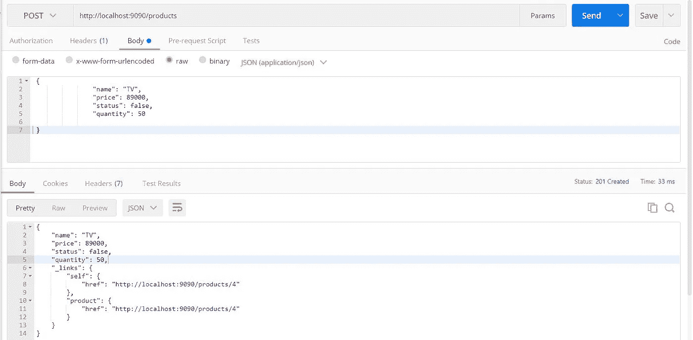
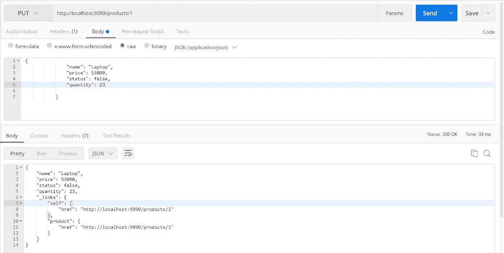

# 在不到 2 分钟的时间内编写微服务..(比 Maggi 快)

> 原文：<https://medium.com/javarevisited/write-microservice-in-less-than-2-mins-faster-than-maggi-b5b0d65a058?source=collection_archive---------0----------------------->

现在，微服务架构(MSA)在软件开发领域越来越受欢迎。

如果我说，我们可以在 2 分钟内编写微服务/Rest API…可能吗？

复制的图像

我没有施任何魔法..这个魔术是由 Java 开发者的 **Spring Data REST** starter 依赖完成的。

**Spring Data REST = Spring HATEOAS**+[+Spring Data JPA](/javarevisited/5-best-spring-data-jpa-courses-for-java-developers-45e6438be3c9)

**先决条件:**

*   弹簧靴 2.7.0
*   Maven 3.6 以上
*   Java 8 或更高版本

不浪费时间，我们将开始编写基于 Rest API /Service 的 [Spring boot](https://javarevisited.blogspot.com/2018/02/top-5-restful-web-services-with-spring-courses-for-experienced-java-programmers.html)

请前往[**https://start.spring.io/**](https://start.spring.io/)。请在项目中添加以下依赖项。

*弹簧靴起动器网*

*spring-boot-starter-data-JPA*

*弹簧-启动-启动器-数据-静止*

*龙目岛*

*H2*

*弹簧-启动-开发工具*

项目结构:

参考项目结构

**Product.java**—存储产品信息的实体 bean。
**ProductRepository.java**—扩展 JpaRepository。充当[@ repository restresour](http://twitter.com/RepositoryRestResour)ce，为 RESTful API 提供 CRUD 操作
**data.sql** —我们使用 data.sql 来填充初始产品数据。
**ProductMicroserviceApplication.java**—用于启动应用程序的主 Spring Boot 应用程序类。
**pom.xml** —包含构建这个项目所需的所有依赖项。

**供参考的代码片段**:

微服务的弹簧启动代码

**弹簧靴参考属性**:

应用程序.属性

让我们运行应用程序，看看 Spring Data Rest 的神奇之处:

**项目—>运行方式—>Spring Boot 应用程序。**

下面的快照代表微服务的 CRUD 操作。我已经用邮递员发送请求。

**获取:http://localhost:9090**

**获取 http://localhost:9090/products**

**获取**[**http://localhost:9090/products/2**](http://localhost:9090/products/2)

**POST**[**http://localhost:9090/products**](http://localhost:9090/products/2)

**获取**[**http://localhost:9090/products**](http://localhost:9090/products/2)

**放**[**http://localhost:9090/products**](http://localhost:9090/products/2)

**H2 数据库片段**

我们甚至可以获得开箱即用的**分页**和**排序**功能，而无需编写任何代码

[**http://localhost:9090/products？page = 0&size = 2**](http://localhost:9090/products?page=0&size=2)

**输出**:

*{
"_embedded": {
"产品":[
{
"名称": "笔记本电脑"，
"价格":53000，
"状态":假，
"数量":23，
" _ 链接":{
" self ":{
" href ":*[*http://localhost:9090/products/1*](http://localhost:9090/products/1)
" _ links ":{
" self ":{
" href ":":[*http://localhost:9090/products/2*](http://localhost:9090/products/2)*"
}，
" product ":{
" href ":*[*http://localhost:9090/products/2*](http://localhost:9090/products/2)*"
page = 0&size = 2**"
}，
" self ":{
" href ":"*[*http://localhost:9090/products？page = 0&size = 2*](http://localhost:9090/products?page=0&size=2) *}，
"下一个":{
" href ":"*[*http://localhost:9090/products？page = 1&size = 2*](http://localhost:9090/products?page=1&size=2) *}，
" last ":{
" href ":"*[*http://localhost:9090/products？page=1 & size=2*](http://localhost:9090/products?page=1&size=2)

[http://localhost:9090/products？&sort = name&page = 1&size = 2](http://localhost:9090/products?&sort=name&page=1&size=2)

**输出:**

*{
"_embedded": {
"产品":[
{
"名称": "移动"，
"价格":17540，
"状态":真，
"数量":12，
" _ 链接":{
" self ":{
" href ":*[*http://localhost:9090/products/3*](http://localhost:9090/products/3)
" _ links ":{
" self ":{
" href ":":[*http://localhost:9090/products/4*](http://localhost:9090/products/4)*"
}，
" product ":{
" href ":*[*http://localhost:9090/products/4*](http://localhost:9090/products/4)*"
page = 0&size = 2&sort = name，ASC* *}，
" prev ":{
" href ":"*[*http://localhost:9090/products？page = 0&size = 2&sort = name，ASC*](http://localhost:9090/products?page=0&size=2&sort=name,asc) *}，
" self ":{
" href ":"*[*http://localhost:9090/products？sort = name&page = 1&size = 2*](http://localhost:9090/products?sort=name&page=1&size=2) *}，
" last ":{
" href ":"*[*http://localhost:9090/products？page = 1&size = 2&sort = name，asc*](http://localhost:9090/products?page=1&size=2&sort=name,asc)

请从这里下载代码。

 [## GitHub-Sagar 11988/Spring-数据-休息-产品-微服务

### 此时您不能执行该操作。您已使用另一个标签页或窗口登录。您已在另一个选项卡中注销，或者…

github.com](https://github.com/sagar11988/Spring-Data-REST-Product-Microservice.git)