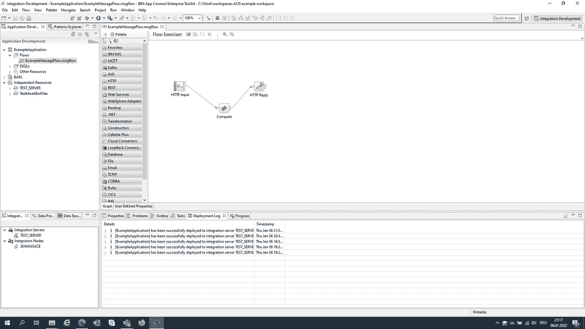
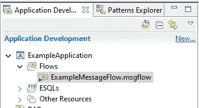
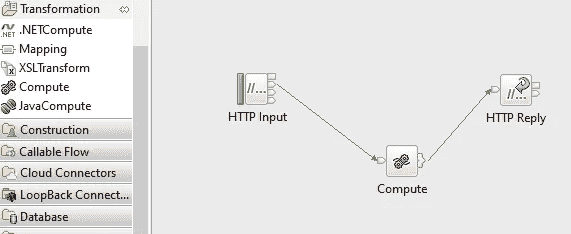
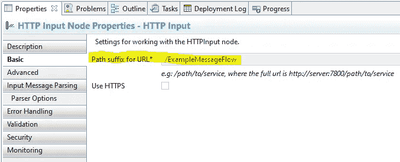
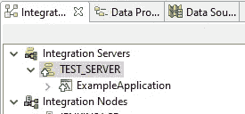
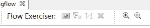
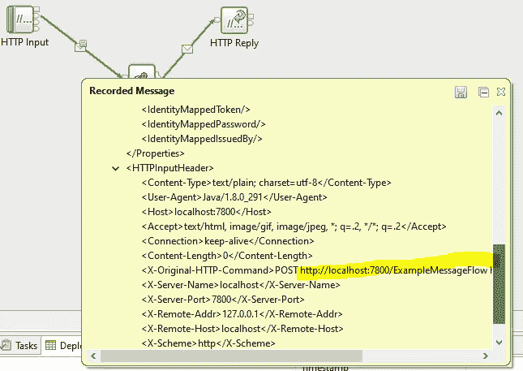
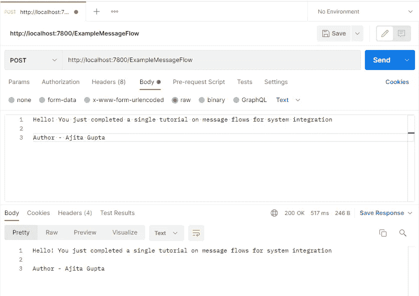

# 编写第一个消息流应用程序

> 原文：<https://medium.com/javarevisited/write-your-very-first-message-flow-application-8d293dbca6b3?source=collection_archive---------2----------------------->

## 假人的系统集成

IBM App Connect Enterprise 11 —作者截图

系统集成不是典型的软件工程类型。它不涉及架构或系统设计，甚至设计模式。它不是关于为你的任务找到最好的数据结构或者实现最快的算法。不。系统集成将工业商业软件连接到工业系统，形成一个更大的系统，作为一个整体运行。它为软件到系统的通信和 It 系统的维护提供基础设施。它还执行数据迁移和数据监控。

从业务角度来看，它有助于提高实时可见性，带来更好的自动化、库存优化和更高的客户满意度。从开发人员的角度来看，它涉及到企业 Java 编程、数据库管理、构建自动化、版本控制，以及绘制流程图。在其核心系统中，集成建立在消息流的基础上，这些消息流将信息从一端传送到另一端，从一个队列传送到另一个队列，从一个节点传送到另一个节点。

本教程旨在教你如何构建一个简单的消息流，传输数据和验证输出。这是在 IBM 的 App Connect Enterprise(一个用于编写和部署集成代码的工具包软件)和 Postman(一个用于 REST 调用的 API 客户端)的帮助下完成的。

# 创建您的应用程序

您必须首先创建一个保存消息流的应用程序。打开 App Connect Enterprise，从主菜单中选择**文件** - > **新建** - > **应用** - > **实例应用**。应用程序开发视图应该显示以下内容:

应用程序开发视图示例应用程序

再次点击**文件**->-**新建**->-**消息流**。选择正确的容器**示例应用**。现在，您可以对流程的逻辑进行编程。这是通过调色板中可用的不同模块来完成的。在我们的例子中，我们通过 **Out** 终端将一个模块 **HTTPInput** (调色板:HTTP)绑定到 **Compute** 模块(调色板:转换)，该终端再次连接到一个**HTTP preply**单元(调色板:HTTP)。您的图表应该如下图所示:

包含我们的消息流图的拖放编辑器

我们的应用程序是做什么的？双击计算模块以访问其代码。这是用 EQSL 语言写的，是扩展 SQL 的缩写。取消第五行代码的注释，如下所示:

计算模块的 ESQL 代码

您一定已经猜到，我们简单实现的逻辑以 HTTP 响应的形式输出输入消息。想起什么了吗？是的，我们正在使用休息呼叫！但是要做到这一点，我们需要分配一个资源名。右键点击 **HTTPInput** - > **属性**->**URL 的路径后缀:/ExampleMessageFlow** 。就是这样！

HTTPInput 的属性视图

# 运行集成服务器

集成服务器用于为一组已部署的消息流和资源提供隔离的运行时环境。每个集成服务器都作为独立地址空间中的唯一进程运行。与 Apache Tomcat 为 web 应用程序所做的类似，运行集成软件需要集成服务器。

要创建服务器，请转到 Integration Explorer 视图，右键单击**集成服务器**->-使用所有默认选项创建本地集成服务器。

集成浏览器视图与我们正在运行的服务器

# 观察输出

现在是时候运行应用程序，并确认我们的应用程序确实工作，并做它应该做的事情。

点击文本流训练器旁边的红色按钮**启动应用程序。**

开始按钮显示为红色

单击红色按钮旁边的图标，发送您选择的消息。您将得到一些信息消息，之后应用程序开始运行，链接以绿色突出显示。双击左边的消息，向下滚动到**消息**部分。提取下面以黄色突出显示的监听端口和路径(确保应用程序仍在运行):

发布请求的 REST URL

现在打开 PostMan，选择 **POST** 后粘贴你的 URL，输入你的 **Body** (选项: **raw** )。点击**发送**。见证奇迹的发生！

在 PostMan 中发布测试示例应用程序的请求

现在怎么办？去给自己倒一杯香槟——这是你应得的！