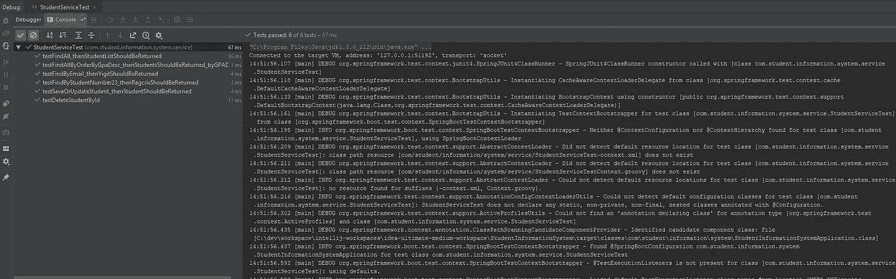
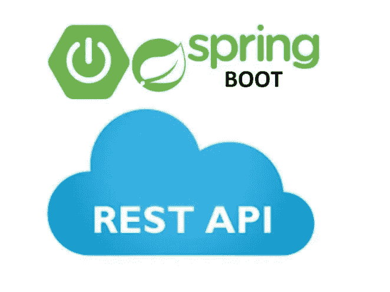
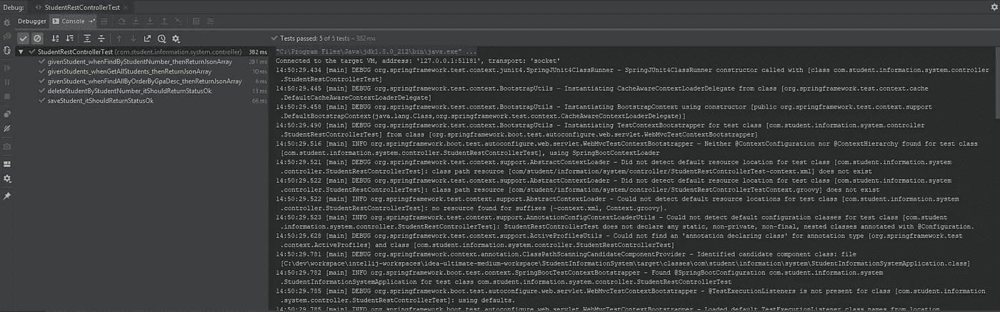

# 使用 Spring Boot 编写单元测试(第 2 部分)

> 原文：<https://medium.com/javarevisited/writing-a-unit-test-using-spring-boot-part-2-b16847484cb9?source=collection_archive---------0----------------------->

在我描述了“ [*如何使用 Spring Boot 和 MongoDB*](/@yigitcannalci/building-a-rest-service-with-spring-boot-and-mongodb-3aa5cd2dce73?source=friends_link&sk=582face6df6e23be283b543ae804552e) 开发 REST 服务”之后，我决定解释一下*如何使用 Spring Boot* 编写单元测试。


乌德米

在本教程中，单元测试是在前面的故事中开发的项目[中编写的，所以前面的项目中使用的技术和设置是相同的。](/@yigitcannalci/building-a-rest-service-with-spring-boot-and-mongodb-3aa5cd2dce73?source=friends_link&sk=582face6df6e23be283b543ae804552e)

您可以从这个 [GitHub](https://github.com/ragcrix/StudentInformationSystem) 链接下载项目源代码。


开源代码库

Spring Boot 用`SpringRunner`简化单元测试。用`MockMVC`为 REST 控制器编写单元测试也更容易。为了编写一个单元测试，Spring Boot 启动测试依赖项应该被添加到您的构建配置文件中(对于我们的项目， **pom.xml** )。

```
<dependency>
    <groupId>org.springframework.boot</groupId>
    <artifactId>spring-boot-starter-test</artifactId>
    <scope>test</scope>
</dependency>
```

这样做之后，我们就可以编写我们的第一个单元测试了。

# StudentService.java 的测试

在这一节中，我们将为图中所示的**StudentService.java**实现一个单元测试。

```
@Service
public class StudentServiceImpl implements StudentService {

    @Autowired
    private StudentRepository studentRepository;

    @Override
    public List<Student> findAll() {
        return studentRepository.findAll();
    }

    @Override
    public Student findByStudentNumber(long studentNumber) {
        return studentRepository.findByStudentNumber(studentNumber);
    }

    @Override
    public Student findByEmail(String email) {
        return studentRepository.findByEmail(email);
    }

    @Override
    public List<Student> findAllByOrderByGpaDesc() {
        return studentRepository.findAllByOrderByGpaDesc();
    }

    @Override
    public Student saveOrUpdateStudent(Student student) {
        return studentRepository.save(student);
    }

    @Override
    public void deleteStudentById(String id) {
        studentRepository.deleteById(id);
    }
}
```

首先，我们需要在类上面写`@RunWith(SpringRunner.class)`注释。这个注释使用`SpringJUnit4ClassRunner`来运行单元测试。

第二，`@SpringBootTest`注释补充。这个注释为测试类提供了许多特性。更多信息请点击[此处](https://docs.spring.io/spring-boot/docs/current/api/org/springframework/boot/test/context/SpringBootTest.html)。

然后，添加要测试的类(**StudentService.java**)及其依赖项，如下所示。

```
@RunWith(SpringRunner.class)
@SpringBootTest
public class StudentServiceTest {

   @Autowired
    private StudentService studentService;

    @MockBean
    private StudentRepository studentRepository; ...}
```

现在，我们可以编写模拟对象来测试 StudentService.java 了。Ragcrix 和 yigit 被创建。以下值被分配给对象。

```
private Student ragcrix;
private Student yigit;

private final Long ragcrixStudentNumber = 23L;
private final Long yigitStudentNumber = 91L;
private final String ragcrixEmail = "ragcrix@rg.com";
private final String yigitEmail = "yigit@ygt.com";
private final List<Student> students = new ArrayList<>();

@Before
public void setup() {
    ragcrix = new Student();
    ragcrix.setId("aBc123");
    ragcrix.setName("ragcrix");
    ragcrix.setEmail(ragcrixEmail);
    ragcrix.setStudentNumber(ragcrixStudentNumber);
    ragcrix.setCourseList(Arrays.*asList*("Math", "Science"));
    ragcrix.setGpa(3.37f);

    yigit = new Student();
    yigit.setId("dEf345");
    yigit.setName("yigit");
    yigit.setEmail(yigitEmail);
    yigit.setStudentNumber(yigitStudentNumber);
    yigit.setCourseList(Arrays.*asList*("Turkish", "German"));
    yigit.setGpa(3.58f);

    students.add(ragcrix);
    students.add(yigit);
```

对于学生服务中的`findAll()`方法，我们需要模仿**StudentRepository.java**中的`findAll()`方法。之后，我们准备写测试方法。为此，编写了`testFindAll_thenStudentListShouldBeReturned()`方法。这个方法只是检查返回数据的大小。

```
...Mockito.*when*(studentRepository.findAll()).thenReturn(students);...@Test
public void testFindAll_thenStudentListShouldBeReturned() {
    List<Student> foundStudents = studentService.findAll();

    *assertNotNull*(foundStudents);
    *assertEquals*(2, foundStudents.size());
}
```

对于学生服务中的`findByStudentNumber()`方法，我们需要模仿**StudentRepository.java**中的`findByStudentNumber()`方法。之后，我们准备写测试方法。对于这一点，`testFindByStudentNumber23_thenRagcrixShouldBeReturned()`法是这样写的。

```
...Mockito.*when*(studentRepository.findByStudentNumber
(ragcrixStudentNumber)).thenReturn(ragcrix);...@Test
public void testFindByStudentNumber23_thenRagcrixShouldBeReturned() {
    Student found = studentService.findByStudentNumber(ragcrixStudentNumber);

    *assertNotNull*(found);
    *assertEquals*(ragcrix.getName(), found.getName());
    *assertEquals*(ragcrix.getId(), found.getId());
}
```

对于学生服务中的`findByEmail()`、`findAllByOrderByGpaDesc()`、`saveOrUpdateStudent()`、`deleteStudentById()`方法，**、**中的相关方法同样被模仿。然后，StudentService 的测试方法编写如下。

```
 ...Mockito.*when*(studentRepository.findByEmail(yigitEmail))
        .thenReturn(yigit);

Mockito.*when*(studentRepository.findAllByOrderByGpaDesc())
        .thenReturn(students.stream().sorted(
                Comparator.*comparing*(Student::getGpa).reversed()).collect(Collectors.*toList*()));

Mockito.*when*(studentRepository.save(ragcrix)).thenReturn(ragcrix);...@Test
public void testFindByEmail_thenYigitShouldBeReturned() {
    Student found = studentService.findByEmail(yigitEmail);

    *assertNotNull*(found);
    *assertEquals*(yigit.getName(), found.getName());
    *assertEquals*(yigit.getId(), found.getId());
}

@Test
public void testFindAllByOrderByGpaDesc_thenStudentsShouldBeReturned_byGPADesc() {
    List<Student> foundStudents = studentService.findAllByOrderByGpaDesc();

    *assertNotNull*(foundStudents);
    *assertEquals*(2, foundStudents.size());
    *assertEquals*(yigit.getName(), foundStudents.get(0).getName());
    *assertEquals*(yigit.getId(), foundStudents.get(0).getId());
}

@Test
public void testSaveOrUpdateStudent_thenStudentShouldBeReturned() {
    Student found = studentService.saveOrUpdateStudent(ragcrix);

    *assertNotNull*(found);
    *assertEquals*(ragcrix.getName(), found.getName());
    *assertEquals*(ragcrix.getId(), found.getId());
}

@Test
public void testDeleteStudentById() {
    studentService.deleteStudentById(ragcrix.getId());

    Mockito.*verify*(studentRepository, Mockito.*times*(1))
            .deleteById(ragcrix.getId());
}
```



StudentServiceTest.java 的测试结果

# StudentRestController.java 测试

Spring Boot 提供了一种为 Rest 控制器编写单元测试的简单方法。在**spring JUnit 4 class runner**和 **MockMVC** 的帮助下，可以创建一个 web 应用上下文来为 Rest 控制器编写单元测试。



[codeflex](https://codeflex.co)

首先，像前面的测试一样，我们向测试类添加必要的注释。`MockMvc`是一类 Spring Boot 测试工具，允许你测试控制器，而不必启动 HTTP 服务器。用`@WebMvcTest`测试网络控制器更容易。[点击](https://docs.spring.io/spring-boot/docs/current/api/org/springframework/boot/test/autoconfigure/web/servlet/WebMvcTest.html)了解详情。

```
@RunWith(SpringRunner.class)
@WebMvcTest
public class StudentRestControllerTest {

    @Autowired
    private MockMvc mvc;

    @MockBean
    private StudentService studentService;

    private ObjectMapper objectMapper = new ObjectMapper();
```

在为 web 控制器测试安排好配置之后，我们可以向这个类添加模拟对象，如下所示。

```
private Student ragcrix;
private Student yigit;

private final Long ragcrixStudentNumber = 23L;
private final Long yigitStudentNumber = 91L;

@Before
public void setup() {
    ragcrix = new Student();
    ragcrix.setId("aBc123");
    ragcrix.setName("ragcrix");
    ragcrix.setEmail("ragcrix@rg.com");
    ragcrix.setStudentNumber(ragcrixStudentNumber);
    ragcrix.setCourseList(Arrays.*asList*("Math", "Science"));
    ragcrix.setGpa(3.37f);

    yigit = new Student();
    yigit.setId("dEf345");
    yigit.setName("yigit");
    yigit.setEmail("yigit@ygt.com");
    yigit.setStudentNumber(yigitStudentNumber);
    yigit.setCourseList(Arrays.*asList*("Turkish", "German"));
    yigit.setGpa(3.58f);
}
```

现在，我们准备编写第一个测试方法。对于**StudentRestController.java**中的`getAllStudents()`，编写如下方法。`mvc.perform()`方法用于测试终点。你可以用下面的方法比较预期和实际的数据。

在这个测试方法中，当调用`studentService.findAll()`时，将返回一个学生列表。之后，用`mvc.perform()`对控制器中的`getAllStudents()`进行测试。

```
@Test
public void givenStudents_whenGetAllStudents_thenReturnJsonArray() throws Exception {
    *given*(studentService.findAll()).willReturn(Arrays.*asList*(ragcrix));

    mvc.perform(*get*("/students/")
            .contentType(MediaType.*APPLICATION_JSON*))
            .andExpect(*status*().isOk())
            .andExpect(*jsonPath*("$", *hasSize*(1)))
            .andExpect(*jsonPath*("$[0].name", *is*(ragcrix.getName())));
}
```

如下所示，其他 **GET** 方法的测试就像`givenStudents_whenGetAllStudents_thenReturnJsonArray()`方法一样编写。

```
@Test
public void givenStudent_whenFindByStudentNumber_thenReturnJsonArray() throws Exception {
    *given*(studentService.findByStudentNumber(ragcrixStudentNumber)).willReturn(ragcrix);

    mvc.perform(*get*("/students/byStudentNumber/{studentNumber}", ragcrixStudentNumber)
            .contentType(MediaType.*APPLICATION_JSON*))
            .andExpect(*status*().isOk())
            .andExpect(*jsonPath*("$.name", *is*(ragcrix.getName())));
}

@Test
public void givenStudent_whenFindAllByOrderByGpaDesc_thenReturnJsonArray() throws Exception {
    *given*(studentService.findAllByOrderByGpaDesc()).willReturn(Arrays.*asList*(yigit, ragcrix));

    mvc.perform(*get*("/students/orderByGpa/")
            .contentType(MediaType.*APPLICATION_JSON*))
            .andExpect(*status*().isOk())
            .andExpect(*jsonPath*("$", *hasSize*(2)))
            .andExpect(*jsonPath*("$[0].name", *is*(yigit.getName())));
}
```

GET 方法的测试完成后，我们就可以编写 POST 方法测试了。对于控制器中的`saveStudent()`方法，编写`saveStudent_itShouldReturnStatusOk()`方法。在这种方法中，`studentService.saveOrUpdateStudent()`法首先被嘲弄。要保存的**学生** **对象** ( `yigit`)通过`objectMapper`转换为`jsonString`。之后，使用`mvc.perform()`方法测试`/save`终点。

与编写的其他 GET 方法一样，您也可以测试`/save`端点的返回值。

```
@Test
public void saveStudent_itShouldReturnStatusOk() throws Exception {
    *given*(studentService.saveOrUpdateStudent(*any*(Student.class))).willReturn(yigit);

    String jsonString = objectMapper.writeValueAsString(yigit);

    mvc.perform(*post*("/students/save/")
            .contentType(MediaType.*APPLICATION_JSON*).content(jsonString))
            .andExpect(*status*().isOk());
}
```

我们在**StudenRestController.java**的最后一个方法是`deleteStudentByStudentNumber()`。对于这个方法，写的是`deleteStudentByStudentNumber_itShouldReturnStatusOk()`。首先，**StudentService.java**中的相关方法像其他测试方法一样被嘲讽。之后用`mvc.perform()`测试`/delete/{studentNumber}`终点。

```
@Test
public void deleteStudentByStudentNumber_itShouldReturnStatusOk() throws Exception {
    *given*(studentService.findByStudentNumber(ragcrixStudentNumber)).willReturn(ragcrix);
    Mockito.*doNothing*().when(studentService).deleteStudentById(*any*(String.class));

    mvc.perform(*delete*("/students/delete/{studentNumber}", ragcrixStudentNumber)
            .contentType(MediaType.*APPLICATION_JSON*))
            .andExpect(*status*().isOk());
}
```



StudentRestControllerTest.java 的测试结果

# 感谢您的阅读！🙏你的想法对我很有价值。请随意分享。😄