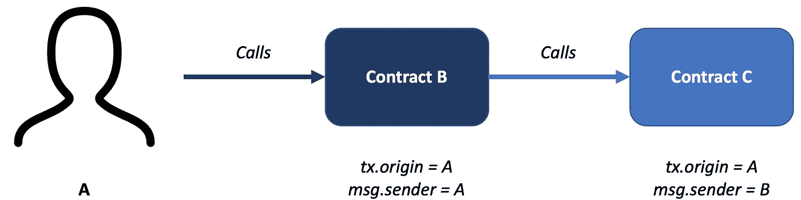

# 撰写我的第一份以太坊智能合约(第 1 部分)

> 原文：<https://medium.com/javarevisited/writing-my-first-ethereum-smart-contract-part-1-fa74e329cb93?source=collection_archive---------4----------------------->

我相信你应该听说过比特币。与比特币类似，以太坊是另一个[区块链平台](/javarevisited/7-free-courses-to-learn-blockchain-in-2020-764e66b47ebe)，拥有自己的加密货币——以太(ETH)。

以太坊是一个去中心化、开源的[区块链](/javarevisited/best-blockchain-courses-and-certification-in-2020-63729f8f04d0)，拥有智能合约——世界可编程区块链。与比特币不同，以太坊让你有能力开发自己的数字资产。

Solidity 是用于在以太坊中编写智能合约的编程语言。让我们从一些坚实的基础开始吧！

[](https://javarevisited.blogspot.com/2021/11/top-5-courses-to-learn-ethereum-for.html)

约翰·施诺布里奇在 [Unsplash](https://unsplash.com/s/photos/smart-contract?utm_source=unsplash&utm_medium=referral&utm_content=creditCopyText) 上的照片

# **坚固性编译**

[](https://javarevisited.blogspot.com/2020/07/top-5-online-courses-to-learn-blockchain.html#axzz6tFYADc00)

*Solc* 用于将 solidity 代码编译成以太坊虚拟机(EVM)字节码。然后字节码将在一个事务中被部署到以太网。

# 固体介绍

## 智能合同的基本结构

其结构与 Java/C#等任何面向对象语言非常相似。

我们应该总是在第一行定义 solidity 版本，然后是契约的实现，它可以封装变量和方法。也支持类继承。

抽象合同的示例

继承合同的示例

## 基本数据类型

*   弯曲件
*   枚举<name>{成员}
    -例如*枚举设备{一、二、三、四、五、六}*</name>
*   int，uint，int8，uint8，int16，uint16，…，uint256
    -有符号和无符号(可以是正数/负数)整数，大小为
    -默认值= 256，因此 int = int256，uint = uint256
    - int8 表示 1 字节有符号整数
*   地址
    -保存 20 字节地址(例如以太坊账户地址)
*   线

**复杂数据类型**

*   字节
    -字节的动态数组
*   <type>[]
    -动态数组
    -如 uint[]numar；</type>
*   映射(<key type="">= ><value type="">)
    ——一个<键类型>到<值类型>
    的哈希映射的概念——比如*映射(address = > uint)平衡；*</value></key>
*   struct <name>{ <member types="">}
    -例如*struct item {
    string name；
    uint id；
    地址 addr
    }*</member></name>

**可变范围**

*   状态变量—在合同范围内定义。它有持久存储，并将存储在以太坊的账本中。
    如
    *合同阅读器{
    uint 数据；//状态变量
    }*
*   局部变量—在函数范围内定义。它在执行期间会消耗 EVM 堆栈内存，但在完成时会被丢弃。
    例如
    *合同阅读器{
    函数 calculate foo(){
    uint temp；//局部变量
    }
    }*

有两种类型的存储:

1.  存储——EVM 的持久存储(昂贵的天然气)。状态变量的默认值
2.  记忆——EVM 的临时储存(下气)。局部变量的默认值。

虽然`memory`是局部变量的默认存储类型，但它(和函数参数)也可以明确定义为`storage`。

## 函数语法

```
function <name> (<params>) <visibility / modifier> <return type> {
  <function body> ...
}e.g. The following method is callable by end users
function calculateSum(uint num) public view returns (uint) {
  ...
  return total;
}
```

**能见度**

1.  外部——可以使用`call`或`delegatecall`从另一个合同调用
2.  public —最终用户可调用的公共函数或状态变量/ web3
3.  内部—可从当前或继承的契约中访问的函数或状态变量
4.  私有—只能从当前契约访问的函数或状态变量

**功能修改器**

1.  应付——能够收到乙醚。否则，如果提供了 ether，将会引发错误。
2.  视图-不改变状态变量。可以在没有交易费的情况下调用(只读函数，根本不修改状态)
3.  纯-根本不访问状态变量。可以无交易费调用。这样的函数通常只做计算。

**函数修饰符使用 _**

`_`用于通常重用的代码片段。这有助于提高可读性。

**特殊方法和变量**

*   `msg.value` —交易调用中发送的乙醚量
*   `msg.sender` —当前交易的调用方
*   `tx.origin` —交易链的原始调用方
*   `tx.gasprice` —呼叫者指定的气价

[](https://www.java67.com/2018/02/5-free-blockchain-technology-courses.html)

演示 tx.orgin 和 msg.sender 之间的区别

## 事件

事件是协定的可继承成员。它允许应用程序订阅和侦听这些事件。发出事件时会创建事务日志。这些日志存储在链中，并且当它仍然存在于链中时，可以使用契约的地址来访问。

```
// Declare an event
event <name> (<parameters>)// Emit an event
emit <name> (<parameters>)
```

# 结论

以上总结了 Solidity 编程的基本概念，我希望它能让你对语法有一个深刻的了解，让我们在下一篇文章中开始一个完整的智能契约的例子吧！

感谢您的阅读！