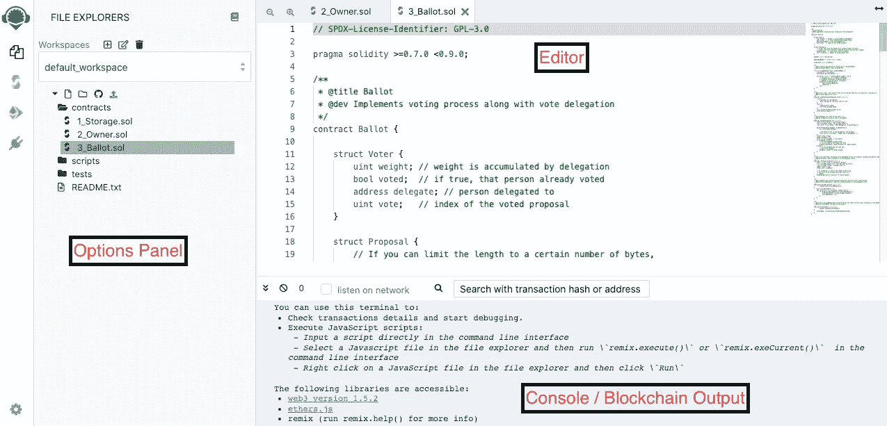
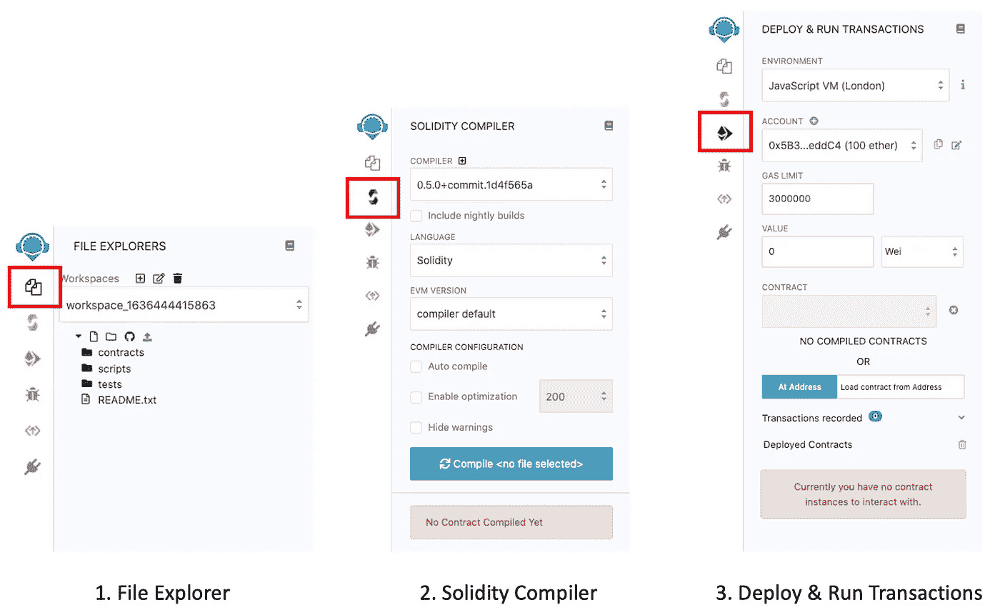
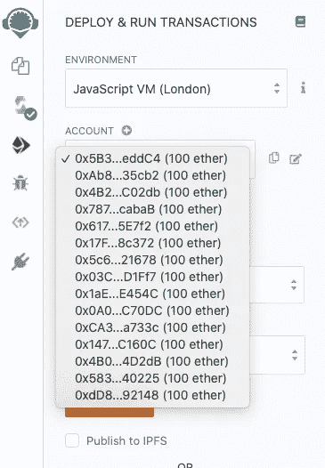
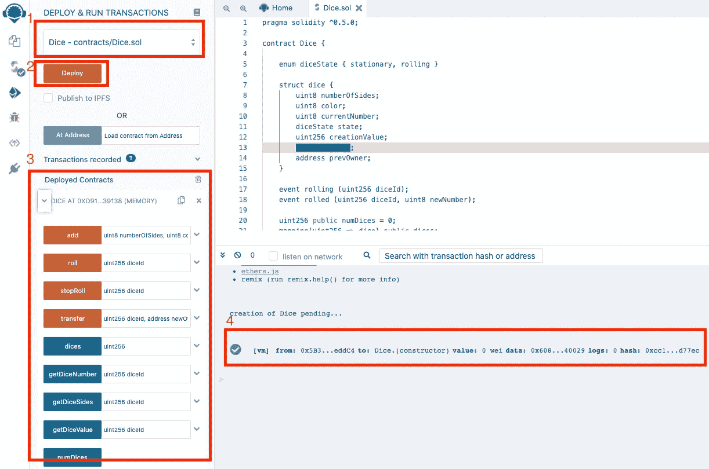
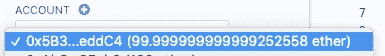
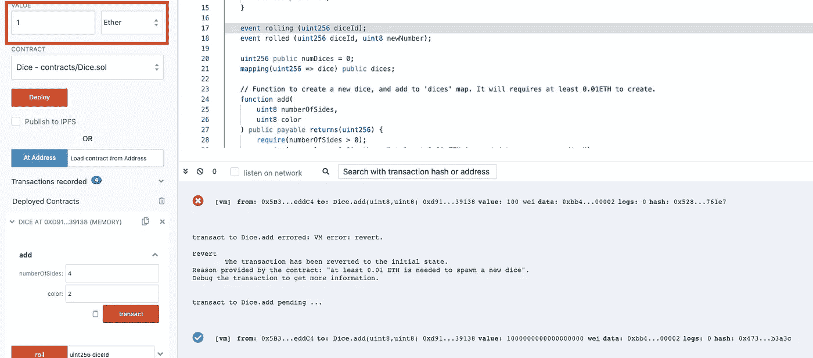

# 撰写我的第一份以太坊智能合约(第二部分)

> 原文：<https://medium.com/javarevisited/writing-my-first-ethereum-smart-contract-part-2-fe9833985aae?source=collection_archive---------3----------------------->

在我的[前一篇文章](/p/fa74e329cb93)中，我已经涵盖了关于稳健的大部分基本和核心概念。如果你没有，那就赶快看看吧！

让我们通过一个非常简单的智能合约开始动手编程吧！

首先，我们将使用一个基于 web 的以太坊 IDE — [Remix](https://remix.ethereum.org/) 。

[](https://javarevisited.blogspot.com/2020/07/top-5-online-courses-to-learn-blockchain.html#axzz6tFYADc00)

照片由 [Shamsudeen Adedokun](https://unsplash.com/@shams_ad?utm_source=unsplash&utm_medium=referral&utm_content=creditCopyText) 在 [Unsplash](https://unsplash.com/s/photos/remix-ide?utm_source=unsplash&utm_medium=referral&utm_content=creditCopyText) 上拍摄

# 关于混音

[](https://www.java67.com/2018/02/5-free-blockchain-technology-courses.html)

混音页面截图

一旦您通过[链接](https://remix.ethereum.org/)导航到 Remix，您应该能够看到一个类似的屏幕。它支持不同的用户界面主题，如黑暗，光明和中世纪等。您可以通过导航栏左下角的*档位*设置图标进行更改。

[](https://javarevisited.blogspot.com/2021/11/top-5-courses-to-learn-ethereum-for.html)

在本教程中，我们将主要关注前 3 个选项卡。

1.  文件浏览器标签——你可以创建文件，甚至链接到你的 Github。
2.  编译器选项卡—您需要在这里编译代码。(我们将使用 0.5.0 版本的编译器)
3.  Deploy & Run Transactions 选项卡—您将选择要部署的已编译合同，您还可以在此处看到部署合同的地址。

# 编码

## 设置基础环境。

在 Remix 中创建一个新文件— `Dice.sol`并将下面的代码复制粘贴到其中。进入编译器选项卡，点击`Compile Dice.sol`。

以下代码为您提供了一个非常基本的骰子智能契约，它具有以下功能:

*   创建一个新骰子
*   掷色子
*   停止掷骰子

您可能需要一些时间来浏览代码，消化并参考我们在[上一篇文章(变量、函数、修饰符和事件)](/p/fa74e329cb93)中浏览过的一些概念。

让我们试着在混音中运行，感受一下它应该如何工作。现在，选择第三个选项卡—部署和运行事务。



请注意，您有 10 个帐户，每个帐户有 100 个以太网。如果需要，您可以点击`ACCOUNT`标题旁边的“+”图标添加更多账户。



确保您选择了方框 1 中突出显示的骰子合约。单击`Deploy`按钮，您应该会在框 4 中看到与您的输出类似的变化(给您一条成功部署的消息),在框 3 中看到已部署的合同。

在框 3 中，除了智能合约的地址(您可以通过单击复制图标轻松访问该地址)，您还可以看到您已编码的函数列表。在这里，您可以进行交互并测试智能合约的所有功能。



您可能已经注意到，您选择用来部署智能合同的帐户比以前更少了。这是因为将智能合约部署到“测试”网络中需要一些(非常少的)GAS。

## 让我们测试一下这些功能。



要运行`add`功能，我们需要为骰子指定一些值(至少 0.1 乙醚)，因此您需要输入一些在红色框中突出显示的值，否则您将被抛出一个错误:

```
transact to Dice.add errored: VM error: revert.revert
      The transaction has been reverted to the initial state.
Reason provided by the contract: "at least 0.01 ETH is needed to spawn a new dice".
....
```

您可以按照自己的节奏尝试其他功能。

## 锻炼身体。

现在，尝试编写一个新函数——销毁骰子并返回以太。您可能需要考虑一些条件，如 ownerOnly、isValidDice 等。看看如何用一种特殊的方法把乙醚归还给物主。

这里是[链接](https://gist.github.com/chialiyun/b376a4a5741f3763c83864025f20efcf)到完整的代码供你参考。

# 结论

我希望这个简单的教程已经让您更好地理解了如何创建自己的智能合同！在后续文章中，我们将更深入地使用一个对管理开发生命周期、调试和测试有用的框架。

感谢您的阅读！下次见！🤓