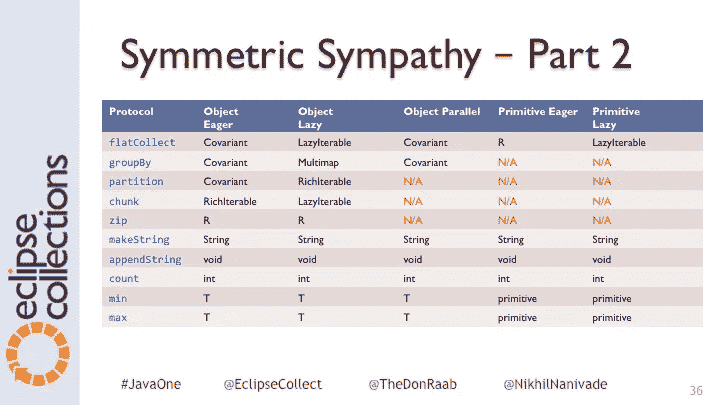

# 拉链对称

> 原文：<https://medium.com/javarevisited/zip-symmetry-a857a934ee26?source=collection_archive---------7----------------------->

另一个关于[对称同情](/@donraab/symmetric-sympathy-2c59d4541d60)的故事发生在物品和原始收藏品的土地上。


克里特岛巴洛斯岛

今年，我在 JavaOne 大会上做了一个题为 ***API Deep Dive:与 Nikhil Nanivadekar 一起设计 Eclipse 集合***【con 6133】的演讲。我真的很喜欢这次演讲，因为我在 45 分钟内回顾了 12 年多的发展历程。这些幻灯片现已在网上[这里](https://static.rainfocus.com/oracle/oow17/sess/1494212572063001UbJA/PF/JavaOne2017_CON6133_12_1507248789169001TA3b.pptx)提供。

对称性继续驱动着 [Eclipse 集合](https://www.eclipse.org/collections/)中新特性的设计和实现。在演示的第 36 张幻灯片上(见下文)，我指出了我们目前在对象集合和基本集合之间缺少一些对称性的地方。



原始渴望 zip 在哪里？

从 JavaOne 回家后，我决定在哥伦布日为 Eclipse 集合中的原始渴望列表实现`zip`。

## zip 是什么？

根据[维基百科](https://en.wikipedia.org/wiki/Convolution_(computer_science)):

> 在计算机科学中，特别是在形式语言中，卷积(有时称为 zip)是一种将序列元组映射成元组序列的函数。

换句话说，如果您有两个对象列表，并且您将它们压缩在一起，您将得到一个对象对的列表。

这里有一个例子，说明如何在 Eclipse Collections (EC)中使用`[zip](https://www.eclipse.org/collections/javadoc/9.0.0/org/eclipse/collections/api/list/ListIterable.html#zip-java.lang.Iterable-)`进行对象收集。

```
MutableList<String> one = Lists.***mutable***.with(**"1"**, **"2"**, **"3"**);
ImmutableList<String> two = Lists.***immutable***.with(**"one"**, **"two"**, **"three"**);
MutableList<Pair<String, String>> zipOneAndTwo = one.zip(two);
ImmutableList<Pair<String, String>> zipTwoAndOne = two.zip(one);
```

如果我们输出`zipOneAndTwo`和`zipTwoAndOne`，它们看起来如下:

```
[1:one, 2:two, 3:three]
[one:1, two:2, three:3]
```

我们可以把第一个列表改成像这样的`Integer`对象。

```
MutableList<Integer> one = Lists.***mutable***.with(1, 2, 3);
ImmutableList<String> two = Lists.***immutable***.with(**"one"**, **"two"**, **"three"**);
MutableList<Pair<Integer, String>> zipOneAndTwo = one.zip(two);
ImmutableList<Pair<String, Integer>> zipTwoAndOne = two.zip(one);
```

我们仍然得到相同的输出，因为`Pair`如何定义`toString()`。

```
[1:one, 2:two, 3:three]
[one:1, two:2, three:3]
```

我讨厌将整数装箱。我希望能够使用`IntList`而不是`Integer`对象的`List`。以前在 EC 里，我们不能把`Integer`的`MutableList`改成`MutableIntList`。现在我们可以了，但是这个新能力凸显了一个小问题。

```
MutableIntList one = IntLists.***mutable***.with(1, 2, 3);
ImmutableList<String> two = Lists.***immutable***.with(**"one"**, **"two"**, **"three"**);
MutableList<IntObjectPair<String>> zipOneAndTwo = one.zip(two);// The following code does not compile
***ImmutableList<ObjectIntPair<String>> zipTwoAndOne = two.zip(one);***
```

我用下面的签名向原语列表添加了一个方法`zip`(下面以`IntList`为例)。

```
*/**
 * Returns a {****@code*** *MutableList} formed from this {****@code*** *MutableIntList} and a {****@code*** *ListIterable} by
 * combining corresponding elements in pairs. If one of the two Lists is longer than the other, its
 * remaining elements are ignored.
 *
 ** ***@since*** *9.1.
 */* default <T> MutableList<IntObjectPair<T>> zip(ListIterable<T> list)
```

`zip`我们还不能用一个原语链表来表示一个对象链表。通过在一个方向(图元+对象)上添加一个特征，我发现(或创建)了在另一个方向(对象+图元)上缺乏对称性。

## 代码生成器的一小步…

我们可以将两个对象列表压缩在一起，而不考虑对象类型，所以我希望至少能够压缩两个 int 列表、两个 double 列表、两个 short 列表等。除此之外，现在还可以用一个对象列表压缩一个原语列表。因此，下面的签名也包含在内，并且今天生成了代码(下面的例子是`IntList`上的`zipInt`)。还为`DoubleList`生成了一个方法`zipDouble`，为`FloatList`生成了`zipFloat`，以此类推。我使用了一种命名模式，这种模式可以很容易地允许以后添加额外的表单，如果出现了它们的用例的话。

```
*/**
 * Returns a {****@code*** *MutableList} formed from this {****@code*** *MutableIntList} and another {****@code*** *IntList} by
 * combining corresponding elements in pairs. If one of the two {****@code*** *IntList}s is longer than the other, its
 * remaining elements are ignored.
 *
 ** ***@since*** *9.1.
 */* default MutableList<IntIntPair> zipInt(IntList list)
```

这里有一个使用方法`zipInt`将两个`IntLists`压缩在一起的例子。

```
MutableIntList one = IntLists.***mutable***.with(1, 2, 3);
ImmutableIntList two = IntLists.***immutable***.with(10, 20, 30);
MutableList<IntIntPair> zipOneAndTwo = one.zipInt(two);
ImmutableList<IntIntPair> zipTwoAndOne = two.zipInt(one);
```

如果我输出两个压缩列表，结果如下:

```
[1:10, 2:20, 3:30]
[10:1, 20:2, 30:3]
```

现在，我们可以将八种形式的原语列表压缩到对象列表中。我们也可以压缩原语列表的“like”形式(`IntList`->-`zipInt`、`DoubleList`->-`zipDouble`)，等等。).我希望这个功能在可预见的将来能够满足大多数需求。

## 北方记得

对称不忘，在缺失和需要的时候，开发者总不会轻易原谅。为了对称而达到完美的对称是徒劳的。如果你发现自己在这个领域需要更多的对称性，记住 [Eclipse Collections 是开源的](https://github.com/eclipse/eclipse-collections/blob/master/CONTRIBUTING.md)。您可以提出请求，也许有人会代表您实现它，但是最快的完成方式可能是积极参与 Eclipse 集合社区并做出贡献。如果您有兴趣投稿，我们将确保您获得所需的所有帮助。

## 续集？

今天我们在 Eclipse 集合中有 zip，但是我们还没有它的自然对应物: *unzip* 。Unzip 将接受一个对列表，返回一对列表。Unzip 只在对象集合端有意义，因为您只能解压缩一组对。听起来很简单，对吗？现在 zip 中支持的原语使得 Unzip 的定义更加复杂。如果你有一个`Pair`的`List`，你会得到一个`Lists`的`Pair`。如果你有一个`ObjectIntPair`的`List`，你会想要得到一个`List`的`Pair`和`IntList` …等等。unzip 的返回类型很难定义，至少不会使 API 变得复杂，因为它不需要任何参数。我认为在试图解决这个对称问题之前，我们应该等待一段时间。然而，有一种模式是非常好的，一旦我们有了它，可能会使使用 zip 变得不那么有吸引力。这个格局就是`collectWithIndex`。我们今天有`forEachWithIndex`和`injectIntoWithIndex`(仅限原语)。哦，不...敬请关注。

我希望我的对称同情故事的最新章节是有趣的和有启发性的。

[*月食收藏*](https://github.com/eclipse/eclipse-collections) *是开作* [*投稿*](https://github.com/eclipse/eclipse-collections/blob/master/CONTRIBUTING.md) *。如果你喜欢这个库，你可以在 GitHub 上让我们知道。*

**你可能喜欢的其他文章:**

[](/javarevisited/what-next-for-senior-developers-in-tech-project-manager-technical-architect-or-a-devops-engineer-b532a80c9ba1) [## 高科技领域的高级开发人员接下来会做什么？项目经理、技术架构师或 DevOps 工程师

### 是时候考虑职业生涯的下一个层次了。

medium.com](/javarevisited/what-next-for-senior-developers-in-tech-project-manager-technical-architect-or-a-devops-engineer-b532a80c9ba1) [](/javarevisited/what-java-programmers-should-learn-in-2020-648050533c83) [## 2020 年 Java 程序员该学什么？

### 2020 年 Java 程序员可以学习的有用工具、技术、框架和库

medium.com](/javarevisited/what-java-programmers-should-learn-in-2020-648050533c83) [](/javarevisited/top-5-courses-to-learn-microservices-in-java-and-spring-framework-e9fed1ba804d) [## 学习 Java 和 Spring 框架中微服务的 7 大课程

### 微服务是软件开发领域的新术语，尤其是在 Java 方面，但它已经在实践中…

medium.com](/javarevisited/top-5-courses-to-learn-microservices-in-java-and-spring-framework-e9fed1ba804d)